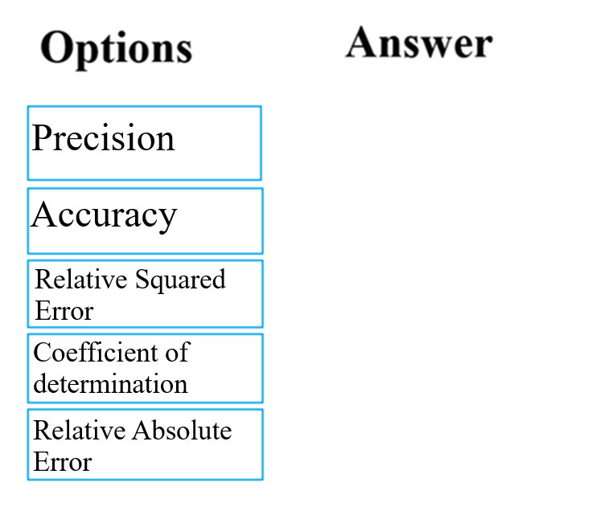

# Question 33

DRAG DROP -

You have been tasked with evaluating the performance of a binary classification model that you created.

You need to choose evaluation metrics to achieve your goal.

Which of the following are the metrics you would choose? Answer by dragging the correct options from the list to the answer area.

Select and Place:

  
Show Suggested Answer

 

The evaluation metrics available for binary classification models are: Accuracy, Precision, Recall, F1 Score, and AUC.

Note: A very natural question is: &#x27;Out of the individuals whom the model, how many were classified correctly (TP)?&#x27;

This question can be answered by looking at the Precision of the model, which is the proportion of positives that are classified correctly.

Reference:

https://docs.microsoft.com/en-us/azure/machine-learning/studio/evaluate-model-performance

  
Show Discussions

<blockquote>
<strong>pancman</strong> <code>(Fri 13 Oct 2023 19:20)</code> - <em>Upvotes: 8</em>

Answer is correct
</blockquote>
<blockquote>
<strong>endeesa</strong> <code>(Sun 08 Dec 2024 22:38)</code> - <em>Upvotes: 1</em>

Given answer is correct
</blockquote>
<blockquote>
<strong>Mirjalol</strong> <code>(Thu 01 Aug 2024 17:34)</code> - <em>Upvotes: 2</em>

Precision and accuracy, so yes, answer is correct
</blockquote>

---

[<< Previous Question](question_32.md) | [Home](/index.md) | [Next Question >>](question_34.md)
