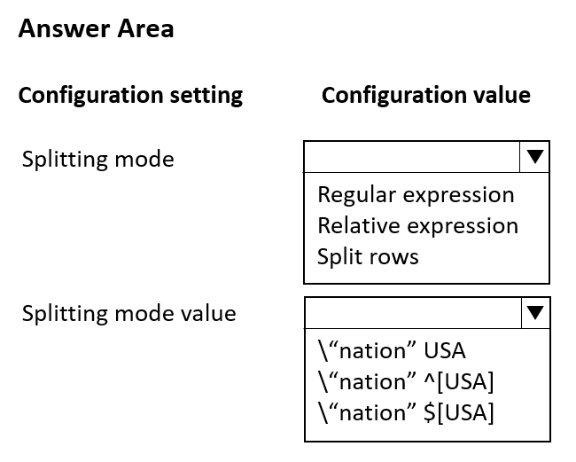
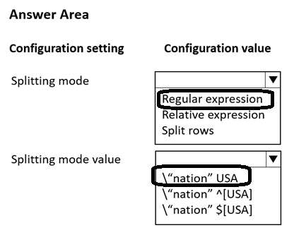

# Question 330

HOTSPOT

-

You are using the Azure Machine Learning designer to transform a dataset containing the census data of all nations.

You must use the Split Data component to separate the dataset into two datasets. The first dataset must contain the census data of the United States. The second dataset must include the census data of the remaining nations.

You need to configure the component to create the datasets.

Which configuration values should you use? To answer, select the appropriate options in the answer area.

NOTE: Each correct selection is worth one point.

  
Show Suggested Answer

 

  
Show Discussions

<blockquote>
<strong>deyoz</strong> <code>(Sun 04 Aug 2024 04:27)</code> - <em>Upvotes: 1</em>

correct 
\&#x27;nation&#x27; USA will split the data, which contains data of only the USA and other datasets contains dataset of remaining countries.  This is a regular expression of single whole word split mode.
</blockquote>
<blockquote>
<strong>Mal42</strong> <code>(Thu 22 Feb 2024 11:49)</code> - <em>Upvotes: 3</em>

On exam 18 Aug 2023
</blockquote>
<blockquote>
<strong>Mikku123</strong> <code>(Tue 06 Feb 2024 21:49)</code> - <em>Upvotes: 2</em>

correct!
</blockquote>

---

[<< Previous Question](question_329.md) | [Home](../index.md) | [Next Question >>](question_331.md)
