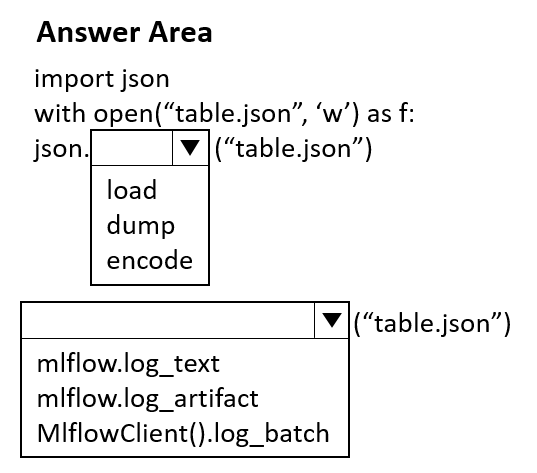
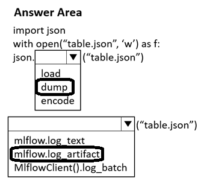

# Question 331

HOTSPOT

-

You create an Azure Machine Learning workspace.

You must use the Python SDK v2 to implement an experiment from a Jupyter notebook in the workspace. The experiment must log a table in the following format:

table = {

"col1" : [1, 2, 3],

"col2" : [4, 5, 6]

)

You need to complete the Python code to log the table.

How should you complete the code? To answer, select the appropriate options in the answer area.

NOTE: Each correct selection is worth one point.

  
Show Suggested Answer

 

  
Show Discussions

<blockquote>
<strong>BR_CS</strong> <code>(Sat 17 Feb 2024 12:12)</code> - <em>Upvotes: 7</em>

The code makes no sense at all.
</blockquote>
<blockquote>
<strong>sl_mslconsulting</strong> <code>(Wed 27 Nov 2024 04:24)</code> - <em>Upvotes: 4</em>

You opened a file for write. It can&#x27;t be &quot;load&quot; function.
import json  
import mlflow  
  
data = {  
    &quot;col1&quot; : [1, 2, 3],  
    &quot;col2&quot; : [4, 5, 6]  
}  
  
filename = &#x27;data.json&#x27;  
  
with open(filename, &#x27;w&#x27;) as f:  
    json.dump(data, f)  
  
mlflow.log_artifact(filename)
</blockquote>
<blockquote>
<strong>gracel11</strong> <code>(Fri 01 Nov 2024 17:41)</code> - <em>Upvotes: 1</em>

The first one should be json.load()
json.load() : read JSON data from a file and convert it into a dictionary.
json.dump(): used for writing the Python object i.e. dict to JSON file.
</blockquote>
<blockquote>
<strong>Ran2025</strong> <code>(Mon 22 Apr 2024 04:56)</code> - <em>Upvotes: 1</em>

I think the first answer is &#x27;load&#x27;.

json.dump(object, file)
</blockquote>

<blockquote>
<strong>Ran2025</strong> <code>(Mon 22 Apr 2024 05:04)</code> - <em>Upvotes: 1</em>

the second is &#x27;log_artifact&#x27;

https://learn.microsoft.com/en-us/azure/machine-learning/how-to-log-view-metrics?view=azureml-api-2&amp;tabs=interactive
</blockquote>

---

[<< Previous Question](question_330.md) | [Home](../index.md) | [Next Question >>](question_332.md)
