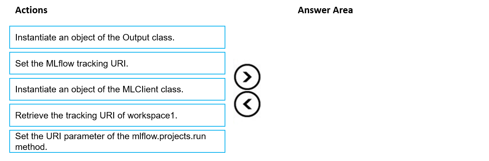
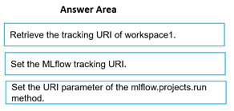

# Question 334

DRAG DROP

-

You manage an Azure Machine Learning workspace named workspace1 and a Data Science Virtual Machine (DSVM) named DSMV1.

You must run an experiment on DSMV1 by using a Jupyter notebook and Python SDK v2 code. You must store metrics and artifacts in workspace1. You start by creating Python SDK v2 code to import all required packages.

You need to implement the Python SDK v2 code to store metrics and artifacts in workspace1.

Which three actions should you perform in sequence? To answer, move the appropriate actions from the list of actions to the answer area and arrange them in the correct order.

  
Show Suggested Answer

 

  
Show Discussions

<blockquote>
<strong>phdykd</strong> <code>(Fri 26 Jan 2024 18:53)</code> - <em>Upvotes: 11</em>

Instantiate an object of the MLClient class. In the Azure Machine Learning Python SDK, the MLClient class is used to manage Azure Machine Learning resources. You can use it to access your workspaces, experiments, and other resources.
Retrieve the tracking URI of workspace1. The tracking URI is used by MLflow to log metrics and artifacts for a specific experiment. You can get this URI from the workspace object.
Set the MLflow tracking URI. MLflow is a platform for managing the machine learning lifecycle. It provides a set of APIs and services that you can use to log and retrieve metrics and artifacts from your machine learning experiments. After getting the tracking URI from the workspace, you should set it as the tracking URI for MLflow.
</blockquote>
<blockquote>
<strong>evangelist</strong> <code>(Mon 09 Dec 2024 13:52)</code> - <em>Upvotes: 5</em>

from azure.ai.ml import MLClient
from azure.identity import DefaultAzureCredential

# Step 1: Instantiate an object of the MLClient class

credential = DefaultAzureCredential()
ml_client = MLClient(credential, subscription_id, resource_group, workspace_name)

# Step 2: Retrieve the tracking URI of workspace1

tracking_uri = ml_client.workspaces.get(workspace_name).mlflow_tracking_uri

# Step 3: Set the MLflow tracking URI

import mlflow
mlflow.set_tracking_uri(tracking_uri)
</blockquote>

<blockquote>
<strong>sl_mslconsulting</strong> <code>(Wed 27 Nov 2024 18:31)</code> - <em>Upvotes: 1</em>

this link should provide all the inform you need to answer this question. https://learn.microsoft.com/en-us/azure/machine-learning/how-to-use-mlflow-configure-tracking?view=azureml-api-2&amp;tabs=python%2Cmlflow
</blockquote>
<blockquote>
<strong>PI_Team</strong> <code>(Sat 08 Jun 2024 10:27)</code> - <em>Upvotes: 3</em>

from azure.ai.ml import MLClient
from azure.identity import DefaultAzureCredential
import mlflow

# Define your parameters

subscription_id = &quot;&lt;your-subscription-id&gt;&quot;
resource_group_name = &quot;&lt;your-resource-group-name&gt;&quot;
workspace_name = &quot;&lt;your-workspace-name&gt;&quot;

# Instantiate the MLClient class

ml_client = MLClient(
credential=DefaultAzureCredential(),
subscription_id=subscription_id,
resource_group_name=resource_group_name,
workspace_name=workspace_name
)

# Retrieve the tracking URI of workspace1

tracking_uri = ml_client.get_tracking_uri()

# Set the MLflow tracking URI

mlflow.set_tracking_uri(tracking_uri)
</blockquote>

<blockquote>
<strong>barb4ever2002</strong> <code>(Wed 27 Dec 2023 10:47)</code> - <em>Upvotes: 1</em>

chat gtp: 
Retrieve the tracking URI of workspace1: To interact with the MLflow server in workspace1, you need to retrieve the tracking URI. This can be done using the Azure Machine Learning SDK to access the workspace and retrieve the necessary information.

Set the MLflow tracking URI: Once you have the tracking URI of workspace1, you need to set it as the tracking URI for MLflow. This ensures that all metrics and artifacts are logged to the correct MLflow server.

Instantiate an object of the MLflow Client class: After setting the tracking URI, you can instantiate an object of the MLflow Client class. This allows you to interact with the MLflow server and log metrics and artifacts from your code.
</blockquote>

---

[<< Previous Question](question_333.md) | [Home](/index.md) | [Next Question >>](question_335.md)
