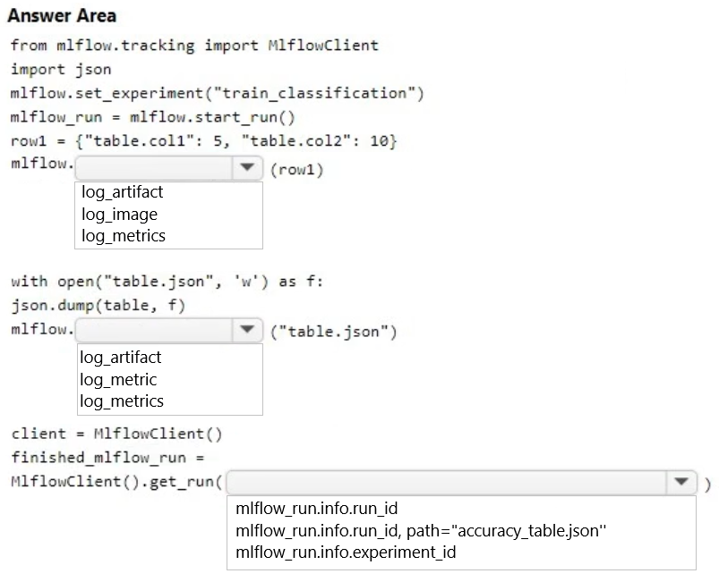
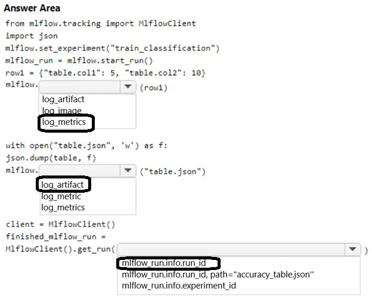

# Question 339

HOTSPOT

-

You monitor an Azure Machine Learning classification training experiment named train.classification on Azure Notebooks.

You must store a table named table as an artifact in Azure Machine Learning Studio during model training.

You need to collect and list the metrics by using MLflow.

How should you complete the code segment? To answer, select the appropriate option in the answer area.

NOTE: Each correct selection is worth one point.

  
Show Suggested Answer

 

  
Show Discussions

<blockquote>
<strong>evangelist</strong> <code>(Mon 09 Dec 2024 13:57)</code> - <em>Upvotes: 2</em>

in MLflow, an artifact is any file that you want to store and associate with a particular experiment run.
</blockquote>
<blockquote>
<strong>damaldon</strong> <code>(Fri 05 Jan 2024 20:54)</code> - <em>Upvotes: 2</em>

Correct:
# Add a metric for each column prefixed by metric name. Similar to log_row
row1 = {&quot;table.col1&quot;: 5, &quot;table.col2&quot;: 10}
# To be done for each row in the table
mlflow.log_metrics(row1)

# Using mlflow.log_artifact

import json

with open(&quot;table.json&quot;, &#x27;w&#x27;) as f:
json.dump(table, f)
mlflow.log_artifact(&quot;table.json&quot;)

# Use MlFlow to retrieve the run that was just completed

client = MlflowClient()
finished_mlflow_run = MlflowClient().get_run(&quot;&lt;RUN_ID&gt;&quot;)
</blockquote>

---

[<< Previous Question](question_338.md) | [Home](/index.md) | [Next Question >>](question_340.md)
