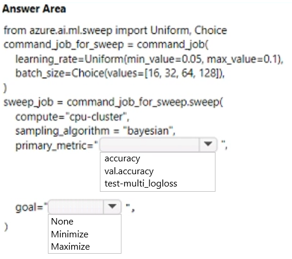
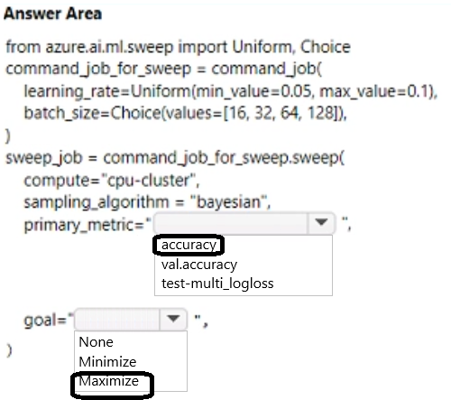

# Question 341

HOTSPOT

-

You use Azure Machine Learning to train a machine learning model.

You use the following training script in Python to perform logging:

import mlflow

mlflow.log_metric(“accuracy", float(vel_accuracy))

You must use a Python script to define a sweep job.

You need to provide the primary metric and goal you want hyperparameter tuning to optimize.

How should you complete the Python script? To answer, select the appropriate options in the answer area.

NOTE: Each correct selection is worth one point.

  
Show Suggested Answer

 

  
Show Discussions

<blockquote>
<strong>damaldon</strong> <code>(Fri 05 Jul 2024 21:11)</code> - <em>Upvotes: 3</em>

from azure.ai.ml.sweep import Uniform, Choice

command_job_for_sweep = command_job(  
 learning_rate=Uniform(min_value=0.05, max_value=0.1),
batch_size=Choice(values=[16, 32, 64, 128]),
)

sweep_job = command_job_for_sweep.sweep(
compute=&quot;cpu-cluster&quot;,
sampling_algorithm = &quot;bayesian&quot;,
primary_metric=&quot;accuracy&quot;,
goal=&quot;Maximize&quot;,
)
</blockquote>

---

[<< Previous Question](question_340.md) | [Home](../index.md) | [Next Question >>](question_342.md)
