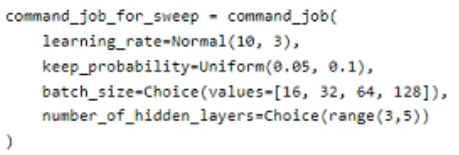
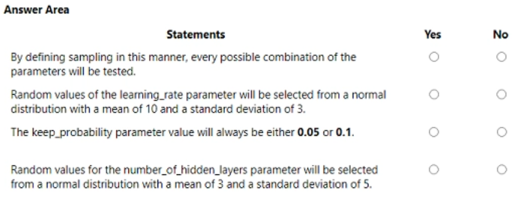
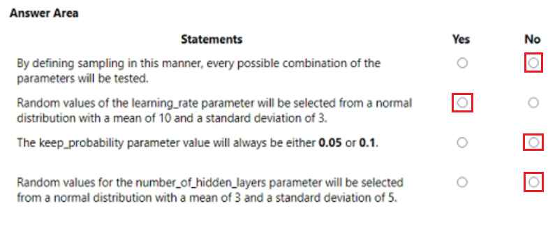

# Question 342

HOTSPOT -

You are using hyperparameter tuning in Azure Machine Learning Python SDK v2 to train a model.

You configure the hyperparameter tuning experiment by running the following code:

For each of the following statements, select Yes if the statement is true. Otherwise, select No.

NOTE: Each correct selection is worth one point.

  
Show Suggested Answer

 

  
Show Discussions

<blockquote>
<strong>phdykd</strong> <code>(Fri 26 Jan 2024 19:55)</code> - <em>Upvotes: 8</em>

NO, YES, NO, NO
</blockquote>
<blockquote>
<strong>BR_CS</strong> <code>(Sat 17 Feb 2024 12:39)</code> - <em>Upvotes: 5</em>

NO, YES, NO, NO
</blockquote>
<blockquote>
<strong>Matt2000</strong> <code>(Fri 02 Aug 2024 06:43)</code> - <em>Upvotes: 1</em>

A is false. Grid sampling (the only way to exhaustively search all combinations of parameters) only allows for Choice(...). Reference: https://learn.microsoft.com/en-us/azure/machine-learning/how-to-tune-hyperparameters?view=azureml-api-2
</blockquote>
<blockquote>
<strong>robdale</strong> <code>(Tue 30 Apr 2024 18:57)</code> - <em>Upvotes: 1</em>

the keep_probability parameter value will always be either 0.05 ot 0.1: NO.

The keep_probability parameter value will not always be either 0.05 or 0.1 based on the code. The keep_probability is defined with a Uniform distribution ranging from 0.05 to 0.1. This means that during hyperparameter tuning, the value of keep_probability can take on any value between 0.05 and 0.1, and it will not necessarily be limited to just these two specific values.

The Uniform distribution will sample values uniformly within the specified range, so you may get values like 0.06, 0.07, 0.08, and so on during the hyperparameter tuning experiment. It will not be constrained to only 0.05 or 0.1.
</blockquote>

<blockquote>
<strong>vmcompra</strong> <code>(Fri 29 Dec 2023 11:54)</code> - <em>Upvotes: 4</em>

A. NO -&gt; As Uniform option is used in &quot;keep_probability&quot; param, Random or Bayesian should be used, and NOT all the combinations will be tested.

The rest are OK: B.YES, C.NO, D.NO
</blockquote>

<blockquote>
<strong>barb4ever2002</strong> <code>(Wed 27 Dec 2023 11:26)</code> - <em>Upvotes: 2</em>

according to chat gtp:
a. No. By defining the sampling in this manner, not every possible combination of the parameters will be tested. Instead, the hyperparameter tuning experiment will use different sampling techniques to explore the hyperparameter space efficiently.

b. Yes. Random values of the learning_rate parameter will be selected from a normal distribution with a mean of 10 and a standard deviation of 3.

c. Yes. The keep_probability parameter value will always be either 0.05 or 0.1 because it is defined as a uniform distribution between these two values.

d. No. The number_of_hidden_layers parameter is defined as a choice between the values of 3 and 4, not as a normal distribution.
</blockquote>

<blockquote>
<strong>vv_bb</strong> <code>(Tue 21 May 2024 20:47)</code> - <em>Upvotes: 1</em>

Agree with everything except for the c.

It should be NO, as Uniform(0.05, 0.1) means it will generate value in the range between 0.05 and 0.1 with uniform distribution

https://learn.microsoft.com/en-us/azure/machine-learning/how-to-tune-hyperparameters?view=azureml-api-2#continuous-hyperparameters
</blockquote>

---

[<< Previous Question](question_341.md) | [Home](/index.md) | [Next Question >>](question_343.md)
