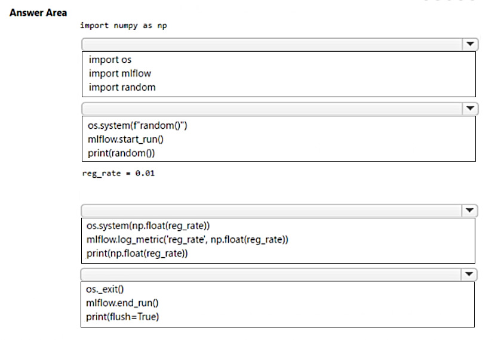
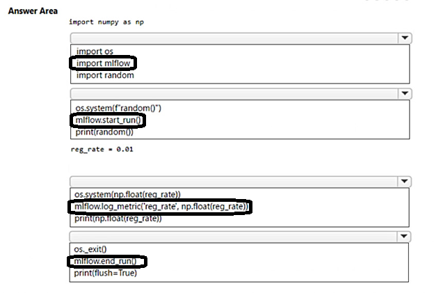

# Question 343

HOTSPOT

-

You are running a training experiment on remote compute in Azure Machine Learning (ML) by using Azure ML SDK v2 for Python.

The experiment is configured to use a conda environment that includes all required packages.

You must track metrics generated in the experiment.

You need to complete the script for the experiment.

How should you complete the code? To answer, select the appropriate options in the answer area.

NOTE: Each correct selection is worth one point.

  
Show Suggested Answer

 

  
Show Discussions

<blockquote>
<strong>Mikku123</strong> <code>(Wed 07 Aug 2024 13:36)</code> - <em>Upvotes: 2</em>

correct!
</blockquote>

---

[<< Previous Question](question_342.md) | [Home](../index.md) | [Next Question >>](question_344.md)
