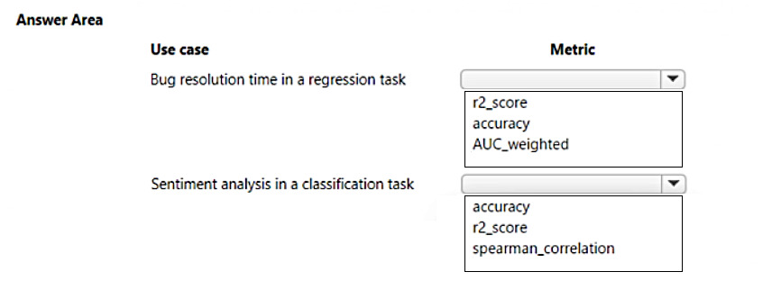
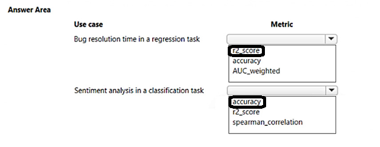

# Question 344

HOTSPOT

-

You create multiple machine learning models by using automated machine learning.

You need to configure a primary metric for each use case.

Which metrics should you configure? To answer, select the appropriate options in the answer area.

NOTE: Each correct selection is worth one point.

  
Show Suggested Answer

 

  
Show Discussions

<blockquote>
<strong>sl_mslconsulting</strong> <code>(Thu 28 Nov 2024 19:29)</code> - <em>Upvotes: 2</em>

this link should provide you the info how to answer this question correctly: https://learn.microsoft.com/en-us/azure/machine-learning/how-to-configure-auto-train?view=azureml-api-2&amp;tabs=python#primary-metric
</blockquote>
<blockquote>
<strong>rameshln</strong> <code>(Sat 20 Apr 2024 15:05)</code> - <em>Upvotes: 1</em>

correct:
Bug Resolution (Regression Task):

Metric: R2 Score
Explanation: R2 Score is a suitable metric for regression tasks like bug resolution, as it measures how well the model predicts the variance in the dependent variable. Higher R2 values indicate better model performance in predicting bug resolution times.
Sentiment Analysis (Classification Task):

Metric: Accuracy
Explanation: Accuracy is commonly used for classification tasks like sentiment analysis. It measures the proportion of correctly classified instances. In sentiment analysis, the goal is typically to classify text into positive, negative, or neutral sentiment. Accuracy is a suitable metric for this purpose.
</blockquote>

---

[<< Previous Question](question_343.md) | [Home](/index.md) | [Next Question >>](question_345.md)
