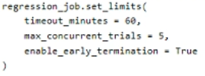
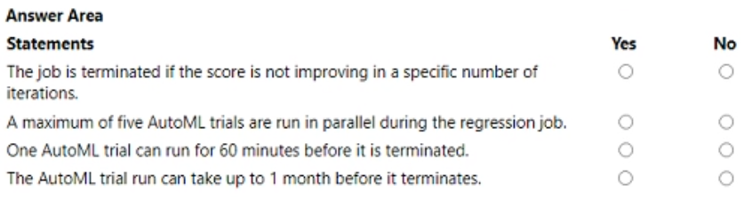
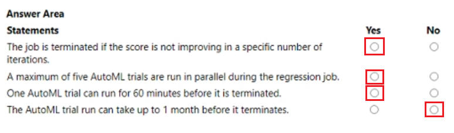

# Question 345

HOTSPOT -

You manage an Azure Machine Learning workspace. You configure an automated machine learning regression training job by using the Azure Machine Learning Python SDK v2.

You configure the regression job by using the following script:

For each of the following statements, select Yes if the statement is true. Otherwise, select No.

  
Show Suggested Answer

 

  
Show Discussions

<blockquote>
<strong>phdykd</strong> <code>(Mon 07 Aug 2023 22:46)</code> - <em>Upvotes: 9</em>

Yes, Yes, Yes, No
</blockquote>
<blockquote>
<strong>vv_bb</strong> <code>(Mon 20 Nov 2023 21:30)</code> - <em>Upvotes: 6</em>

Yes, Yes, No, No
Take a look here:
https://learn.microsoft.com/en-us/azure/machine-learning/how-to-configure-auto-train?view=azureml-api-2&amp;tabs=python#exit-criteria

The only concern is the first question: it asks &quot; ... in a specific number of iterations&quot; while it seems in set_limits() you just can set [enable_early_termination = True], but can&#x27;t define an exact number of iterations.
</blockquote>

<blockquote>
<strong>sl_mslconsulting</strong> <code>(Mon 27 May 2024 21:34)</code> - <em>Upvotes: 1</em>

The doc you provided does mention a criteria max_trails, which has a default value of 1000.
</blockquote>
<blockquote>
<strong>f2a9aa5</strong> <code>(Thu 27 Jun 2024 09:48)</code> - <em>Upvotes: 1</em>

“score is not improving in a specific no. of trials” we don’t know the exact no. of trials when it terminates. Even if it terminated at 1000 trials (max default) within the 60 minutes, the termination did not happen because the score did not improve. Actually the score always improves as termination policy ensures that, but the termination was a result of max trials rather than drop in score.
so NYYN
</blockquote>
<blockquote>
<strong>evangelist</strong> <code>(Sun 09 Jun 2024 13:24)</code> - <em>Upvotes: 1</em>

Yes, Yes, Yes, No
</blockquote>
<blockquote>
<strong>haby</strong> <code>(Tue 19 Dec 2023 01:12)</code> - <em>Upvotes: 2</em>

Yes
Yes
Yes - Firstly, I assume it&#x27;s a typo since the parameter should be &quot;timeout&quot; not &quot;timeout_minute&quot;. Timeout , defines how long, in minutes, your experiment should continue to run. When experiment terminates, all autoML trials will be terminated. Trial has another parameter to control, trial_timeout_minutes, maximum time in minutes that each trial (child job) can run for before it terminates. 
No
</blockquote>

---

[<< Previous Question](question_344.md) | [Home](/index.md) | [Next Question >>](question_346.md)
