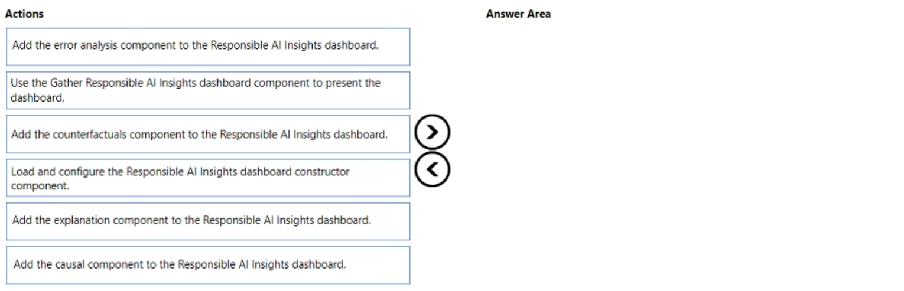
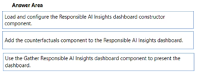

# Question 346

DRAG DROP

-

You manage an Azure Machine Learning workspace. You train a model named model1.

You must identify the features to modify for a differing model prediction result.

You need to configure the Responsible AI (RAI) dashboard for model1.

Which three actions should you perform in sequence? To answer, move the appropriate actions from the list of actions to the answer area and arrange them in the correct order.

  
Show Suggested Answer

 

  
Show Discussions

<blockquote>
<strong>KeiNek</strong> <code>(Sun 09 Feb 2025 14:09)</code> - <em>Upvotes: 1</em>

1. Load and configure the Responsible AI Insights dashboard constructor component. 
2. Add the counterfactuals component to the Responsible AI Insights dashboard. 
3. Use the Gather Responsible AI Insights dashboard component to present the dashboard.

The RAI Insights dashboard constructor and Gather RAI Insights dashboard components are always required, plus at least one of the tool components.
Ref :
https://learn.microsoft.com/en-us/azure/machine-learning/how-to-responsible-ai-insights-sdk-cli?view=azureml-api-2&amp;tabs=yaml#responsible-ai-components

&gt;&gt; You must identify the features to modify for a differing model prediction result.
Counterfactual component :
to observe how feature perturbations would affect your model predictions while providing the closest data points with opposing or &#x27;different model&#x27; predictions.
Ref :
https://learn.microsoft.com/en-us/azure/machine-learning/concept-responsible-ai-dashboard?view=azureml-api-2#responsible-ai-dashboard-components
</blockquote>

<blockquote>
<strong>Tin_Tin</strong> <code>(Sat 20 Jul 2024 07:14)</code> - <em>Upvotes: 1</em>

seems correct.
https://techcommunity.microsoft.com/t5/ai-machine-learning-blog/how-to-create-a-responsible-ai-dashboard-to-debug-ai-models-part/ba-p/3766710
https://techcommunity.microsoft.com/t5/ai-machine-learning-blog/how-to-generate-counterfactuals-for-a-model-with-responsible-ai/ba-p/3803934
</blockquote>
<blockquote>
<strong>damaldon</strong> <code>(Fri 05 Jan 2024 21:48)</code> - <em>Upvotes: 1</em>

The core components for constructing the Responsible AI dashboard in Azure Machine Learning are:

    RAI Insights dashboard constructor
    The tool components:
        Add Explanation to RAI Insights dashboard
        Add Causal to RAI Insights dashboard
        Add Counterfactuals to RAI Insights dashboard
        Add Error Analysis to RAI Insights dashboard
        Gather RAI Insights dashboard
        Gather RAI Insights score card

The RAI Insights dashboard constructor and Gather RAI Insights dashboard components are always required, plus at least one of the tool components. However, it isn&#x27;t necessary to use all the tools in every Responsible AI dashboard.
</blockquote>

---

[<< Previous Question](question_345.md) | [Home](../index.md) | [Next Question >>](question_347.md)
