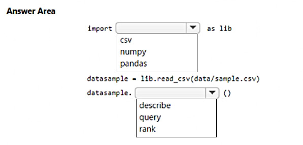
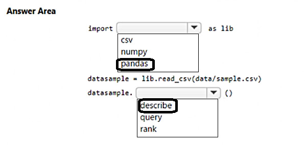

# Question 349

HOTSPOT

-

You download a .csv file from a notebook in an Azure Machine Learning workspace to a data/sample.csv folder on a compute instance. The file contains 10,000 records.

You must generate the summary statistics for the data in the file. The statistics must include the following for each numerical column:

• number of non-empty values

• average value

• standard deviation

• minimum and maximum values

• 25th, 50th, and 75th percentiles

You need to complete the Python code that will generate the summary statistics.

Which code segments should you use? To answer, select the appropriate options in the answer area.

NOTE: Each correct selection is worth one point.

  
Show Suggested Answer

 

  
Show Discussions

<blockquote>
<strong>Lion007</strong> <code>(Fri 28 Jun 2024 19:41)</code> - <em>Upvotes: 1</em>

Correct, the answers are: pandas and describe
pandas is a Python library for data manipulation and analysis, particularly suited for handling tabular data like csv files and performing statistical analysis, which includes generating summary statistics such as the describe() function to generate descriptive statistics.

Wrong Answers:

- csv module does not provide the functionality for statistical analysis required for this task.
- numpy is primarily for lower-level array operations and does not provide high-level data analysis functions like describe().
- query is used to filter data based on a query expression, not to generate summary statistics.
- rank is used to provide rank values to each entry in the series, not to generate descriptive statistics.
</blockquote>
<blockquote>
<strong>Mikku123</strong> <code>(Wed 07 Feb 2024 14:41)</code> - <em>Upvotes: 1</em>

correct!
</blockquote>

---

[<< Previous Question](question_348.md) | [Home](/index.md) | [Next Question >>](question_350.md)
