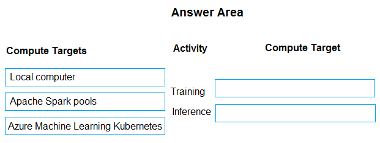
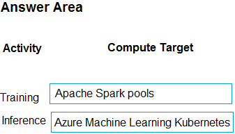

# Question 351

DRAG DROP

-

You are designing an Azure Machine Learning solution by using the Python SDK v2.

You must train and deploy the solution by using a compute target. The compute target must meet the following requirements:

• Enable the use of on-premises compute resources.

• Support autoscaling.

You need to configure a compute target for training and inference.

Which compute targets should you configure?

To answer, select the appropriate options in the answer area.

NOTE: Each correct selection is worth one point.

  
Show Suggested Answer

 

  
Show Discussions

<blockquote>
<strong>negin</strong> <code>(Wed 25 Jun 2025 01:42)</code> - <em>Upvotes: 1</em>

Local Computer and AKS
</blockquote>

---

[<< Previous Question](question_350.md) | [Home](../index.md) | [Next Question >>](question_352.md)
