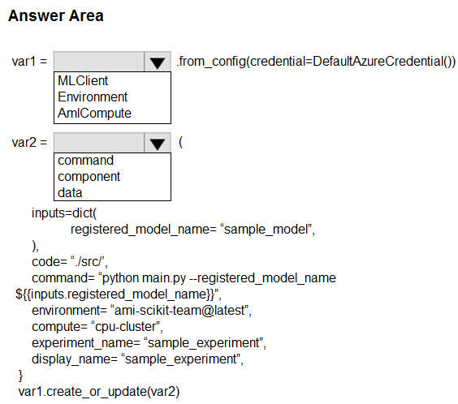
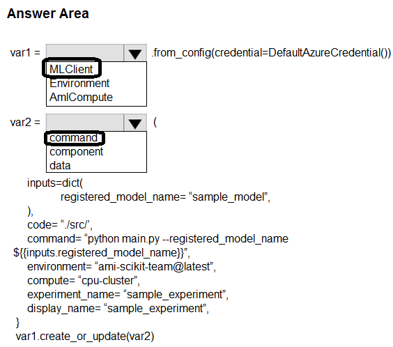

# Question 352

HOTSPOT

-

You create an Azure Machine Learning workspace.

You are developing a Python SDK v2 noteboot to perform custom model training in the workspace. The notebook code imports all required packages.

You need to complete the Python SDK v2 code to include a training script, environment, and compute information.

How should you complete the code? To answer, select the appropriate options in the answer area.

NOTE: Each correct selection is worth one point.

  
Show Suggested Answer

 

  
Show Discussions

<blockquote>
<strong>apz333</strong> <code>(Mon 19 Aug 2024 11:27)</code> - <em>Upvotes: 2</em>

Shouldn&#x27;t box 2 be &quot;component&quot;, I don&#x27;t think create_or_update accepts anything like &quot;command&quot;:
https://learn.microsoft.com/en-us/python/api/azure-ai-ml/azure.ai.ml.mlclient?view=azure-python#azure-ai-ml-mlclient-create-or-update
</blockquote>
<blockquote>
<strong>Karthikat</strong> <code>(Tue 03 Sep 2024 18:14)</code> - <em>Upvotes: 2</em>

You are correct
create_or_update(entity: T, **kwargs) -&gt; T
entity
Union[Job , Model, Environment, Component , Datastore]
</blockquote>
<blockquote>
<strong>tamagochi13</strong> <code>(Fri 13 Sep 2024 01:19)</code> - <em>Upvotes: 4</em>

component does not have experiment_name parameter. also here is example where create_or_update used for command: 
https://learn.microsoft.com/en-us/training/modules/run-training-script-command-job-azure-machine-learning/3-run-script-command-job
</blockquote>

---

[<< Previous Question](question_351.md) | [Home](../index.md) | [Next Question >>](question_353.md)
