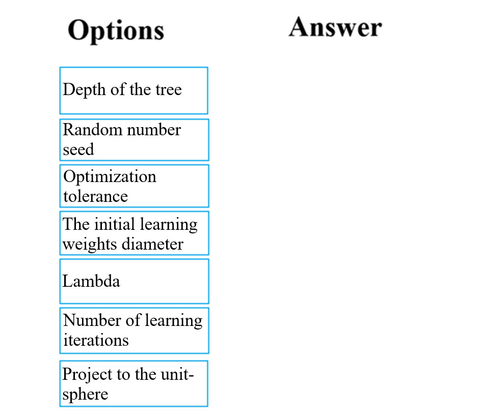
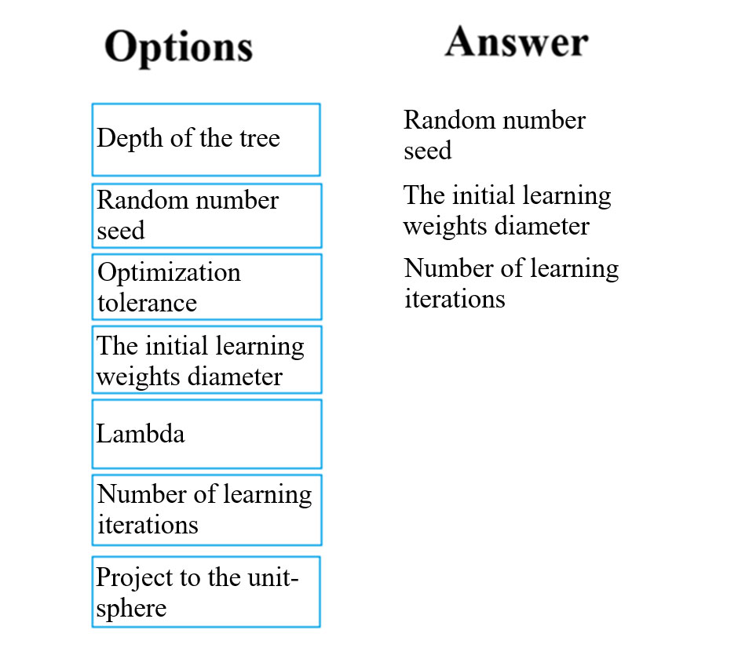

# Question 36

DRAG DROP -

You build a binary classification model using the Azure Machine Learning Studio Two-Class Neural Network module.

You are preparing to configure the Tune Model Hyperparameters module for the purpose of tuning accuracy for the model.

Which of the following are valid parameters for the Two-Class Neural Network module? Answer by dragging the correct options from the list to the answer area.

Select and Place:

  
Show Suggested Answer

 

Reference:

https://docs.microsoft.com/en-us/azure/machine-learning/studio-module-reference/two-class-neural-network

  
Show Discussions

<blockquote>
<strong>KingTN</strong> <code>(Wed 08 Feb 2023 17:01)</code> - <em>Upvotes: 6</em>

Random seed does not help in tuning accuracy, it just make experiments reproducible. I think it should not be used.

https://learn.microsoft.com/en-us/azure/machine-learning/component-reference/two-class-neural-network

&quot;For Random number seed, type a value to use as the seed.
Specifying a seed value is useful when you want to ensure repeatability across runs of the same pipeline. Otherwise, a system clock value is used as the seed, which can cause slightly different results each time you run the pipeline.&quot;
</blockquote>

<blockquote>
<strong>michaelmorar</strong> <code>(Thu 23 Feb 2023 13:18)</code> - <em>Upvotes: 3</em>

The question read: &quot;Which of the following are valid parameters for the Two-Class Neural Network module?&quot;

And according the Microsoft&#x27;s Azure documentation regarding 2-class NN&#x27;s, Random Seed is a valid parameter.
</blockquote>

<blockquote>
<strong>ning</strong> <code>(Fri 17 Jun 2022 10:40)</code> - <em>Upvotes: 5</em>

Random seed is a parameter for binary classification, but I do not understand &quot;Hyperparameters&quot; has anything to do with it???
</blockquote>
<blockquote>
<strong>SweetChilliPhilly</strong> <code>(Fri 11 Nov 2022 02:23)</code> - <em>Upvotes: 1</em>

Random seed is not a parameter in the context of machine learning. Random seed is a Hyperparameter.
</blockquote>
<blockquote>
<strong>Xsesi</strong> <code>(Tue 30 Jul 2024 08:54)</code> - <em>Upvotes: 1</em>

Could anyone please provide insight into why one might choose not to use Optimization Tolerance?

No question with selecting The Initial learning weights diameter &amp; Number of learning iterations. Random seed shall not be selected since it does not optimise during the training process but merely ensure consistent results.
</blockquote>

<blockquote>
<strong>EmmettBrown</strong> <code>(Sun 16 Apr 2023 12:10)</code> - <em>Upvotes: 3</em>

Answer is correct
https://learn.microsoft.com/en-us/azure/machine-learning/component-reference/two-class-neural-network?view=azureml-api-2#how-to-configure
</blockquote>
<blockquote>
<strong>prabhjot</strong> <code>(Sat 27 Jan 2024 04:46)</code> - <em>Upvotes: 1</em>

100% agree with you
</blockquote>
<blockquote>
<strong>bvkr</strong> <code>(Tue 28 Mar 2023 16:16)</code> - <em>Upvotes: 1</em>

Chat GPT answer:The Two-Class Neural Network module has the following valid parameters:
The Initial learning weights diameter: This parameter controls the magnitude of the weights in the neural network at the start of the training process.

Lambda: This parameter controls the amount of regularization applied to the neural network during training.

Number of learning iterations: This parameter controls the number of iterations performed during the training process.
</blockquote>

<blockquote>
<strong>victorafb</strong> <code>(Fri 14 Oct 2022 01:20)</code> - <em>Upvotes: 2</em>

https://learn.microsoft.com/en-us/azure/machine-learning/component-reference/two-class-neural-network

Correct
</blockquote>

---

[<< Previous Question](question_35.md) | [Home](/index.md) | [Next Question >>](question_37.md)
