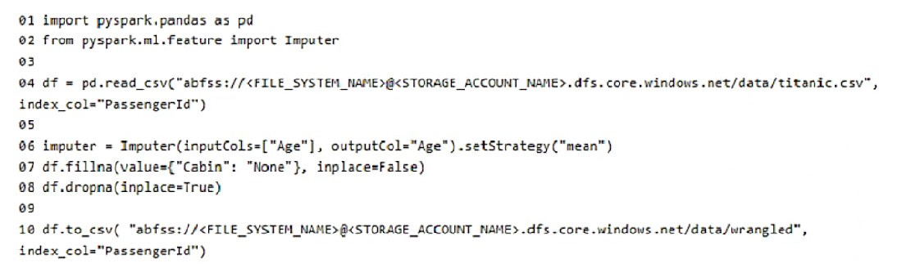
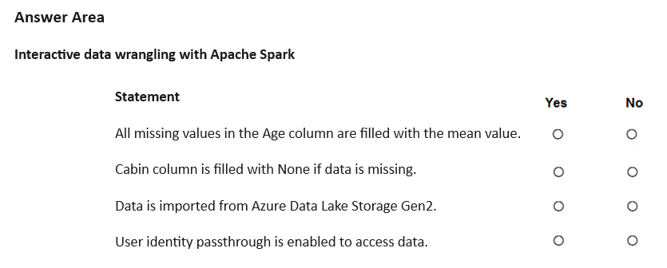
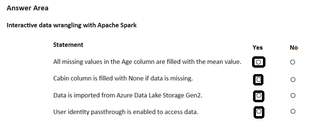

# Question 366

HOTSPOT

-

You manage an Azure Machine Learning workspace. The development environment is configured with a Serverless Spark compute in Azure Machine Learning Notebooks.

You perform interactive data wrangling to clean up the Titanic dataset and store it as a new dataset. (Line numbers are used for reference only.)

For each of the following statements, select Yes if the statement is true. Otherwise, select No.

NOTE: Each correct selection is worth one point.

  
Show Suggested Answer

 

  
Show Discussions

<blockquote>
<strong>445f1bd</strong> <code>(Sun 27 Jul 2025 02:07)</code> - <em>Upvotes: 1</em>

All missing values in the Age column are filled with the mean value.
NO

The Imputer for the &quot;Age&quot; column is only initialized, but never applied to the DataFrame. There is no call to .fit(df).transform(df) or any reassignment, so missing values are not filled.

2. Cabin column is filled with None if data is missing.
   NO

The code df.fillna(value={&quot;Cabin&quot;: &quot;None&quot;}, inplace=False) does not modify the original DataFrame, since the result is not assigned back to df and inplace=True is not used. So, missing values in &quot;Cabin&quot; are not filled.

3. Data is imported from Azure Data Lake Storage Gen2.
   YES

The path starts with abfss://...dfs.core.windows.net/..., which is the standard URI for Azure Data Lake Storage Gen2.

4. User identity passthrough is enabled to access data.
   NO

There is no indication in the code that user identity passthrough is enabled. This would require specific configuration, which is not shown here.
</blockquote>

<blockquote>
<strong>astone42</strong> <code>(Mon 13 Jan 2025 12:59)</code> - <em>Upvotes: 1</em>

No
The imputer just gets initialized, it&#x27;s never being used

No
inplace=False . Line 7 has no impact to the final df.

Yes

No
</blockquote>

<blockquote>
<strong>jefimija</strong> <code>(Wed 30 Oct 2024 13:22)</code> - <em>Upvotes: 2</em>

yes
yes
yes
no
</blockquote>
<blockquote>
<strong>Shudharsanan</strong> <code>(Thu 12 Dec 2024 11:53)</code> - <em>Upvotes: 2</em>

second one is No, because inplace = False
</blockquote>

---

[<< Previous Question](question_365.md) | [Home](/index.md) | [Next Question >>](question_367.md)
