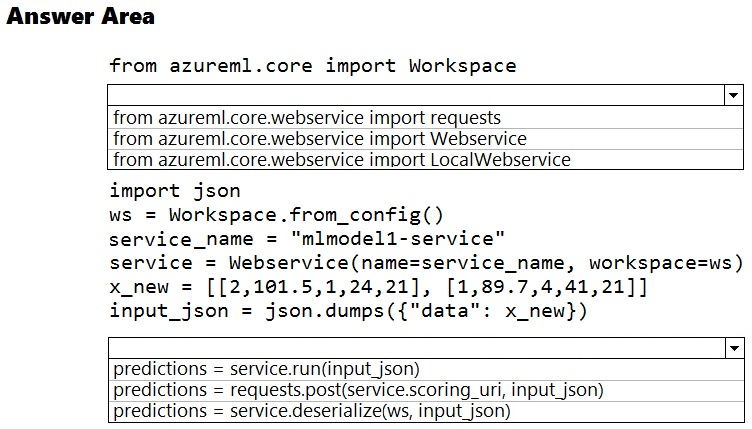
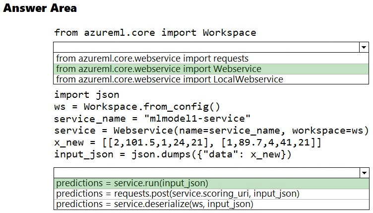

# Question 376

HOTSPOT -

You deploy a model in Azure Container Instance.

You must use the Azure Machine Learning SDK to call the model API.

You need to invoke the deployed model using native SDK classes and methods.

How should you complete the command? To answer, select the appropriate options in the answer areas.

NOTE: Each correct selection is worth one point.

Hot Area:

  
Show Suggested Answer

 

Box 1: from azureml.core.webservice import Webservice

The following code shows how to use the SDK to update the model, environment, and entry script for a web service to Azure Container Instances: from azureml.core import Environment from azureml.core.webservice import Webservice from azureml.core.model import Model, InferenceConfig

Box 2: predictions = service.run(input_json)

Example: The following code demonstrates sending data to the service: import json test_sample = json.dumps({&#x27;data&#x27;: [

[1, 2, 3, 4, 5, 6, 7, 8, 9, 10],

[10, 9, 8, 7, 6, 5, 4, 3, 2, 1]

]})

test_sample = bytes(test_sample, encoding=&#x27;utf8&#x27;)

prediction = service.run(input_data=test_sample)

print(prediction)

Reference:

https://docs.microsoft.com/bs-latn-ba/azure/machine-learning/how-to-deploy-azure-container-instance https://docs.microsoft.com/en-us/azure/machine-learning/how-to-troubleshoot-deployment

  
Show Discussions

<blockquote>
<strong>rishi_ram</strong> <code>(Thu 07 Dec 2023 13:38)</code> - <em>Upvotes: 12</em>

Question was there in June 2021 Exam
</blockquote>
<blockquote>
<strong>1q2w3e4r5t</strong> <code>(Tue 27 Feb 2024 16:21)</code> - <em>Upvotes: 9</em>

given answer is correct
</blockquote>
<blockquote>
<strong>punz61</strong> <code>(Fri 18 Oct 2024 06:42)</code> - <em>Upvotes: 2</em>

given answer is correct
</blockquote>
<blockquote>
<strong>synapse</strong> <code>(Fri 13 Sep 2024 01:18)</code> - <em>Upvotes: 2</em>

Given answer is correct. 
https://docs.microsoft.com/en-us/python/api/azureml-core/azureml.core.webservice(class)?view=azure-ml-py#azureml-core-webservice-run
</blockquote>
<blockquote>
<strong>AjoseO</strong> <code>(Tue 03 Sep 2024 05:37)</code> - <em>Upvotes: 5</em>

On Exam: 03 March 2022
</blockquote>
<blockquote>
<strong>hargur</strong> <code>(Sat 20 Apr 2024 09:52)</code> - <em>Upvotes: 2</em>

on 19Oct2021
</blockquote>
<blockquote>
<strong>azurecert2021</strong> <code>(Sun 24 Dec 2023 22:28)</code> - <em>Upvotes: 5</em>

First option is correct for sure but second is wrong 
You deploy a model in Azure Container Instance so it is already deployed!
You must use the Azure Machine Learning SDK to call the model API so here ask is how to call ?
You need to invoke the deployed model using native SDK classes and methods ,again we need to invoke remember!
so second answer should be prediction = requests.post(service.scoring_uri, input_json)
</blockquote>
<blockquote>
<strong>ning</strong> <code>(Mon 09 Dec 2024 18:21)</code> - <em>Upvotes: 1</em>

Answer is correct!  WebService is not the same as normal web request, class definition here: https://docs.microsoft.com/en-us/python/api/azureml-core/azureml.core.webservice(class)?view=azure-ml-py#azureml-core-webservice-run
</blockquote>
<blockquote>
<strong>SnowCheetah</strong> <code>(Tue 26 Dec 2023 12:49)</code> - <em>Upvotes: 10</em>

The Answer is already correct with Webservice and run()

https://docs.microsoft.com/en-us/python/api/azureml-core/azureml.core.webservice(class)?view=azure-ml-py

in Webservice have method call run() to call webservice with an input. It should do the same functionality as requests.post(service.scoring_uri, input_json).
I believe that prediction = requests.post(service.scoring_uri, input_json) should not work because of the upper provided code is not include &quot;import requests&quot; to be able running post method.
</blockquote>

<blockquote>
<strong>Maunik</strong> <code>(Tue 16 Jan 2024 18:42)</code> - <em>Upvotes: 3</em>

Given answer in correct: 
https://github.com/Azure/MachineLearningNotebooks/blob/master/how-to-use-azureml/deployment/deploy-to-cloud/model-register-and-deploy.ipynb
</blockquote>
<blockquote>
<strong>dda711</strong> <code>(Tue 14 May 2024 20:57)</code> - <em>Upvotes: 3</em>

requests is not a native SDK class either
</blockquote>
<blockquote>
<strong>pancman</strong> <code>(Fri 11 Oct 2024 20:19)</code> - <em>Upvotes: 1</em>

You are mistaken; requests is a python library, which is not part of zure ML SDK. Webservice is part of SDK. The run method of Webservice calls the Webservice with the provided input. And the input parameter is the data your machine learning model expects as an input to run predictions. Here in the correct answer, we feed the json data as the input.
</blockquote>

---

[<< Previous Question](question_375.md) | [Home](../index.md) | [Next Question >>](question_377.md)
