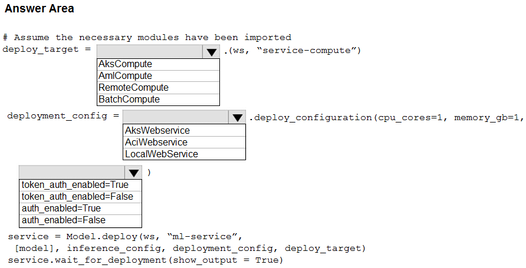
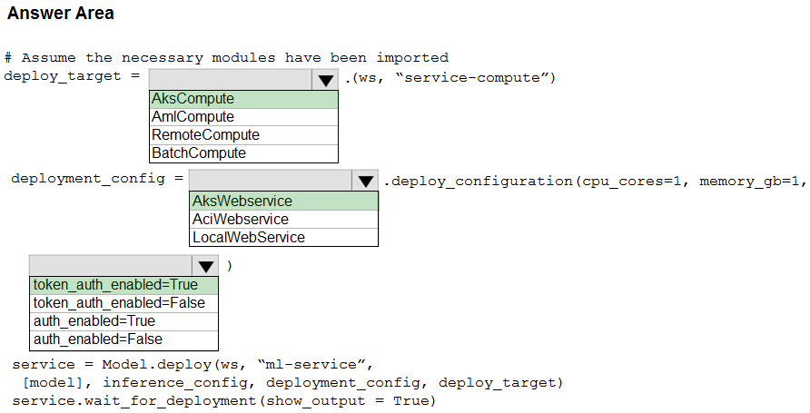

# Question 382

HOTSPOT -

You use Azure Machine Learning to train and register a model.

You must deploy the model into production as a real-time web service to an inference cluster named service-compute that the IT department has created in the

Azure Machine Learning workspace.

Client applications consuming the deployed web service must be authenticated based on their Azure Active Directory service principal.

You need to write a script that uses the Azure Machine Learning SDK to deploy the model. The necessary modules have been imported.

How should you complete the code? To answer, select the appropriate options in the answer area.

NOTE: Each correct selection is worth one point.

Hot Area:

  
Show Suggested Answer

 

Box 1: AksCompute -

Example:

aks_target = AksCompute(ws,&quot;myaks&quot;)

# If deploying to a cluster configured for dev/test, ensure that it was created with enough

# cores and memory to handle this deployment configuration. Note that memory is also used by

# things such as dependencies and AML components.

deployment_config = AksWebservice.deploy_configuration(cpu_cores = 1, memory_gb = 1) service = Model.deploy(ws, &quot;myservice&quot;, [model], inference_config, deployment_config, aks_target)

Box 2: AksWebservice -

Box 3: token_auth_enabled=Yes -

Whether or not token auth is enabled for the Webservice.

Note: A Service principal defined in Azure Active Directory (Azure AD) can act as a principal on which authentication and authorization policies can be enforced in

Azure Databricks.

The Azure Active Directory Authentication Library (ADAL) can be used  to programmatically get an Azure AD access token for a user.

Incorrect Answers:

auth_enabled (bool): Whether or not to enable key auth for this Webservice. Defaults to True.

Reference:

https://docs.microsoft.com/en-us/azure/machine-learning/how-to-deploy-azure-kubernetes-service https://docs.microsoft.com/en-us/azure/databricks/dev-tools/api/latest/aad/service-prin-aad-token

  
Show Discussions

<blockquote>
<strong>ljljljlj</strong> <code>(Tue 11 Jan 2022 15:18)</code> - <em>Upvotes: 11</em>

On exam 2021/7/10
</blockquote>
<blockquote>
<strong>azurecert2021</strong> <code>(Sat 25 Dec 2021 15:56)</code> - <em>Upvotes: 10</em>

given answer is correct

token_auth_enabled
bool
default value: None
Whether or not to enable Token auth for this Webservice. If this is enabled, users can access this Webservice by fetching an access token using their Azure Active Directory credentials. Defaults to False.
https://docs.microsoft.com/en-us/python/api/azureml-core/azureml.core.webservice.akswebservice?view=azure-ml-py
Service principal: You create a service principal account in Azure Active Directory, and use it to authenticate or get a token. A service principal is used when you need an automated process to authenticate to the service without requiring user interaction. For example, a continuous integration and deployment script that trains and tests a model every time the training code changes.
https://docs.microsoft.com/en-us/azure/machine-learning/how-to-setup-authentication
</blockquote>

<blockquote>
<strong>evangelist</strong> <code>(Sun 08 Dec 2024 13:28)</code> - <em>Upvotes: 1</em>

amlcompute=&gt;training
Akscompute=&gt;real time computing and scalable
batchcompute=&gt;non real time
</blockquote>
<blockquote>
<strong>james2033</strong> <code>(Sat 20 Apr 2024 06:54)</code> - <em>Upvotes: 1</em>

Constructor azureml.core.compute.aks.AksCompute(workspace, name)

https://learn.microsoft.com/en-us/python/api/azureml-core/azureml.core.compute.aks.akscompute?view=azure-ml-py#constructor

azureml.core.webservice.aks.AksWebservice.deploy_configuration(...)

https://learn.microsoft.com/en-us/python/api/azureml-core/azureml.core.webservice.aks.akswebservice?view=azure-ml-py#azureml-core-webservice-aks-akswebservice-deploy-configuration
</blockquote>

<blockquote>
<strong>pancman</strong> <code>(Tue 11 Oct 2022 20:57)</code> - <em>Upvotes: 6</em>

Given answer is correct. The third one might be confusing for some people but here is what Microsoft documentation says:
token_auth_enabled: Whether or not to enable Token auth for this Webservice. If this is enabled, users can access this Webservice by fetching an access token using their Azure Active Directory credentials. Defaults to False.
</blockquote>
<blockquote>
<strong>kkkk_jjjj</strong> <code>(Sun 18 Sep 2022 08:47)</code> - <em>Upvotes: 3</em>

on exam 18/03/2022
</blockquote>
<blockquote>
<strong>AjoseO</strong> <code>(Sat 03 Sep 2022 06:55)</code> - <em>Upvotes: 1</em>

On Exam: 03 March 2022
</blockquote>
<blockquote>
<strong>Tsardoz</strong> <code>(Fri 15 Jul 2022 10:03)</code> - <em>Upvotes: 2</em>

cpu_cores = 1, memory_gb=1 does not sound like AKS to me
</blockquote>
<blockquote>
<strong>AI247</strong> <code>(Sat 07 May 2022 21:23)</code> - <em>Upvotes: 2</em>

on exam 05Nov 2021
</blockquote>
<blockquote>
<strong>JoshuaXu</strong> <code>(Fri 06 May 2022 22:07)</code> - <em>Upvotes: 2</em>

on 6 Nov 2021
</blockquote>
<blockquote>
<strong>hargur</strong> <code>(Wed 20 Apr 2022 09:53)</code> - <em>Upvotes: 1</em>

on 19Oct2021
</blockquote>
<blockquote>
<strong>snsnsnsn</strong> <code>(Thu 03 Mar 2022 08:37)</code> - <em>Upvotes: 2</em>

on 2/9/21
</blockquote>
<blockquote>
<strong>SaulG</strong> <code>(Thu 09 Dec 2021 07:13)</code> - <em>Upvotes: 5</em>

Answer is correct!
</blockquote>

---

[<< Previous Question](question_381.md) | [Home](../index.md) | [Next Question >>](question_383.md)
