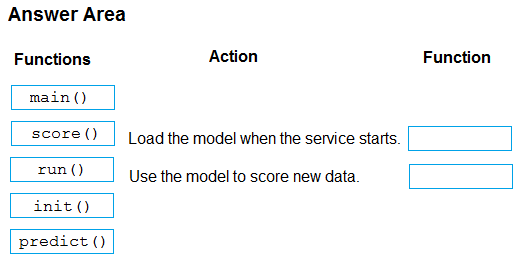

# Question 395

DRAG DROP -

You use Azure Machine Learning to deploy a model as a real-time web service.

You need to create an entry script for the service that ensures that the model is loaded when the service starts and is used to score new data as it is received.

Which functions should you include in the script? To answer, drag the appropriate functions to the correct actions. Each function may be used once, more than once, or not at all. You may need to drag the split bar between panes or scroll to view content.

NOTE: Each correct selection is worth one point.

Select and Place:

  
Show Suggested Answer

 

Box 1: init()

The entry script has only two required functions, init() and run(data). These functions are used to initialize the service at startup and run the model using request data passed in by a client. The rest of the script handles loading and running the model(s).

Box 2: run()

Reference:

https://docs.microsoft.com/en-us/azure/machine-learning/how-to-deploy-existing-model

  
Show Discussions

<blockquote>
<strong>ljljljlj</strong> <code>(Mon 11 Jul 2022 14:21)</code> - <em>Upvotes: 6</em>

On exam 2021/7/10
</blockquote>
<blockquote>
<strong>james2033</strong> <code>(Sun 20 Oct 2024 10:26)</code> - <em>Upvotes: 1</em>

init(): Called once at the beginning of the process, so use for any costly or common preparation like loading the model.

run(): Called for each mini batch to perform the scoring.

https://learn.microsoft.com/en-us/training/modules/deploy-model-batch-endpoint/4-deploy-custom-model-batch-endpoint#create-the-scoring-script
</blockquote>

<blockquote>
<strong>rohanpal636</strong> <code>(Mon 19 Aug 2024 06:54)</code> - <em>Upvotes: 1</em>

Idk keksl
</blockquote>
<blockquote>
<strong>AjoseO</strong> <code>(Fri 03 Mar 2023 07:57)</code> - <em>Upvotes: 4</em>

On Exam: 03 March 2022
</blockquote>
<blockquote>
<strong>snsnsnsn</strong> <code>(Sat 03 Sep 2022 07:38)</code> - <em>Upvotes: 2</em>

on 2/9/21
</blockquote>
<blockquote>
<strong>Moshekwa</strong> <code>(Sat 30 Jul 2022 01:00)</code> - <em>Upvotes: 4</em>

Given answer is correct as per link

https://docs.microsoft.com/en-us/learn/modules/deploy-batch-inference-pipelines-with-azure-machine-learning/2-batch-inference-pipelines
</blockquote>

<blockquote>
<strong>Orangecm</strong> <code>(Fri 08 Apr 2022 16:57)</code> - <em>Upvotes: 1</em>

Having checked the link provided, it seems init() and predict() are more appropriate ?
</blockquote>
<blockquote>
<strong>ACSC</strong> <code>(Mon 11 Apr 2022 13:33)</code> - <em>Upvotes: 17</em>

No. Answer is correct. init() and run(). Predict() is not used to score new data.
</blockquote>

---

[<< Previous Question](question_394.md) | [Home](/index.md) | [Next Question >>](question_396.md)
