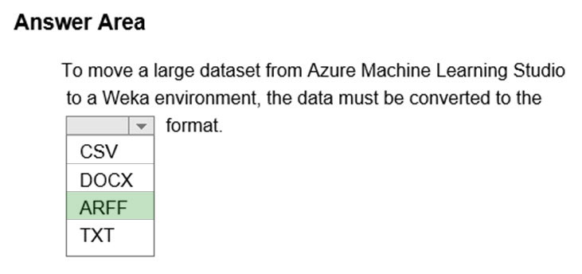

# Question 4

HOTSPOT -

Complete the sentence by selecting the correct option in the answer area.

Hot Area:

  
Show Suggested Answer

 

Use the Convert to ARFF module in Azure Machine Learning Studio, to convert datasets and results in Azure Machine Learning to the attribute-relation file format used by the Weka toolset. This format is known as ARFF.

The ARFF data specification for Weka supports multiple machine learning tasks, including data preprocessing, classification, and feature selection. In this format, data is organized by entities and their attributes, and is contained in a single text file.

Reference:

https://docs.microsoft.com/en-us/azure/machine-learning/studio-module-reference/convert-to-arff

 

  
Show Discussions

<blockquote>
<strong>eternaleclipse</strong> <code>(Wed 17 Apr 2024 12:31)</code> - <em>Upvotes: 8</em>

This wasn&#x27;t in the exam study material
</blockquote>
<blockquote>
<strong>oliveirafernandaz</strong> <code>(Tue 01 Oct 2024 18:38)</code> - <em>Upvotes: 4</em>

I didn&#x27;t see anything about Weka on Azure study material
</blockquote>
<blockquote>
<strong>james2033</strong> <code>(Sat 20 Apr 2024 13:06)</code> - <em>Upvotes: 2</em>

ARFF: Attribute-relation file format used by Weka.
</blockquote>
<blockquote>
<strong>PopeyeDS</strong> <code>(Sun 14 Jan 2024 08:30)</code> - <em>Upvotes: 2</em>

Weka, a popular machine learning and data mining software, supports the ARFF (Attribute-Relation File Format) as its standard data format. The ARFF format is a plain text file format that allows you to define the attributes and data instances in a structured manner.
</blockquote>
<blockquote>
<strong>Manlogs</strong> <code>(Fri 24 Mar 2023 20:34)</code> - <em>Upvotes: 1</em>

Correct
</blockquote>
<blockquote>
<strong>Gabonia</strong> <code>(Sun 19 Feb 2023 14:23)</code> - <em>Upvotes: 1</em>

correct
</blockquote>

---

[<< Previous Question](question_3.md) | [Home](../index.md) | [Next Question >>](question_5.md)
