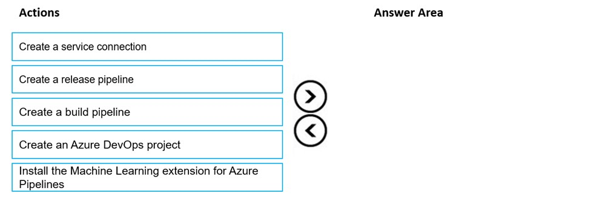
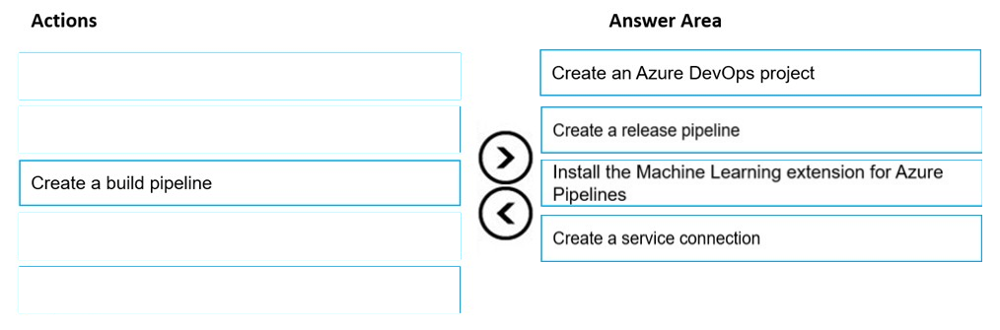
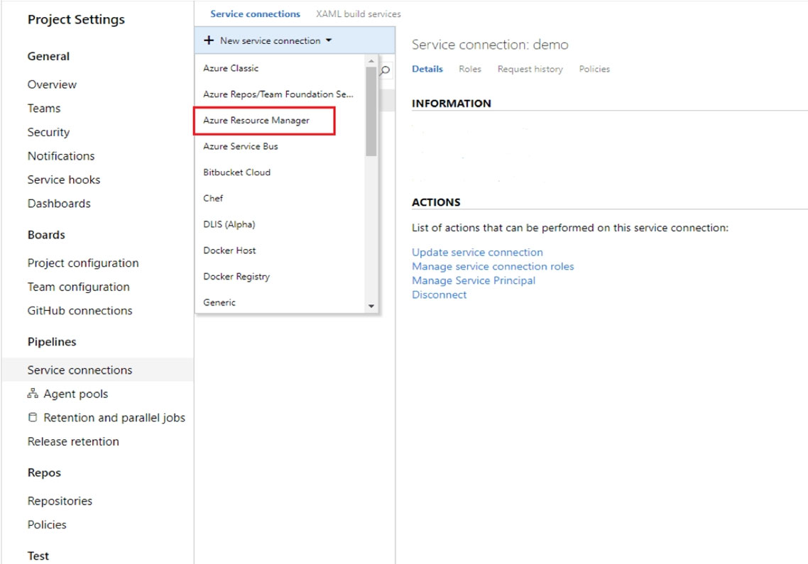
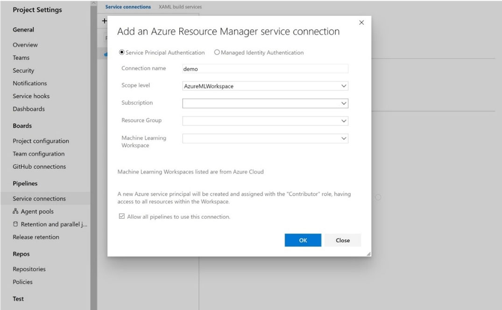

# Question 407

DRAG DROP -

You create an Azure Machine Learning workspace and a new Azure DevOps organization. You register a model in the workspace and deploy the model to the target environment.

All new versions of the model registered in the workspace must automatically be deployed to the target environment.

You need to configure Azure Pipelines to deploy the model.

Which four actions should you perform in sequence? To answer, move the appropriate actions from the list of actions to the answer area and arrange them in the correct order.

Select and Place:

  
Show Suggested Answer

 

Step 1: Create an Azure DevOps project

Step 2: Create a release pipeline

1. Sign in to your Azure DevOps organization and navigate to your project.

2. Go to Pipelines, and then select New pipeline.

Step 3: Install the Machine Learning extension for Azure Pipelines

You must install and configure the Azure CLI and ML extension.

Step 4: Create a service connection

How to set up your service connection

 

Select AzureMLWorkspace for the scope level, then fill in the following subsequent parameters.

 

Note: How to enable model triggering in a release pipeline

✑ Go to your release pipeline and add a new artifact. Click on AzureML Model artifact then select the appropriate AzureML service connection and select from the available models in your workspace.

✑ Enable the deployment trigger on your model artifact as shown here. Every time a new version of that model is registered, a release pipeline will be triggered.

Reference:

https://marketplace.visualstudio.com/items?itemName=ms-air-aiagility.vss-services-azureml https://docs.microsoft.com/en-us/azure/devops/pipelines/targets/azure-machine-learning

  
Show Discussions

<blockquote>
<strong>bbigwolf</strong> <code>(Sun 25 Sep 2022 05:08)</code> - <em>Upvotes: 22</em>

From CI/CD pipeline perspective, the e2e process should be:
1. Create a project.
2. Create service connections.
3. Create build pipeline.
4. Create release pipeline.
I don&#x27;t think it&#x27;s necessary to install ml extension as a separate step since it&#x27;s in pipeline script code.

https://www.azuredevopslabs.com/labs/vstsextend/aml/
</blockquote>

<blockquote>
<strong>ZoeJ</strong> <code>(Thu 27 Apr 2023 03:36)</code> - <em>Upvotes: 3</em>

https://docs.microsoft.com/en-us/azure/devops/pipelines/targets/azure-machine-learning?view=azure-devops
I agree with you
</blockquote>
<blockquote>
<strong>Matt2000</strong> <code>(Mon 05 Feb 2024 11:47)</code> - <em>Upvotes: 1</em>

The extension is for Azure pipelines, part of Azure devops, and this reference says it is a prerequisite for the steps you describe here: https://learn.microsoft.com/en-us/azure/machine-learning/how-to-devops-machine-learning?view=azureml-api-2&amp;viewFallbackFrom=azure-devops&amp;tabs=arm
</blockquote>
<blockquote>
<strong>giusecozza</strong> <code>(Wed 07 Sep 2022 14:32)</code> - <em>Upvotes: 14</em>

Looking at the doc below, the correct sequence should be:
1) create devops project [STEP 2]
2) create service connection [STEP 3]
3) create release pipeline [STEP 4]
4) install SDK extension [STEP 6]

https://docs.microsoft.com/en-us/azure/devops/pipelines/targets/azure-machine-learning?view=azure-devops
</blockquote>

<blockquote>
<strong>[Removed]</strong> <code>(Mon 16 Jan 2023 10:43)</code> - <em>Upvotes: 1</em>

Why would install ML extension be the last step? @bbigwolf&#x27;s answer seems correct.
</blockquote>
<blockquote>
<strong>vprowerty</strong> <code>(Sat 17 Feb 2024 17:54)</code> - <em>Upvotes: 1</em>

Agree but 3) should be replaced by &quot;create build pipeline&quot; that correlates with steps 4 and 5 from azure website article. The main task is to configure azure pipelines. so create release pipeline will be the discarded step.
The main task is to configure azure pipelines. so create release pipeline will be the discarded step.
</blockquote>
<blockquote>
<strong>brzhanyu</strong> <code>(Tue 15 Oct 2024 02:08)</code> - <em>Upvotes: 4</em>

1.	Create an Azure DevOps project: This is the first step, where you set up a new Azure DevOps project to manage your build and release pipelines.
	2.	Install the Machine Learning extension for Azure Pipelines: This step ensures that the necessary tools are in place for working with Azure Machine Learning in your DevOps environment.
	3.	Create a service connection: This creates the link between Azure DevOps and your Azure Machine Learning workspace, allowing the pipelines to interact with your models and other resources.
	4.	Create a release pipeline: This pipeline is used to automate the deployment of the model to the target environment whenever a new model version is registered.
</blockquote>
<blockquote>
<strong>jessyMIH</strong> <code>(Thu 30 May 2024 10:15)</code> - <em>Upvotes: 1</em>

To configure Azure Pipelines to deploy a model from an Azure Machine Learning workspace, you should follow a specific sequence of actions. Here&#x27;s the correct order based on the provided options:

Create an Azure DevOps project: This is the initial step where you set up the project in Azure DevOps.
Install the Machine Learning extension for Azure Pipelines: This step ensures that you have the necessary tools to work with Azure Machine Learning in your pipeline.
Create a service connection: This step involves creating a connection to the Azure Machine Learning workspace so that the pipeline can interact with it.
Create a build pipeline: This is where you define the build process, which includes steps to register the model.
Create a release pipeline: Finally, set up the release pipeline to deploy the registered model to the target environment.
</blockquote>

<blockquote>
<strong>esimsek</strong> <code>(Mon 27 Mar 2023 19:45)</code> - <em>Upvotes: 3</em>

On exam 2023-03-27
</blockquote>
<blockquote>
<strong>phdykd</strong> <code>(Fri 24 Feb 2023 01:02)</code> - <em>Upvotes: 3</em>

Create a service connection: A service connection is required to connect Azure DevOps to Azure Machine Learning workspace.
Install the Machine learning extension for Azure pipelines: This extension is required to use the Azure Machine Learning tasks in the release pipeline.
Create a build pipeline: This step is optional, but it can be useful to create a build pipeline to build and package the model.
Create a release pipeline: This step is essential to create a release pipeline that deploys the model to the target environment.

Create an Azure DevOps project is not necessary since you have already created an Azure DevOps organization.
</blockquote>

---

[<< Previous Question](question_406.md) | [Home](/index.md) | [Next Question >>](question_408.md)
