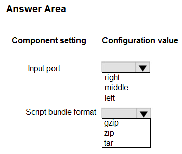
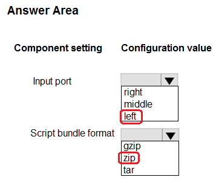

# Question 408

HOTSPOT

-

You create an Azure Machine Learning dataset. You use the Azure Machine Learning designer to transform the dataset by using an Execute Python Script component and custom code.

You must upload the script and associated libraries as a script bundle.

You need to configure the Execute Python Script component.

Which configurations should you use? To answer, select the appropriate options in the answer area.

NOTE: Each correct selection is worth one point.

  
Show Suggested Answer

 

  
Show Discussions

<blockquote>
<strong>Matt2000</strong> <code>(Mon 05 Aug 2024 11:13)</code> - <em>Upvotes: 2</em>

Right and zip. Reference: https://learn.microsoft.com/en-us/azure/machine-learning/component-reference/execute-python-script?view=azureml-api-2
</blockquote>
<blockquote>
<strong>PI_Team</strong> <code>(Sun 25 Feb 2024 11:25)</code> - <em>Upvotes: 1</em>

Right, and zip

SaM
</blockquote>

<blockquote>
<strong>phdykd</strong> <code>(Sat 27 Jan 2024 14:14)</code> - <em>Upvotes: 2</em>

Right port, zip
</blockquote>
<blockquote>
<strong>snegnik</strong> <code>(Mon 04 Dec 2023 12:47)</code> - <em>Upvotes: 3</em>

To include new Python packages or code, connect the zipped file that contains these custom resources to Script bundle port. Or if your script is larger than 16 KB, use the Script Bundle port to avoid errors like CommandLine exceeds the limit of 16597 characters.

Bundle the script and other custom resources to a zip file.
Upload the zip file as a File Dataset to the studio.
Drag the dataset component from the Datasets list in the left component pane in the designer authoring page.
Connect the dataset component to the Script Bundle port of Execute Python Script component.

https://learn.microsoft.com/en-us/azure/machine-learning/component-reference/execute-python-script?view=azureml-api-2
</blockquote>

<blockquote>
<strong>vish9</strong> <code>(Mon 13 Nov 2023 14:03)</code> - <em>Upvotes: 2</em>

Right Port &amp; Zip.
 https://learn.microsoft.com/en-us/azure/machine-learning/how-to-designer-python?view=azureml-api-2
</blockquote>

---

[<< Previous Question](question_407.md) | [Home](/index.md) | [Next Question >>](question_409.md)
