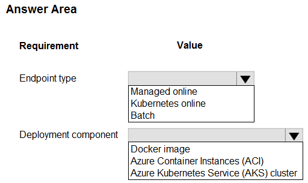
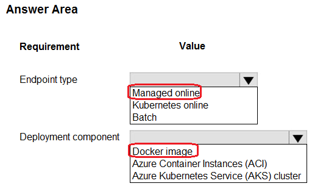

# Question 409

HOTSPOT

-

You create an Azure Machine Learning model to include model files and a scoring script.

You must deploy the model. The deployment solution must meet the following requirements:

• Provide near real-time inferencing.

• Enable endpoint and deployment level cost estimates.

• Support logging to Azure Log Analytics.

You need to configure the deployment solution.

What should you configure? To answer, select the appropriate options in the answer area.

NOTE: Each correct selection is worth one point.

  
Show Suggested Answer

 

  
Show Discussions

<blockquote>
<strong>nposteraro</strong> <code>(Mon 18 Nov 2024 12:06)</code> - <em>Upvotes: 1</em>

For Endpoint type the Managed Online Endpoint is the right answer. I was not convinced but then I read this: https://learn.microsoft.com/en-us/azure/machine-learning/concept-endpoints-online?view=azureml-api-2#managed-online-endpoints-vs-kubernetes-online-endpoints
</blockquote>
<blockquote>
<strong>evangelist</strong> <code>(Sun 09 Jun 2024 08:55)</code> - <em>Upvotes: 4</em>

Endpoint type: Kubernetes online
Deployment component: Azure Kubernetes Service (AKS) cluster
</blockquote>
<blockquote>
<strong>deyoz</strong> <code>(Tue 20 Feb 2024 04:38)</code> - <em>Upvotes: 1</em>

answers are correct:

A Docker image can be used for real-time inferencing of ML models, depending on the deployment solution and the requirements. For example, you can use a Docker image to create a web service that exposes your model via a REST API and responds to requests with predictions in near real-time1. Alternatively, you can use a Docker image to deploy your model to a cloud platform such as Amazon SageMaker2 or Azure Machine Learning3 that provides managed online endpoints for real-time inferencing. However, using a Docker image for real-time inferencing may also introduce some challenges, such as ensuring the compatibility and security of the image, synchronizing the image with the online feature store, and scaling the image to handle the traffic and latency demands4. Therefore, you should carefully evaluate the trade-offs and best practices of using a Docker image for real-time inferencing of ML models.
</blockquote>

<blockquote>
<strong>vprowerty</strong> <code>(Sun 18 Feb 2024 15:23)</code> - <em>Upvotes: 1</em>

Deployment component asnwer might be docker image! Because:

https://learn.microsoft.com/en-us/azure/machine-learning/how-to-deploy-online-endpoints?view=azureml-api-2&amp;tabs=azure-cli#define-the-deployment
Define the deployment:
A deployment is a set of resources required for hosting the model that does the actual inferencing. To deploy a model, you must have: (among others)

- An environment in which your model runs. The environment can be a Docker image with Conda dependencies or a Dockerfile.
</blockquote>
<blockquote>
<strong>PI_Team</strong> <code>(Fri 25 Aug 2023 10:13)</code> - <em>Upvotes: 1</em>

both managed online endpoints and AKS-based online endpoints can be used to deploy machine learning models for real-time inferencing in Azure Machine Learning. Managed online endpoints are fully managed by Azure Machine Learning and provide a simple and cost-effective way to deploy models for real-time inferencing. They also provide out-of-the-box monitoring and logging powered by Azure Monitor and Log Analytics, which includes key metrics and log tables for endpoints and deployments. On the other hand, AKS-based online endpoints provide more flexibility and control, but require more user responsibility to set up and manage.

So the only reason I would go for managed online is the mentioning of Azure Log Analytics directly.

Second one should be Azure Kubernetes Service (AKS) for deployment.

SaM
</blockquote>

<blockquote>
<strong>snegnik</strong> <code>(Sun 04 Jun 2023 11:32)</code> - <em>Upvotes: 2</em>

To enable endpoint and deployment level cost estimates, you can use managed online endpoints. Managed online endpoints work with powerful CPU and GPU machines in Azure in a scalable, fully managed way. They take care of serving, scaling, securing, and monitoring your models, freeing you from the underlying infrastructure management.

https://learn.microsoft.com/en-us/azure/machine-learning/concept-endpoints-online?view=azureml-api-2#managed-online-endpoints-vs-kubernetes-online-endpoints
</blockquote>

<blockquote>
<strong>ZoeJ</strong> <code>(Thu 27 Apr 2023 03:59)</code> - <em>Upvotes: 2</em>

https://learn.microsoft.com/en-us/azure/machine-learning/concept-endpoints?view=azureml-api-2
managed online can provide deployment level cost estimates
</blockquote>
<blockquote>
<strong>ZoeJ</strong> <code>(Thu 27 Apr 2023 04:06)</code> - <em>Upvotes: 1</em>

https://learn.microsoft.com/en-us/azure/aks/monitor-aks#analyze-log-data-with-log-analytics
There is a &#x27;Analyze log data with Log Analytics&#x27; part, maybe this is the evidence that we can choose AKS for the second question. If anyone find better evidence please let me know
</blockquote>
<blockquote>
<strong>sap_dg</strong> <code>(Wed 29 Mar 2023 02:58)</code> - <em>Upvotes: 2</em>

I would go for EndpointType: managed online, Deployment component: AKS cluster
</blockquote>
<blockquote>
<strong>esimsek</strong> <code>(Mon 27 Mar 2023 19:48)</code> - <em>Upvotes: 4</em>

Was on exam 2023-03-27
</blockquote>
<blockquote>
<strong>esimsek</strong> <code>(Mon 27 Mar 2023 10:36)</code> - <em>Upvotes: 1</em>

Is it correct?
</blockquote>

---

[<< Previous Question](question_408.md) | [Home](/index.md) | [Next Question >>](question_410.md)
