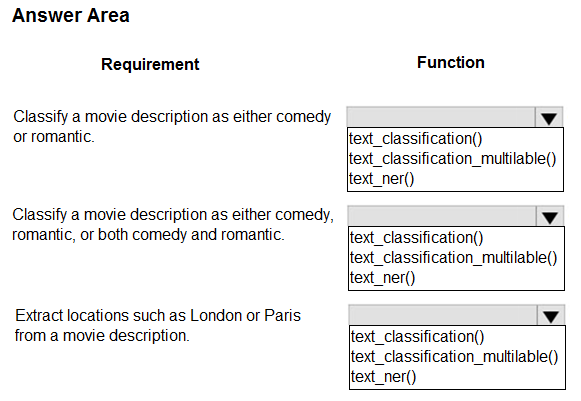
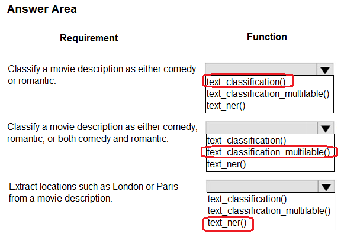

# Question 412

HOTSPOT

-

You create a list of movie descriptions in text data format.

You must analyze the movie descriptions with automated machine learning.

You need to use the Azure Machine Learning for Python SDK v1 to configure a job with the specific natural language processing (NLP) task function for AutoML jobs.

Which functions should you use? To answer, select the appropriate options in the answer area.

NOTE: Each correct selection is worth one point.

  
Show Suggested Answer

 

  
Show Discussions

<blockquote>
<strong>oakmm</strong> <code>(Fri 20 Sep 2024 23:35)</code> - <em>Upvotes: 3</em>

https://learn.microsoft.com/en-us/azure/machine-learning/how-to-auto-train-nlp-models?tabs=cli#named-entity-recognition-ner
</blockquote>

---

[<< Previous Question](question_411.md) | [Home](../index.md) | [Next Question >>](question_413.md)
