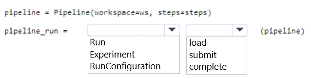
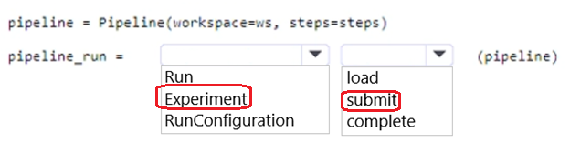

# Question 416

HOTSPOT

-

You are authoring a pipeline by using the Azure Machine Learning SDK for Python. You implement code to import all relevant classes, configure the workspace, and define all pipeline steps.

You need to initiate pipeline execution.

How should you complete the code? To answer, select the appropriate options in the answer area.

NOTE: Each correct selection is worth one point.

  
Show Suggested Answer

 

  
Show Discussions

<blockquote>
<strong>onurag</strong> <code>(Mon 07 Oct 2024 17:12)</code> - <em>Upvotes: 1</em>

correct
</blockquote>
<blockquote>
<strong>Tommo565</strong> <code>(Thu 23 Mar 2023 16:40)</code> - <em>Upvotes: 2</em>

Correct: https://learn.microsoft.com/en-us/azure/machine-learning/v1/how-to-create-machine-learning-pipelines#submit-the-pipeline
</blockquote>

---

[<< Previous Question](question_415.md) | [Home](../index.md) | [Next Question >>](question_417.md)
