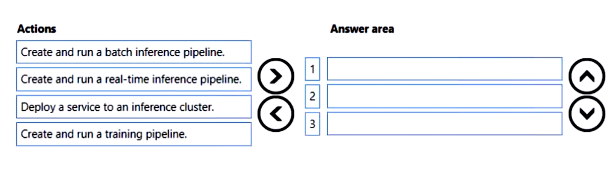
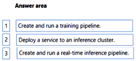

# Question 418

DRAG DROP

-

You are developing a machine learning solution by using the Azure Machine Learning designer.

You need to create a web service that applications can use to submit data feature values and retrieve a predicted label.

Which three actions should you perform in sequence? To answer, move the appropriate actions from the list of actions to the answer area and arrange them in the correct order.

  
Show Suggested Answer

 

  
Show Discussions

<blockquote>
<strong>avotofu</strong> <code>(Thu 20 Apr 2023 07:13)</code> - <em>Upvotes: 11</em>

answer should be
1.Create and run training pipeline
2.Create and run a real-time inference pipeline
3.Deploy a serivce to an inference cluster

https://learn.microsoft.com/en-us/azure/machine-learning/tutorial-designer-automobile-price-deploy
</blockquote>

<blockquote>
<strong>VeraKo</strong> <code>(Wed 10 Jul 2024 12:09)</code> - <em>Upvotes: 1</em>

Thanks for the info!

I have one question. Why does it have to be a real-time inference pipeline? This was mentioned nowhere in the question. Can it be a batch inference pipeline instead?
</blockquote>

<blockquote>
<strong>justinm410</strong> <code>(Thu 12 Dec 2024 01:58)</code> - <em>Upvotes: 1</em>

Batch inference is for non-time-sensitive jobs that are large and must scale well. Users expect a web service to respond promptly, so real-time inference is needed.
</blockquote>
<blockquote>
<strong>phdykd</strong> <code>(Thu 27 Jul 2023 17:25)</code> - <em>Upvotes: 3</em>

Create and run a training pipeline. This is the first step because before you can create a prediction model, you need to train it with existing data. This is done by creating and running a training pipeline, which takes in your data, applies a machine learning algorithm, and outputs a model that can be used to make predictions.
Create and run a real-time inference pipeline. Once the model has been trained, it&#x27;s time to use it for prediction. This is done by creating a real-time inference pipeline. The inference pipeline takes in new data, applies the trained model, and outputs predictions.
Deploy a service to an inference cluster. After you have a working inference pipeline, you can deploy it as a web service to an inference cluster. This allows applications to send data to the service and receive predictions in return. This is the last step because you need a trained model and a working inference pipeline before you can deploy a service.
</blockquote>

---

[<< Previous Question](question_417.md) | [Home](../index.md) | [Next Question >>](question_419.md)
