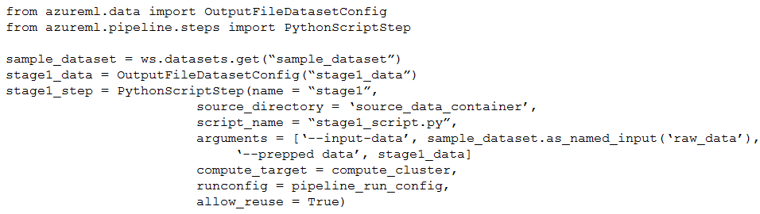

# Question 420

You create an Azure Machine Learning workspace. The workspace contains a dataset named sample_dataset, a compute instance, and a compute cluster.

You must create a two-stage pipeline that will prepare data in the dataset and then train and register a model based on the prepared data.

The first stage of the pipeline contains the following code:

You need to identify the location containing the output of the first stage of the script that you can use as input for the second stage.

Which storage location should you use?

- A.workspaceblobstore datastore
- B.workspacefilestore datastore
- C.compute instance
- D.compute_cluster

  
Show Suggested Answer

<strong>A</strong> 

  
Show Discussions

<blockquote>
<strong>phdykd</strong> <code>(Sat 27 Jul 2024 16:38)</code> - <em>Upvotes: 1</em>

The OutputFileDatasetConfig(&quot;stagel data&quot;) in the first stage of the pipeline is used to configure a location in the workspace&#x27;s default datastore to store the output from the step. The Azure Machine Learning workspace default datastore is typically an Azure blob storage, known as workspaceblobstore, and it is used to store the intermediate and output data of the pipeline stages.

Therefore, the correct answer is:

A. workspaceblobstore datastore
</blockquote>

<blockquote>
<strong>oakmm</strong> <code>(Wed 20 Mar 2024 01:14)</code> - <em>Upvotes: 3</em>

Selected Answer: A
When you create a workspace, an Azure blob container and an Azure file share are automatically registered as datastores to the workspace. They&#x27;re named workspaceblobstore and workspacefilestore, respectively. The workspaceblobstore is used to store workspace artifacts and your machine learning experiment logs. It&#x27;s also set as the default datastore and can&#x27;t be deleted from the workspace. The workspacefilestore is used to store notebooks and R scripts authorized via compute instance.
https://learn.microsoft.com/en-us/azure/machine-learning/v1/how-to-access-data
</blockquote>

---

[<< Previous Question](question_419.md) | [Home](/index.md) | [Next Question >>](question_421.md)
