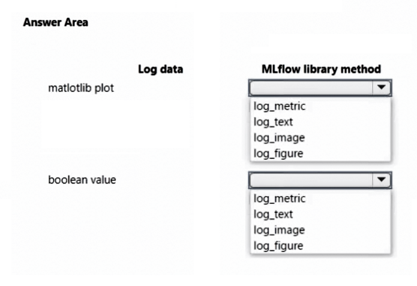
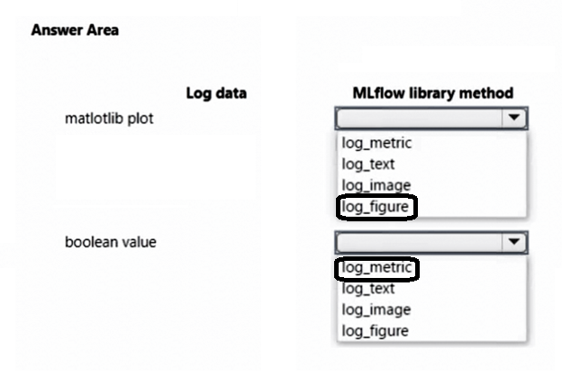

# Question 421

HOTSPOT

-

You create an Azure Machine Learning workspace and install the MLflow library.

You need to log different types of data by using the MLflow library.

Which method should you use? To answer, select the appropriate options in the answer area.

NOTE: Each correct selection is worth one point.

  
Show Suggested Answer

 

  
Show Discussions

<blockquote>
<strong>phdykd</strong> <code>(Thu 27 Jul 2023 17:32)</code> - <em>Upvotes: 4</em>

Log matlotlib plot or image file---mlflow.log_figure(fig, &quot;figure.png&quot;)
Log numpy metrics or PIL image objects	mlflow.log_image(img, &quot;figure.png&quot;)
Log a boolean value---mlflow.log_metric(&quot;my_metric&quot;, 0).
so given answer is correct!
</blockquote>
<blockquote>
<strong>adamcodes716</strong> <code>(Wed 26 Apr 2023 11:44)</code> - <em>Upvotes: 2</em>

Looks right
https://learn.microsoft.com/en-us/azure/machine-learning/how-to-log-view-metrics?view=azureml-api-2&amp;tabs=interactive#logging-images
</blockquote>
<blockquote>
<strong>damaldon</strong> <code>(Fri 07 Jul 2023 17:04)</code> - <em>Upvotes: 2</em>

According to you link:
matlotlib --&gt; log image
Boolean --&gt; log metric
</blockquote>
<blockquote>
<strong>Vince_1</strong> <code>(Sat 31 Aug 2024 10:15)</code> - <em>Upvotes: 1</em>

Actually, if you really look at the documentation properly you would notice that log_image is for &quot; numpy metrics or PIL image objects&quot; while log_figure is for &quot;matlotlib plot or image file&quot; under the section of Log Images.
So, the answer is correct:
https://learn.microsoft.com/en-us/azure/machine-learning/how-to-log-view-metrics?view=azureml-api-2&amp;tabs=interactive#log-images
</blockquote>

---

[<< Previous Question](question_420.md) | [Home](/index.md) | [Next Question >>](question_422.md)
