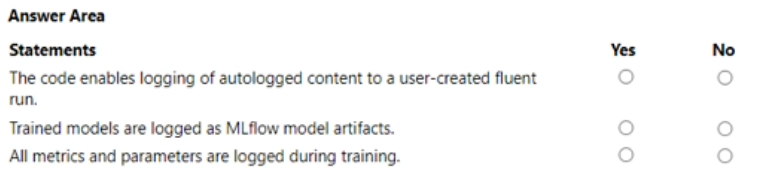
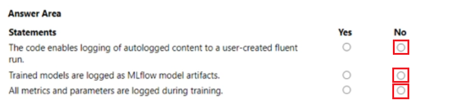

# Question 424

HOTSPOT -

You manage an Azure Machine Learning workspace. You submit a training job with the Azure Machine Learning Python SDK v2. You must use MLflow to log metrics, model parameters, and model artifacts automatically when training a model.

You start by writing the following code segment:

import mlflow

mlflow.autolog(log_models=False, exclusive=True)

For each of the following statements, select Yes if the statement is true. Otherwise, select No.

  
Show Suggested Answer

 

  
Show Discussions

<blockquote>
<strong>PI_Team</strong> <code>(Fri 25 Aug 2023 12:14)</code> - <em>Upvotes: 6</em>

Y,N,Y

https://learn.microsoft.com/en-us/azure/machine-learning/how-to-log-view-metrics?view=azureml-api-2&amp;tabs=interactive#logging-images

When you use the mlflow.autolog function, it enables automatic logging of metrics, parameters, and artifacts to a user-created run in MLflow. This means that the autologged content will be logged to a run that was created by the user, rather than being logged to a system-generated run.

SaM
</blockquote>

<blockquote>
<strong>phdykd</strong> <code>(Thu 27 Jul 2023 18:09)</code> - <em>Upvotes: 6</em>

https://mlflow.org/docs/latest/python_api/mlflow.html#mlflow.autolog

No, No, No
</blockquote>

<blockquote>
<strong>VeraKo</strong> <code>(Wed 10 Jul 2024 12:26)</code> - <em>Upvotes: 1</em>

Correct! No, No, No

From your link https://mlflow.org/docs/latest/python_api/mlflow.html#mlflow.autolog

--&gt; log_models – If True, trained models are logged as MLflow model artifacts. If False, trained models are not logged. Input examples and model signatures, which are attributes of MLflow models, are also omitted when log_models is False.

--&gt; exclusive – If True, autologged content is not logged to user-created fluent runs. If False, autologged content is logged to the active fluent run, which may be user-created.
</blockquote>

<blockquote>
<strong>Shariq</strong> <code>(Fri 31 May 2024 01:26)</code> - <em>Upvotes: 3</em>

The exclusive=True parameter ensures that only MLflow logging will be used, preventing conflicts with other loggers that might be active. this means that the first one should be YES
</blockquote>
<blockquote>
<strong>Tin_Tin</strong> <code>(Tue 23 Jan 2024 08:49)</code> - <em>Upvotes: 2</em>

log_models – If True, trained models are logged as MLflow model artifacts. If False, trained models are not logged. Input examples and model signatures, which are attributes of MLflow models, are also omitted when log_models is False.
exclusive – If True, autologged content is not logged to user-created fluent runs. If False, autologged content is logged to the active fluent run, which may be user-created
https://mlflow.org/docs/latest/python_api/mlflow.html#mlflow.autolog
</blockquote>
<blockquote>
<strong>hiyoww</strong> <code>(Thu 11 Apr 2024 10:07)</code> - <em>Upvotes: 1</em>

So N N N
</blockquote>
<blockquote>
<strong>prabhabharadwaj</strong> <code>(Tue 05 Dec 2023 02:58)</code> - <em>Upvotes: 3</em>

No No Yes, Based n below 2 link
</blockquote>

---

[<< Previous Question](question_423.md) | [Home](../index.md) | [Next Question >>](question_425.md)
