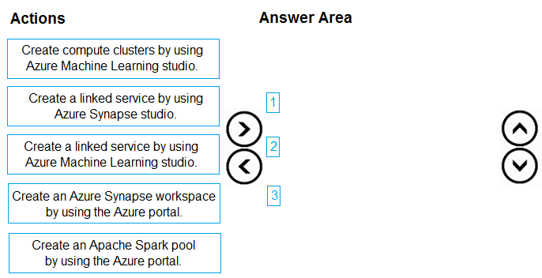
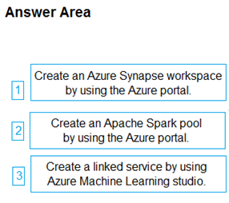

# Question 43

DRAG DROP

-

You create an Azure Machine Learning workspace.

You must implement dedicated compute for model training in the workspace by using Azure Synapse compute resources. The solution must attach the dedicated compute and start an Azure Synapse session.

You need to implement the computer resources.

Which three actions should you perform in sequence? To answer, move the appropriate actions from the list of actions to the answer area and arrange them in the correct order.

  
Show Suggested Answer

 

  
Show Discussions

<blockquote>
<strong>PatAms538</strong> <code>(Fri 01 Aug 2025 00:34)</code> - <em>Upvotes: 1</em>

Was in the exam 31/07/25
</blockquote>
<blockquote>
<strong>PCRamirez</strong> <code>(Tue 18 Jun 2024 00:11)</code> - <em>Upvotes: 2</em>

According to Copilot Pro:
D) Create an Azure Synapse Workspace by using the Azure Portal: This is the first step because you need to have an Azure Synapse Workspace set up before you can link it to Azure Machine Learning or create compute resources within it1.
E) Create an Apache Spark pool by using the Azure Portal: Once the Azure Synapse Workspace is created, you should create an Apache Spark pool within it. This pool will provide the compute resources needed for model training2.
B) Create a linked service by using Azure Synapse Studio: After setting up the Azure Synapse Workspace and the Apache Spark pool, you need to create a linked service in Azure Synapse Studio to connect the Azure Synapse Workspace with the Azure Machine Learning workspace.
</blockquote>
<blockquote>
<strong>Ratz</strong> <code>(Tue 15 Aug 2023 03:57)</code> - <em>Upvotes: 2</em>

However, a new Synapse workspace can no longer be registered with Azure Machine Latest Update:
Learning as a linked service. We recommend using Managed (Automatic) Synapse compute and attached Synapse Spark pools available in CLI v2 and Python SDK v2. Please see https://aka.ms/aml-spark for more details.
</blockquote>
<blockquote>
<strong>naruto1012</strong> <code>(Wed 10 May 2023 16:25)</code> - <em>Upvotes: 2</em>

The answer is correct from this link https://learn.microsoft.com/en-us/azure/machine-learning/v1/how-to-link-synapse-ml-workspaces?view=azureml-api-1
</blockquote>
<blockquote>
<strong>daviduzo</strong> <code>(Wed 21 Jun 2023 07:54)</code> - <em>Upvotes: 2</em>

That&#x27;s outdated
</blockquote>
<blockquote>
<strong>Tommo565</strong> <code>(Thu 23 Mar 2023 13:24)</code> - <em>Upvotes: 1</em>

Answer is correct (I think)
</blockquote>
<blockquote>
<strong>Jin_22</strong> <code>(Wed 22 Mar 2023 08:19)</code> - <em>Upvotes: 4</em>

I think the correct answer should be:
Create an Azure Synapse workspace
Create an Azure Synapse Compute
Attach the Compute to Azure ML Workspace
</blockquote>

---

[<< Previous Question](question_42.md) | [Home](../index.md) | [Next Question >>](question_44.md)
