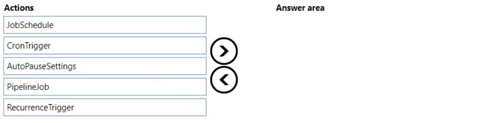
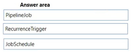

# Question 434

DRAG DROP

-

You create a multi-class image classification deep learning model.

The model must be retrained monthly with the new image data fetched from a public web portal. You create an Azure Machine Learning pipeline to fetch new data, standardize the size of images, and retrain the model.

You need to use the Azure Machine Learning Python SDK v2 to configure the schedule for the pipeline. The schedule should be defined by using the frequency and interval properties, with frequency set to “month" and interval set to "1".

Which three classes should you instantiate in sequence? To answer, move the appropriate actions from the list of actions to the answer area and arrange them in the correct order.

  
Show Suggested Answer

 

  
Show Discussions

<blockquote>
<strong>damaldon</strong> <code>(Fri 07 Jul 2023 19:44)</code> - <em>Upvotes: 5</em>

Correct.
https://learn.microsoft.com/en-us/azure/machine-learning/how-to-schedule-pipeline-job?view=azureml-api-2&amp;tabs=python#schedule-a-pipeline-job
</blockquote>
<blockquote>
<strong>gunn_m</strong> <code>(Sun 01 Dec 2024 20:16)</code> - <em>Upvotes: 1</em>

Couldn&#x27;t I do this using cron?
</blockquote>
<blockquote>
<strong>sl_mslconsulting</strong> <code>(Sat 01 Jun 2024 19:01)</code> - <em>Upvotes: 1</em>

The link provided by damaldon tells everything you need to know. Click on the studio UI table and you will see everything become clearer.
When you have a pipeline job with satisfying performance and outputs, you can set up a schedule to automatically trigger this job on a regular basis...
</blockquote>
<blockquote>
<strong>sl_mslconsulting</strong> <code>(Sat 01 Jun 2024 19:02)</code> - <em>Upvotes: 1</em>

*tab not table
</blockquote>
<blockquote>
<strong>haby</strong> <code>(Tue 19 Dec 2023 21:49)</code> - <em>Upvotes: 1</em>

A
B - This is a wired answer, it is a pipeline trigger, but doesn&#x27;t have &quot;frequency and interval&quot; parameters, it uses Cron expression. I will take this one only coz question says 3 answers.
E
I didn&#x27;t find any docs showing Pipeline is available as a trigger.
https://learn.microsoft.com/en-us/python/api/azure-ai-ml/azure.ai.ml.entities.pipelinejob?view=azure-python
</blockquote>
<blockquote>
<strong>haby</strong> <code>(Fri 22 Dec 2023 18:07)</code> - <em>Upvotes: 2</em>

Pipeline Job is not a Obj, it&#x27;s a schema in json, answer should be D-E-A.
</blockquote>

---

[<< Previous Question](question_433.md) | [Home](/index.md) | [Next Question >>](question_435.md)
