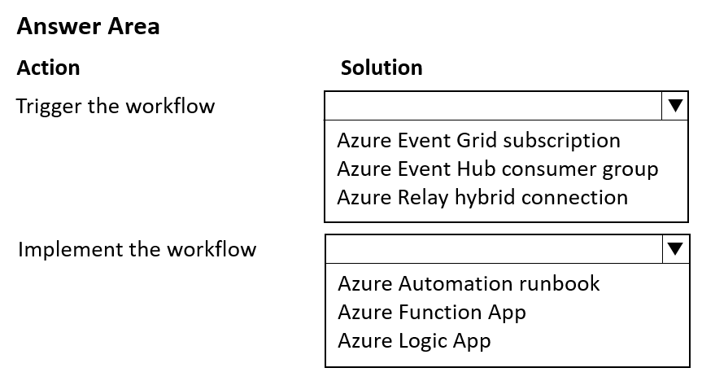
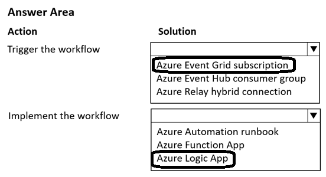

# Question 435

HOTSPOT

-

You use an Azure Machine Learning workspace, Azure Data Factory pipeline, and a dataset monitor that runs on a schedule to detect data drift.

You need to implement an automated workflow to trigger when the dataset monitor detects data drift and launch the Azure Data Factory pipeline to update the dataset. The solution must minimize the effort to configure the workflow.

How should you configure the workflow? To answer, select the appropriate options in the answer area.

NOTE: Each correct selection is worth one point.

  
Show Suggested Answer

 

  
Show Discussions

<blockquote>
<strong>LMCloud1000</strong> <code>(Thu 10 Oct 2024 02:52)</code> - <em>Upvotes: 2</em>

On exam March 2024
</blockquote>
<blockquote>
<strong>A_PL300</strong> <code>(Fri 29 Mar 2024 00:46)</code> - <em>Upvotes: 4</em>

On Sept-4-2023 exam
</blockquote>
<blockquote>
<strong>damaldon</strong> <code>(Sun 07 Jan 2024 19:47)</code> - <em>Upvotes: 1</em>

Correct.
</blockquote>

---

[<< Previous Question](question_434.md) | [Home](../index.md) | [Next Question >>](question_436.md)
