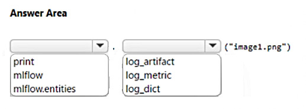

# Question 438

HOTSPOT

-

You create an Azure Machine Learning workspace.

You plan to write an Azure Machine Learning SDK for Python v2 script that logs an image for an experiment. The logged image must be available from the images tab in Azure Machine Learning Studio.

You need to complete the script.

Which code segments should you use? To answer, select the appropriate options in the answer area.

NOTE: Each correct selection is worth one point.

  
Show Suggested Answer

 

  
Show Discussions

<blockquote>
<strong>Jacob12378</strong> <code>(Wed 20 Nov 2024 21:03)</code> - <em>Upvotes: 2</em>

why not log_image()?
</blockquote>
<blockquote>
<strong>LMCloud1000</strong> <code>(Thu 10 Oct 2024 13:36)</code> - <em>Upvotes: 1</em>

Correct
</blockquote>
<blockquote>
<strong>damaldon</strong> <code>(Sun 07 Jan 2024 21:06)</code> - <em>Upvotes: 1</em>

Correct.
https://learn.microsoft.com/en-us/azure/machine-learning/how-to-log-view-metrics?view=azureml-api-2&amp;tabs=interactive#logging-images
</blockquote>

---

[<< Previous Question](question_437.md) | [Home](/index.md) | [Next Question >>](question_439.md)
