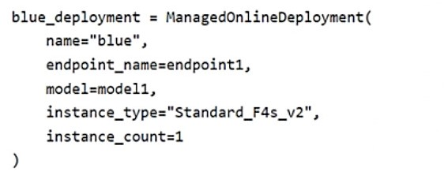

# Question 452

Note: This question is part of a series of questions that present the same scenario. Each question in the series contains a unique solution that might meet the stated goals. Some question sets might have more than one correct solution, while others might not have a correct solution.

After you answer a question in this section, you will NOT be able to return to it. As a result, these questions will not appear in the review screen.

You have an Azure Machine Learning workspace named Workspace1. Workspace1 has a registered MLflow model named model1 with PyFunc flavor.

You plan to deploy model1 to an online endpoint named endpoint1 without egress connectivity by using Azure Machine Learning Python SDK v2.

You have the following code:

You need to add a parameter to the ManagedOnlineDeployment object to ensure the model deploys successfully.

Solution: Add the with_package parameter.

Does the solution meet the goal?

- A.Yes
- B.No

  
Show Suggested Answer

<strong>A</strong> 

  
Show Discussions

<blockquote>
<strong>astone42</strong> <code>(Sat 11 Jan 2025 07:18)</code> - <em>Upvotes: 1</em>

&quot;Workspaces without public network access: Before you can deploy MLflow models to online endpoints without egress connectivity, you have to package the models (preview). By using model packaging, you can avoid the need for an internet connection, which Azure Machine Learning would otherwise require to dynamically install necessary Python packages for the MLflow models.&quot;
</blockquote>
<blockquote>
<strong>Ben999</strong> <code>(Sun 29 Dec 2024 04:57)</code> - <em>Upvotes: 1</em>

without egress connectivity
blue_deployment = ManagedOnlineDeployment(
    name=&quot;blue&quot;,
    endpoint_name=endpoint_name,
    model=model,
    instance_type=&quot;Standard_F4s_v2&quot;,
    instance_count=1,
    with_package=True,
)
</blockquote>
<blockquote>
<strong>D0ktor</strong> <code>(Thu 14 Nov 2024 00:03)</code> - <em>Upvotes: 1</em>

No param called like that
</blockquote>
<blockquote>
<strong>D0ktor</strong> <code>(Mon 18 Nov 2024 19:20)</code> - <em>Upvotes: 1</em>

My fault, the answer is yes, due to &quot;egress connectivity&quot; requirement
</blockquote>
<blockquote>
<strong>f2a9aa5</strong> <code>(Fri 28 Jun 2024 10:04)</code> - <em>Upvotes: 3</em>

A.

To deploy an MLflow model to an online endpoint in Azure Machine Learning without egress connectivity, you can use model packaging. Here’s how:

First, ensure that your workspace has no public network access.
Package your MLflow model using the --with-package flag:

az ml online-deployment create --with-package --endpoint-name $ENDPOINT_NAME -f blue-deployment.yml --all-traffic

Replace $ENDPOINT_NAME with your desired endpoint name.

This approach allows you to avoid the need for an internet connection while deploying MLflow models.

https://learn.microsoft.com/en-us/azure/machine-learning/how-to-deploy-mlflow-models-online-endpoints?view=azureml-api-2&amp;tabs=cli
</blockquote>

<blockquote>
<strong>cryodax</strong> <code>(Sat 15 Jun 2024 19:35)</code> - <em>Upvotes: 3</em>

The ManagedOnlineDeployment class requires the following parameters:

name: str: Name of the deployment resource.
model: str | Model | None: Model entity for the endpoint deployment, defaults to None.
code_configuration: CodeConfiguration | None: Code Configuration, defaults to None.
environment: str | Environment | None: Environment entity for the endpoint deployment, defaults to None.
These are the minimum required parameters to create an instance of the ManagedOnlineDeployment class. All other parameters are optional and have default values. Please note that while model, code_configuration, and environment are optional in the constructor, they are typically necessary for a successful deployment. If not provided in the constructor, they should be set before deployment.
</blockquote>

<blockquote>
<strong>cryodax</strong> <code>(Sat 15 Jun 2024 19:32)</code> - <em>Upvotes: 1</em>

Sorry, scoring_script is optional. Copilot response:

When using the ManagedOnlineDeployment class with the pyfunc flavor, the parameters remain the same. However, the model and code_configuration parameters are particularly important:

model: str | Model | None: This should be an instance of mlflow.pyfunc.PyFuncModel or the URI of the model saved with mlflow.pyfunc.save_model1.
code_configuration: CodeConfiguration | None: This should be an instance of CodeConfiguration where the code_flavor is set to pyfunc.
</blockquote>

<blockquote>
<strong>D0ktor</strong> <code>(Mon 18 Nov 2024 19:25)</code> - <em>Upvotes: 1</em>

https://learn.microsoft.com/en-us/python/api/azure-ai-ml/azure.ai.ml.entities.managedonlinedeployment?view=azure-python
Scoring script is not optional
</blockquote>
<blockquote>
<strong>cryodax</strong> <code>(Sat 15 Jun 2024 19:22)</code> - <em>Upvotes: 2</em>

B. No
Scoring script is a requirement for managedonlinedeployment
</blockquote>

---

[<< Previous Question](question_451.md) | [Home](../index.md) | [Next Question >>](question_453.md)
