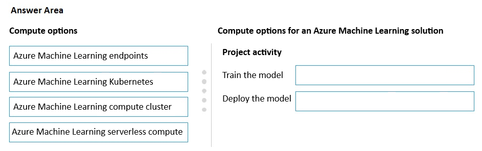
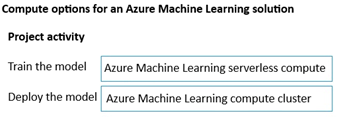

# Question 456

DRAG DROP

-

You are designing an Azure Machine Learning solution.

The model must be trained by using automated machine learning. The compute must be a shared resource with users in the Azure Machine Learning workspace. After you train the model, it must be deployed for batch scoring on a serverless compute.

You need to select the appropriate computation options for the solution.

Which compute options should you select for training and deployment? To answer, move the appropriate compute options to the correct project activities. You may use each compute option once, more than once, or not at all. You may need to move the split bar between panes or scroll to view content.

NOTE: Each correct selection is worth one point.

  
Show Suggested Answer

 

  
Show Discussions

<blockquote>
<strong>negin</strong> <code>(Thu 26 Jun 2025 18:08)</code> - <em>Upvotes: 1</em>

Train the model → Azure Machine Learning compute cluster
Deploy the model → Azure Machine Learning serverless compute
</blockquote>

---

[<< Previous Question](question_455.md) | [Home](/index.md) | [Next Question >>](question_457.md)
