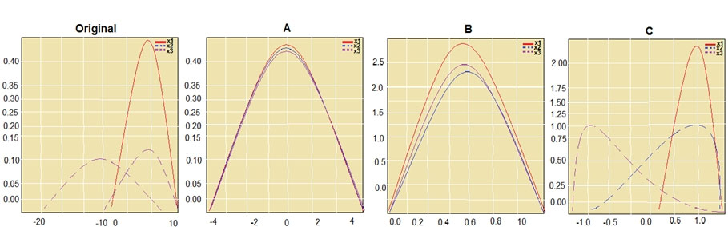
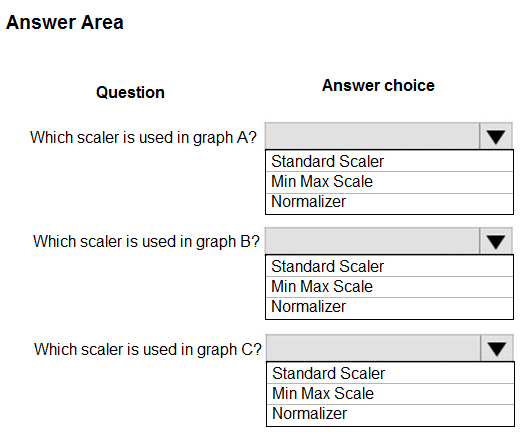
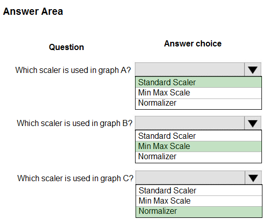
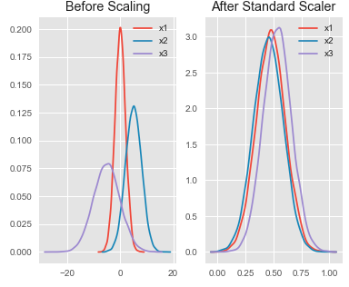
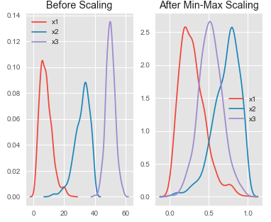

# Question 463

HOTSPOT -

You are performing feature scaling by using the scikit-learn Python library for x.1 x2, and x3 features.

Original and scaled data is shown in the following image.

Use the drop-down menus to select the answer choice that answers each question based on the information presented in the graphic.

NOTE: Each correct selection is worth one point.

Hot Area:

  
Show Suggested Answer

 

Box 1: StandardScaler -

The StandardScaler assumes your data is normally distributed within each feature and will scale them such that the distribution is now centred around 0, with a standard deviation of 1.

Example:

 

All features are now on the same scale relative to one another.

Box 2: Min Max Scaler -

 

Notice that the skewness of the distribution is maintained but the 3 distributions are brought into the same scale so that they overlap.

Box 3: Normalizer -

Reference:

http://benalexkeen.com/feature-scaling-with-scikit-learn/

  
Show Discussions

<blockquote>
<strong>davo123</strong> <code>(Wed 20 May 2020 09:28)</code> - <em>Upvotes: 20</em>

Is this correct? Why not A: Standard, B: Normal, C: Min Max ?
</blockquote>
<blockquote>
<strong>hendrata</strong> <code>(Mon 08 Jun 2020 21:20)</code> - <em>Upvotes: 1</em>

I agree that C in min max (look at the range of x values in C)
But I think A is normal, because the sum of squares (x_1^2 + x_2^2 + x_3^2) must be = 1 in a normalized data set, that&#x27;s the definition that it was used in the reference page. 
So that leaves B to be standard
</blockquote>
<blockquote>
<strong>epgd</strong> <code>(Sun 28 Jun 2020 21:38)</code> - <em>Upvotes: 7</em>

I dont think so, because:
 The StandardScaler assumes your data is normally distributed within each feature and will scale them such that the distribution is now centred around 0, with a standard deviation of 1. (look at the range of the x values in B)
</blockquote>
<blockquote>
<strong>HkIsCrazY</strong> <code>(Sat 06 Feb 2021 12:56)</code> - <em>Upvotes: 4</em>

Yes! A: standard, B: Normal, C: Min Max

Standard - The StandardScaler assumes your data is normally distributed within each feature and will scale them such that the distribution is now centred around 0, with a standard deviation of 1

Min Max - MinMaxScaler preserves the shape of the original distribution. It doesn’t meaningfully change the information embedded in the original data.

Normal - Normalizer does transform all the features to values between -1 and 1
</blockquote>

<blockquote>
<strong>tomiskolc</strong> <code>(Thu 29 Apr 2021 10:07)</code> - <em>Upvotes: 26</em>

I&#x27;m pretty pretty sure, that you&#x27;re wrong! MinMaxScaler always(!!) between 0 and 1, Normalizer always between -1 and 1! and Standard always around 0 (with standard deviation of 1). So the correct answer is A: Standard, B: Min Max, C: Normal . (Please others dont write if you dont know)
</blockquote>
<blockquote>
<strong>YipingRuan</strong> <code>(Sun 11 Jul 2021 06:49)</code> - <em>Upvotes: 3</em>

But in chart B, it goes beyond 1?
</blockquote>
<blockquote>
<strong>E_aws</strong> <code>(Sun 16 May 2021 15:15)</code> - <em>Upvotes: 17</em>

As a mathematician I can approve that the answers are correct! :))
</blockquote>
<blockquote>
<strong>jl420</strong> <code>(Mon 11 Nov 2024 13:51)</code> - <em>Upvotes: 1</em>

Graph A: Standard Scaler
Graph B: Min Max Scale
Graph C: Normalizer

Graph A:

Scaler Used: Standard Scaler
The data in Graph A appears to be centered around zero with a standard deviation of one, which is characteristic of the StandardScaler.
Graph B:

Scaler Used: Min Max Scale
The data in Graph B is scaled within a range, likely [0, 1], which is characteristic of the MinMaxScaler.
Graph C:

Scaler Used: Normalizer
The data in Graph C has been scaled in a way that likely brings each data point to unit norm, typical of the Normalizer.
</blockquote>

<blockquote>
<strong>deyoz</strong> <code>(Thu 08 Feb 2024 02:16)</code> - <em>Upvotes: 1</em>

These answers are correct, for sure!
</blockquote>
<blockquote>
<strong>ZoeJ</strong> <code>(Thu 27 Apr 2023 04:58)</code> - <em>Upvotes: 1</em>

A: Standard, B: Min Max, C: Normal
</blockquote>
<blockquote>
<strong>ZoeJ</strong> <code>(Thu 27 Apr 2023 04:58)</code> - <em>Upvotes: 1</em>

http://benalexkeen.com/feature-scaling-with-scikit-learn/
</blockquote>
<blockquote>
<strong>AzureJobsTillRetire</strong> <code>(Thu 09 Feb 2023 20:14)</code> - <em>Upvotes: 3</em>

There seems to be a typo in picture B, and the number 10 on x-axis should be 1.
</blockquote>
<blockquote>
<strong>chevyli</strong> <code>(Thu 08 Sep 2022 05:56)</code> - <em>Upvotes: 2</em>

Have the question even appeared in any exam?
</blockquote>
<blockquote>
<strong>ning</strong> <code>(Sun 12 Jun 2022 13:38)</code> - <em>Upvotes: 1</em>

Should be correct answer, A is std deviation, so it is standardization, B is between 0 and 1, so it must be Min, Max, and C is a bit confusion, normalizer is used for rows, not columns, but since it can be the only valid answer here
</blockquote>
<blockquote>
<strong>pancman</strong> <code>(Tue 12 Apr 2022 21:13)</code> - <em>Upvotes: 2</em>

Given answer is correct. Because, StandardScaler scales the feature so that it&#x27;s mean is 0 and st. deviation is 1. MinMax Scaler sets the minimum value to 0 and max value to 1. Normalizer rescales eact data point independently of other samples (hence the shape of the feature&#x27;s distribution doesn&#x27;t change).
</blockquote>
<blockquote>
<strong>dushmantha</strong> <code>(Mon 30 Aug 2021 07:56)</code> - <em>Upvotes: 1</em>

No doubt about MinMax scaler. But based on the following explanation the given answers are correct (https://datascience.stackexchange.com/questions/45900/when-to-use-standard-scaler-and-when-normalizer). Because normalizer kind of not change the shape of each distribution
</blockquote>
<blockquote>
<strong>dev2dev</strong> <code>(Sat 20 Mar 2021 04:47)</code> - <em>Upvotes: 6</em>

Answers are correct. I verified by using the referenced link and running the script using 3 scalers.
</blockquote>
<blockquote>
<strong>kty</strong> <code>(Thu 18 Mar 2021 09:52)</code> - <em>Upvotes: 3</em>

answer is correct 
StandartScaler : (-4, 4)
Normalizer : (-1, 1)
MinMax : (0, 1)
</blockquote>
<blockquote>
<strong>HkIsCrazY</strong> <code>(Sat 06 Feb 2021 13:01)</code> - <em>Upvotes: 4</em>

Answers are correct
</blockquote>
<blockquote>
<strong>Shankar_102</strong> <code>(Thu 28 Jan 2021 13:50)</code> - <em>Upvotes: 4</em>

200% answer is correct guys.
</blockquote>
<blockquote>
<strong>ck1729</strong> <code>(Wed 20 Jan 2021 08:08)</code> - <em>Upvotes: 2</em>

min max scale = 0 to 1 and hence the answer is correct
</blockquote>
<blockquote>
<strong>Axure92</strong> <code>(Sat 16 Jan 2021 18:20)</code> - <em>Upvotes: 3</em>

Answers are correct!
https://scikit-learn.org/stable/auto_examples/preprocessing/plot_all_scaling.html
A - Standard; B - Min Max; C - Normalizer
</blockquote>
<blockquote>
<strong>satishgunjal</strong> <code>(Sat 16 Jan 2021 07:03)</code> - <em>Upvotes: 3</em>

&gt;&gt; first one is standard scaler&gt; after standard scaler all features will have mean close to zero, valueas are on same scale but range is larger than min max scaler
   &gt;&gt; Second is min max scaler&gt; features are at same relative scale after min max is applied (space between them is also maintained)
   &gt;&gt; Third one is normalizer&gt; Each point is now within 1 unit of the origin on this Cartesian co-ordinate system.
</blockquote>

---

[<< Previous Question](question_462.md) | [Home](../index.md) | [Next Question >>](question_464.md)
