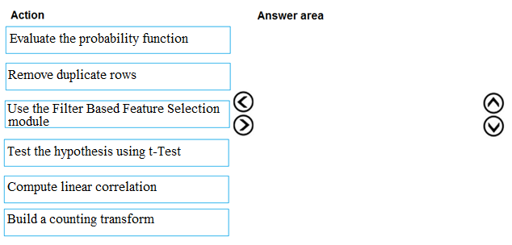
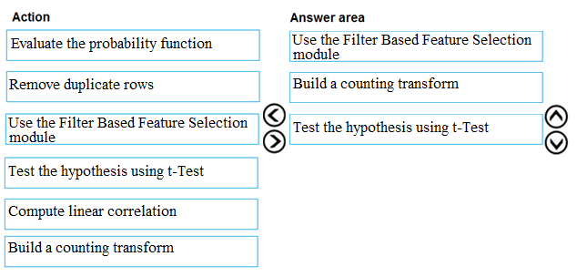

# Question 464

DRAG DROP -

You are producing a multiple linear regression model in Azure Machine Learning Studio.

Several independent variables are highly correlated.

You need to select appropriate methods for conducting effective feature engineering on all the data.

Which three actions should you perform in sequence? To answer, move the appropriate actions from the list of actions to the answer area and arrange them in the correct order.

Select and Place:

  
Show Suggested Answer

 

Step 1: Use the Filter Based Feature Selection module

Filter Based Feature Selection identifies the features in a dataset with the greatest predictive power.

The module outputs a dataset that contains the best feature columns, as ranked by predictive power. It also outputs the names of the features and their scores from the selected metric.

Step 2: Build a counting transform

A counting transform creates a transformation that turns count tables into features, so that you can apply the transformation to multiple datasets.

Step 3: Test the hypothesis using t-Test

Reference:

https://docs.microsoft.com/bs-latn-ba/azure/machine-learning/studio-module-reference/filter-based-feature-selection https://docs.microsoft.com/en-us/azure/machine-learning/studio-module-reference/build-counting-transform

  
Show Discussions

<blockquote>
<strong>lucazav</strong> <code>(Thu 15 Apr 2021 14:41)</code> - <em>Upvotes: 26</em>

I would simply do the following:
1. Remove duplicate rows (to fix any duplicate issue)
2. Use the Filter Based Feature Selection module (to filter out too much correlated features)
3. Build a counting transform (to add new engineered features)
</blockquote>
<blockquote>
<strong>slashssab</strong> <code>(Fri 15 Apr 2022 11:55)</code> - <em>Upvotes: 4</em>

Removing duplicated rows is used in regressions because duplicated data provides additional bias to you model, so i think @lucazav is correct.
</blockquote>
<blockquote>
<strong>bruce</strong> <code>(Fri 08 Oct 2021 11:16)</code> - <em>Upvotes: 12</em>

They haven&#x27;t mentioned anything about Duplicate data here. So I think the answer will be
1. Use the Filter Based Feature Selection module 2. Compute linear correlation 3. Build a counting transform
</blockquote>
<blockquote>
<strong>modschegiebsch</strong> <code>(Thu 10 Dec 2020 14:40)</code> - <em>Upvotes: 11</em>

What kind of hyothesis am I supposed to test here? I would go with the correlations as well.
</blockquote>
<blockquote>
<strong>haby</strong> <code>(Thu 20 Jun 2024 00:21)</code> - <em>Upvotes: 2</em>

Compute linear correlation - Use the Filter Based Feature Selection module - Test the hypothesis using t-Test
</blockquote>
<blockquote>
<strong>phdykd</strong> <code>(Fri 09 Feb 2024 12:39)</code> - <em>Upvotes: 2</em>

To effectively perform feature engineering on highly correlated independent variables in a multiple linear regression model in Azure Machine Learning Studio, you should take the following actions in sequence:

Compute linear correlation (e): Calculate the correlation between the independent variables to understand the degree of correlation between them.
Use the Filter Based Feature Selection module (c): Utilize this module to select the most relevant features while considering their correlations. This step helps in reducing multicollinearity and selecting a subset of features that contribute the most to the model.
Test the hypothesis using t-Test (d): After selecting the features, perform hypothesis testing using t-Tests to validate the statistical significance of the chosen features in relation to the dependent variable.
</blockquote>

<blockquote>
<strong>phdykd</strong> <code>(Sun 28 Jan 2024 19:58)</code> - <em>Upvotes: 1</em>

Compute linear correlation: By computing linear correlation between variables, you can identify pairs of variables that are highly correlated. These are the ones causing multicollinearity.
Use the Filter Based Feature Selection module: Azure Machine Learning Studio provides this module to automatically select important features. It can help eliminate redundant features, i.e., features that are highly correlated with each other, which helps reduce multicollinearity.
Remove duplicate rows: As mentioned before, removing duplicate rows is a good practice in general, not necessarily to handle high correlation among variables. However, in some cases, duplicate rows may contribute to multicollinearity, especially when they form a significant proportion of the dataset.
</blockquote>
<blockquote>
<strong>phdykd</strong> <code>(Thu 24 Aug 2023 02:14)</code> - <em>Upvotes: 1</em>

Compute linear correlation
Use the filter based feature selection module
Build a counting transform
Rest of them are not directly related to feature engineering for highly correlated independent variables in a multiple linear regression model.
</blockquote>
<blockquote>
<strong>ning</strong> <code>(Mon 12 Dec 2022 15:33)</code> - <em>Upvotes: 1</em>

I cannot find any where in designer
1. build a counting transform
2. computer linear correlation
I guess this is dated question
</blockquote>
<blockquote>
<strong>dija123</strong> <code>(Sun 19 Jun 2022 13:17)</code> - <em>Upvotes: 1</em>

I find the given answer is correct
</blockquote>
<blockquote>
<strong>ljljljlj</strong> <code>(Tue 11 Jan 2022 15:23)</code> - <em>Upvotes: 7</em>

On exam 2021/7/10
</blockquote>
<blockquote>
<strong>slash_nyk</strong> <code>(Mon 27 Dec 2021 04:19)</code> - <em>Upvotes: 6</em>

do we know the answer to this question?
</blockquote>
<blockquote>
<strong>ralucabala</strong> <code>(Thu 21 Oct 2021 08:06)</code> - <em>Upvotes: 2</em>

Filter Based Feature Selection has only 2 options in Designer: PearsonCorrelation and ChiSquare test
</blockquote>
<blockquote>
<strong>Alexandra</strong> <code>(Sat 02 Jan 2021 12:06)</code> - <em>Upvotes: 5</em>

linear correlation measures correlation only between two variables. I think that is why t-test is more suitable as the requirements is to measure correlation on whole data set
</blockquote>
<blockquote>
<strong>ning</strong> <code>(Mon 12 Dec 2022 15:33)</code> - <em>Upvotes: 1</em>

No, this will be a linear correlation matrix, the same thing applied to PCA ...
</blockquote>
<blockquote>
<strong>davo123</strong> <code>(Fri 20 Nov 2020 10:29)</code> - <em>Upvotes: 6</em>

Is this the correct answer? I do not see any of the solutions in the references. One could compute the correlations as well
</blockquote>

---

[<< Previous Question](question_463.md) | [Home](/index.md) | [Next Question >>](question_465.md)
