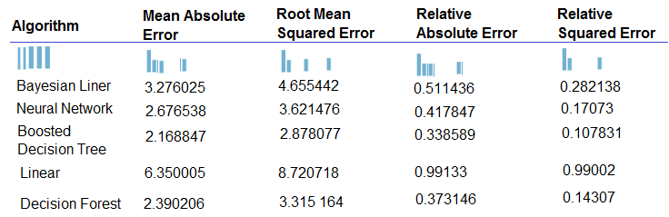
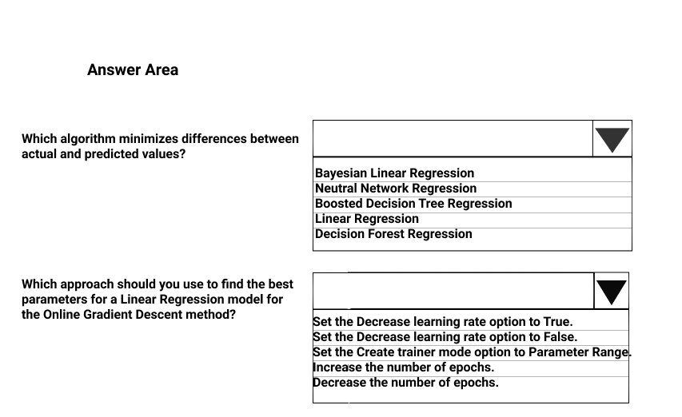
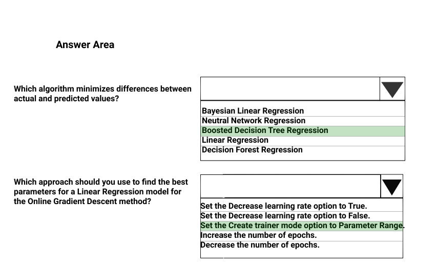

# Question 472

HOTSPOT -

You are developing a linear regression model in Azure Machine Learning Studio. You run an experiment to compare different algorithms.

The following image displays the results dataset output:

Use the drop-down menus to select the answer choice that answers each question based on the information presented in the image.

NOTE: Each correct selection is worth one point.

Hot Area:

  
Show Suggested Answer

 

Box 1: Boosted Decision Tree Regression

Mean absolute error (MAE) measures how close the predictions are to the actual outcomes; thus, a lower score is better.

Box 2:

Online Gradient Descent: If you want the algorithm to find the best parameters for you, set Create trainer mode option to Parameter Range. You can then specify multiple values for the algorithm to try.

Reference:

https://docs.microsoft.com/en-us/azure/machine-learning/studio-module-reference/evaluate-model https://docs.microsoft.com/en-us/azure/machine-learning/studio-module-reference/linear-regression

  
Show Discussions

<blockquote>
<strong>ljljljlj</strong> <code>(Sun 11 Jul 2021 14:24)</code> - <em>Upvotes: 8</em>

On exam 2021/7/10
</blockquote>
<blockquote>
<strong>azayra</strong> <code>(Fri 16 Jul 2021 10:29)</code> - <em>Upvotes: 6</em>

You passed?
</blockquote>
<blockquote>
<strong>jefimija</strong> <code>(Mon 04 Nov 2024 09:52)</code> - <em>Upvotes: 1</em>

Linear Regression is not incorrect, maybe two options are correct.
</blockquote>
<blockquote>
<strong>AzureGeek79</strong> <code>(Sat 12 Oct 2024 19:01)</code> - <em>Upvotes: 1</em>

Would linear regression not be the right answer for first drop-down?
</blockquote>
<blockquote>
<strong>snegnik</strong> <code>(Sun 04 Jun 2023 15:09)</code> - <em>Upvotes: 1</em>

the table is not needed for the second question.
</blockquote>
<blockquote>
<strong>ning</strong> <code>(Mon 13 Jun 2022 12:40)</code> - <em>Upvotes: 4</em>

Yes, the given answer is correct:
&quot;Parameter Range: If you want the algorithm to find the best parameters for you, set Create trainer mode option to Parameter Range. You can then specify multiple values for the algorithm to try.&quot;
</blockquote>
<blockquote>
<strong>ZoeJ</strong> <code>(Thu 27 Apr 2023 07:05)</code> - <em>Upvotes: 1</em>

https://learn.microsoft.com/en-us/azure/machine-learning/component-reference/linear-regression?view=azureml-api-2#create-a-regression-model-using-online-gradient-descent
</blockquote>
<blockquote>
<strong>Tsardoz</strong> <code>(Sun 16 Jan 2022 09:19)</code> - <em>Upvotes: 2</em>

Not sure about parameter range. The only way this would work is if you had prior knwledge of the coefficients eg. by looking at the Bayesian results. Otherwise increasing number of epochs would be the most sensible approach.
</blockquote>

---

[<< Previous Question](question_471.md) | [Home](../index.md) | [Next Question >>](question_473.md)
