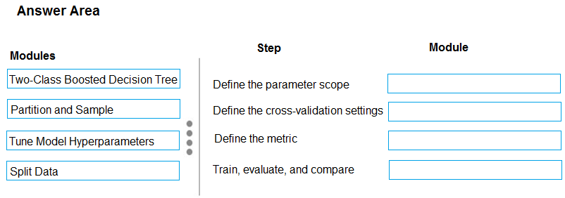
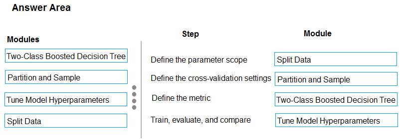

# Question 474

DRAG DROP -

You have a model with a large difference between the training and validation error values.

You must create a new model and perform cross-validation.

You need to identify a parameter set for the new model using Azure Machine Learning Studio.

Which module you should use for each step? To answer, drag the appropriate modules to the correct steps. Each module may be used once or more than once, or not at all. You may need to drag the split bar between panes or scroll to view content.

NOTE: Each correct selection is worth one point.

Select and Place:

  
Show Suggested Answer

 

Box 1: Split data -

Box 2: Partition and Sample -

Box 3: Two-Class Boosted Decision Tree

Box 4: Tune Model Hyperparameters

Integrated train and tune: You configure a set of parameters to use, and then let the module iterate over multiple combinations, measuring accuracy until it finds a

&quot;best&quot; model. With most learner modules, you can choose which parameters should be changed during the training process, and which should remain fixed.

We recommend that you use Cross-Validate Model to establish the goodness of the model given the specified parameters. Use Tune Model Hyperparameters to identify the optimal parameters.

Reference:

https://docs.microsoft.com/en-us/azure/machine-learning/studio-module-reference/partition-and-sample

  
Show Discussions

<blockquote>
<strong>priyalnish</strong> <code>(Mon 13 Jul 2020 15:45)</code> - <em>Upvotes: 98</em>

According to below link;
https://docs.microsoft.com/en-us/azure/machine-learning/studio/algorithm-parameters-optimize
1. Two-Class Boosted Decision Tree
2. Partition and Sample
3. Tune Model Hyperparameters
4. Tune Model Hyperparameters
</blockquote>
<blockquote>
<strong>Gitty</strong> <code>(Thu 13 Aug 2020 02:16)</code> - <em>Upvotes: 2</em>

correct
</blockquote>
<blockquote>
<strong>jay2323</strong> <code>(Tue 06 Jul 2021 20:19)</code> - <em>Upvotes: 2</em>

Why is 3 and 4 have the same answer?
</blockquote>
<blockquote>
<strong>YipingRuan</strong> <code>(Sun 25 Jul 2021 06:10)</code> - <em>Upvotes: 1</em>

Train, evaluate, and compare
The same Tune Model Hyperparameters module trains all the models that correspond to the parameter set,
</blockquote>
<blockquote>
<strong>SnowCheetah</strong> <code>(Sat 26 Jun 2021 09:02)</code> - <em>Upvotes: 1</em>

This is a correct Answer
</blockquote>
<blockquote>
<strong>VJPrakash</strong> <code>(Fri 30 Jul 2021 17:07)</code> - <em>Upvotes: 2</em>

Thanks for the link. These answers are accurate based on the documentation.
</blockquote>
<blockquote>
<strong>Yilu</strong> <code>(Tue 12 May 2020 05:20)</code> - <em>Upvotes: 9</em>

box 1 and 4 got swapped
</blockquote>
<blockquote>
<strong>jl420</strong> <code>(Mon 11 Nov 2024 14:44)</code> - <em>Upvotes: 1</em>

Step	Module
Define the parameter scope	- Tune Model Hyperparameters
Define the cross-validation settings	- Partition and Sample
Define the metric	- Tune Model Hyperparameters
Train, evaluate, and compare	- Two-Class Boosted Decision Tree
</blockquote>
<blockquote>
<strong>jl420</strong> <code>(Mon 11 Nov 2024 14:52)</code> - <em>Upvotes: 1</em>

Ignore this is wrong. Given answer is correct -&gt; Split, Part, Boost, Tune
</blockquote>
<blockquote>
<strong>BR_CS</strong> <code>(Thu 17 Aug 2023 15:11)</code> - <em>Upvotes: 2</em>

The answers in the comments seem to make no sense, just like the answers shown. Was the image changed?
</blockquote>
<blockquote>
<strong>ZoeJ</strong> <code>(Thu 27 Apr 2023 07:15)</code> - <em>Upvotes: 2</em>

I think this is an out-dated question
</blockquote>
<blockquote>
<strong>ck1729</strong> <code>(Wed 20 Jan 2021 21:50)</code> - <em>Upvotes: 2</em>

how come the answers below say selecting the model first? shouldn&#x27;t we split the data first and feed in the training data to the model?
</blockquote>
<blockquote>
<strong>kath3624</strong> <code>(Mon 29 Jun 2020 16:48)</code> - <em>Upvotes: 4</em>

https://docs.microsoft.com/en-us/azure/machine-learning/studio/algorithm-parameters-optimize
box 1:  Boosted Decision Tree
box 2:  Partition and Sample
box 3:  Tune Model Hyperparameters 
box 4:
</blockquote>
<blockquote>
<strong>dev2dev</strong> <code>(Mon 22 Mar 2021 05:01)</code> - <em>Upvotes: 1</em>

4th also hyperparmeters too
</blockquote>
<blockquote>
<strong>pepmir</strong> <code>(Thu 25 Jun 2020 19:48)</code> - <em>Upvotes: 3</em>

Tune Hyperparams belongs to Train Module. So 4 is correct.
</blockquote>
<blockquote>
<strong>davo123</strong> <code>(Wed 20 May 2020 09:32)</code> - <em>Upvotes: 2</em>

Box 1 should be Two Class Boosted?
</blockquote>
<blockquote>
<strong>abofficial</strong> <code>(Wed 18 Nov 2020 07:20)</code> - <em>Upvotes: 6</em>

I think box 1 should be tune hyperparameters.. take note of the keyword &#x27;parameter scope&#x27;
</blockquote>

---

[<< Previous Question](question_473.md) | [Home](../index.md) | [Next Question >>](question_475.md)
