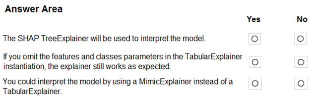
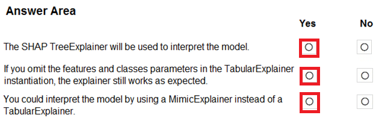

# Question 479

HOTSPOT -

You train a classification model by using a decision tree algorithm.

You create an estimator by running the following Python code. The variable feature_names is a list of all feature names, and class_names is a list of all class names. from interpret.ext.blackbox import TabularExplainer explainer = TabularExplainer(model, x_train, features=feature_names, classes=class_names)

You need to explain the predictions made by the model for all classes by determining the importance of all features.

For each of the following statements, select Yes if the statement is true. Otherwise, select No.

NOTE: Each correct selection is worth one point.

Hot Area:

  
Show Suggested Answer

 

  
Show Discussions

<blockquote>
<strong>claudiapatricia777</strong> <code>(Sat 09 Apr 2022 14:26)</code> - <em>Upvotes: 16</em>

Answer is : Yes: No doubt - 2 - Yes: feature and class are optional arguments - 3 - Yes: Mimic also supports Tree based algorithms.
</blockquote>
<blockquote>
<strong>Ben999</strong> <code>(Sun 29 Dec 2024 06:00)</code> - <em>Upvotes: 1</em>

Y,Y,N. - For MimicExplainer you would need to import the MimicExplainer class, which is not the case here.
</blockquote>
<blockquote>
<strong>dushmantha</strong> <code>(Mon 28 Feb 2022 10:25)</code> - <em>Upvotes: 8</em>

Answer should be
yes: no doubt
no: there is no way that explainer knows what is class variable
yes: explainers has no restrictions to be used in a tree based method
</blockquote>
<blockquote>
<strong>deyoz</strong> <code>(Thu 08 Aug 2024 02:50)</code> - <em>Upvotes: 1</em>

field classes is optional
</blockquote>
<blockquote>
<strong>deyoz</strong> <code>(Thu 08 Aug 2024 02:54)</code> - <em>Upvotes: 1</em>

oh yes i overlooked the phrase &quot;as expected&quot; . i totally agree with your answer. the tone of the question give some hint that the model works without these parameters , but might not work as expected.
</blockquote>
<blockquote>
<strong>haby</strong> <code>(Sat 22 Jun 2024 18:02)</code> - <em>Upvotes: 1</em>

1- Yes
2- No - features and classes fields are optional, true, but without adding them, they work but can&#x27;t work &quot;as expected&quot;
3- Yes
</blockquote>
<blockquote>
<strong>haby</strong> <code>(Sat 22 Jun 2024 18:05)</code> - <em>Upvotes: 1</em>

My bad, 2nd is Yes. features and classes only change visualization result.
</blockquote>
<blockquote>
<strong>phdykd</strong> <code>(Thu 24 Aug 2023 03:47)</code> - <em>Upvotes: 2</em>

YYY.
2 - Yes: feature and class are optional arguments
</blockquote>
<blockquote>
<strong>phdykd</strong> <code>(Thu 24 Aug 2023 03:46)</code> - <em>Upvotes: 1</em>

YES YES YES
</blockquote>
<blockquote>
<strong>casiopa</strong> <code>(Mon 12 Jun 2023 09:53)</code> - <em>Upvotes: 1</em>

1-Yes
2-Yes
3-No

3- could be a NO because for a MimicExplainer you would need to specify the argument: explainable_model. Otherwise, a MimicExplainer is a valid choice.

Ex:
explainer = MimicExplainer(model, x_train, explainable_model=DecisionTreeExplainableModel, features=feature_names, classes=class_names)
</blockquote>

<blockquote>
<strong>pancman</strong> <code>(Thu 13 Oct 2022 03:20)</code> - <em>Upvotes: 1</em>

You can refer to TabularExplainer documentation here:
https://interpret-community.readthedocs.io/en/latest/api_reference/interpret_community.html?highlight=tabularexplainer#interpret_community.TabularExplainer
</blockquote>
<blockquote>
<strong>dija123</strong> <code>(Wed 08 Jun 2022 18:00)</code> - <em>Upvotes: 3</em>

1- Yes
2- Yes as &quot;features&quot; and &quot;classes&quot; fields are optional
https://docs.microsoft.com/en-us/azure/machine-learning/how-to-machine-learning-interpretability-aml
3- Yes
</blockquote>
<blockquote>
<strong>azayra</strong> <code>(Thu 28 Apr 2022 10:36)</code> - <em>Upvotes: 2</em>

yes , yes and yes
</blockquote>
<blockquote>
<strong>snsnsnsn</strong> <code>(Thu 03 Mar 2022 08:42)</code> - <em>Upvotes: 1</em>

on 2/9/21
</blockquote>
<blockquote>
<strong>saurabh288</strong> <code>(Fri 21 Jan 2022 16:12)</code> - <em>Upvotes: 3</em>

MimicExplainer can also be used here.
</blockquote>
<blockquote>
<strong>ljljljlj</strong> <code>(Tue 11 Jan 2022 15:25)</code> - <em>Upvotes: 6</em>

On exam 2021/7/10
</blockquote>
<blockquote>
<strong>Srik33</strong> <code>(Tue 04 Jan 2022 18:11)</code> - <em>Upvotes: 3</em>

Why cant MIMIC be used here , they also can be used for Linerar Regression black box models
</blockquote>
<blockquote>
<strong>YipingRuan</strong> <code>(Tue 25 Jan 2022 16:32)</code> - <em>Upvotes: 1</em>

You can use one of the following interpretable models as your surrogate model: LightGBM (LGBMExplainableModel), Linear Regression (LinearExplainableModel)

https://docs.microsoft.com/en-us/azure/machine-learning/how-to-machine-learning-interpretability
</blockquote>

<blockquote>
<strong>thhvancouver</strong> <code>(Mon 31 Jan 2022 18:28)</code> - <em>Upvotes: 5</em>

According to the documentation: You can use one of the following interpretable models as your surrogate model: LightGBM (LGBMExplainableModel), Linear Regression (LinearExplainableModel), Stochastic Gradient Descent explainable model (SGDExplainableModel), and Decision Tree (DecisionTreeExplainableModel). So a MimicExplainer can also be used with Decision Tree.
</blockquote>

---

[<< Previous Question](question_478.md) | [Home](/index.md) | [Next Question >>](question_480.md)
