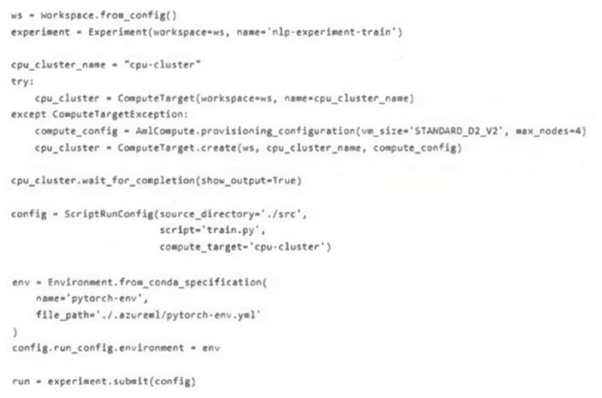
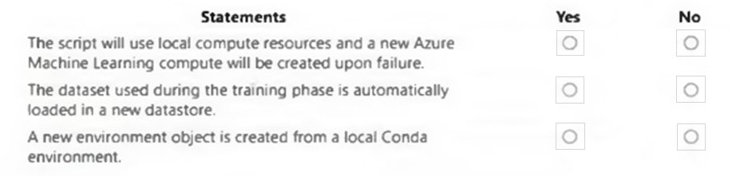
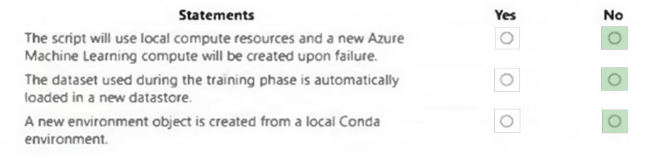

# Question 484

HOTSPOT -

You create an Azure Machine Learning workspace and load a Python training script named train.py in the src subfolder. The dataset used to train your model is available locally.

You run the following script to train the model:

Instructions: For each of the following statements, select Yes if the statement is true. Otherwise, select No.

NOTE: Each correct selection is worth one point.

Hot Area:

  
Show Suggested Answer

 

  
Show Discussions

<blockquote>
<strong>JTWang</strong> <code>(Thu 25 Apr 2024 07:28)</code> - <em>Upvotes: 7</em>

My answer:  
1.N 
2.N 
3.N  (use build_local function to create local env)

https://learn.microsoft.com/en-us/python/api/azureml-core/azureml.core.environment(class)?view=azure-ml-p
</blockquote>

<blockquote>
<strong>BTAB</strong> <code>(Sun 14 Jul 2024 11:48)</code> - <em>Upvotes: 1</em>

Yes, that&#x27;s correct.
</blockquote>
<blockquote>
<strong>AzureJobsTillRetire</strong> <code>(Sat 10 Aug 2024 18:56)</code> - <em>Upvotes: 2</em>

The first box is No because when you use your local computer for training, there is no need to create a compute target.

https://learn.microsoft.com/en-us/azure/machine-learning/v1/how-to-attach-compute-targets#local-computer
</blockquote>

<blockquote>
<strong>Tommo565</strong> <code>(Sat 28 Sep 2024 11:49)</code> - <em>Upvotes: 1</em>

N, N, N is correct
</blockquote>
<blockquote>
<strong>claps92</strong> <code>(Sun 10 Mar 2024 14:10)</code> - <em>Upvotes: 3</em>

isn&#x27;t 1)N 2)N 3)Y?
</blockquote>

---

[<< Previous Question](question_483.md) | [Home](/index.md) | [Next Question >>](question_485.md)
