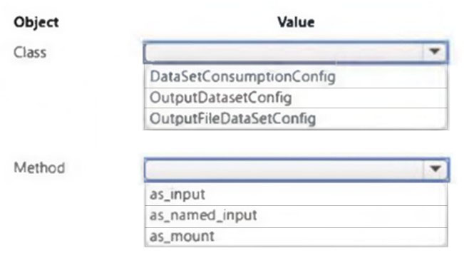
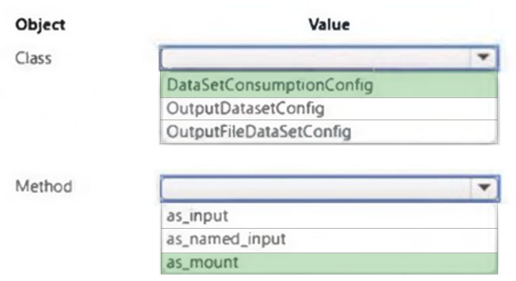

# Question 487

HOTSPOT -

You are developing a two-step Azure Machine Learning pipeline by using the Azure Machine Learning SDK for Python.

The pipeline must pass temporary data from the first step to the second step.

You need to configure the second step to ensure that it can use the temporary data from the first step.

Which class and method should you use? To answer, select the appropriate options in the answer area.

NOTE: Each correct selection is worth one point.

Hot Area:

  
Show Suggested Answer

 

  
Show Discussions

<blockquote>
<strong>giusecozza</strong> <code>(Wed 07 Sep 2022 16:27)</code> - <em>Upvotes: 34</em>

It seems the correct answers should be OutputFileDatasetConfig and as_input(). It is clearly explained on Microsoft Learn: 
https://docs.microsoft.com/en-us/training/modules/create-pipelines-in-aml/3-pipeline-data
</blockquote>
<blockquote>
<strong>Sadhak</strong> <code>(Sat 16 Nov 2024 13:38)</code> - <em>Upvotes: 1</em>

Class: OutputDatasetConfig
Method: as_named_input
</blockquote>
<blockquote>
<strong>Mckay_</strong> <code>(Fri 14 Oct 2022 18:09)</code> - <em>Upvotes: 1</em>

I agree with you 100%
</blockquote>
<blockquote>
<strong>NeitherLand</strong> <code>(Thu 20 Oct 2022 07:35)</code> - <em>Upvotes: 1</em>

Absolutely
</blockquote>
<blockquote>
<strong>JTWang</strong> <code>(Tue 25 Oct 2022 08:31)</code> - <em>Upvotes: 3</em>

Correct !!
</blockquote>
<blockquote>
<strong>zishankamal</strong> <code>(Sat 17 Feb 2024 04:55)</code> - <em>Upvotes: 2</em>

Class: OutputDatasetConfig
Method: as_named_input
</blockquote>
<blockquote>
<strong>Krista2023A</strong> <code>(Tue 19 Sep 2023 14:11)</code> - <em>Upvotes: 3</em>

OutputFileDatasetConfig
as_named_input
https://learn.microsoft.com/en-us/azure/machine-learning/how-to-move-data-in-out-of-pipelines?view=azureml-api-1

from azureml.data import OutputFileDatasetConfig
dataprep_output = OutputFileDatasetConfig()
input_dataset = Dataset.get_by_name(workspace, &#x27;raw_data&#x27;)

dataprep_step = PythonScriptStep(
name=&quot;prep_data&quot;,
script_name=&quot;dataprep.py&quot;,
compute_target=cluster,
arguments=[input_dataset.as_named_input(&#x27;raw_data&#x27;).as_mount(), dataprep_output]
)
</blockquote>

<blockquote>
<strong>Yuriy_Ch</strong> <code>(Wed 08 Mar 2023 12:34)</code> - <em>Upvotes: 3</em>

Exactly this question was on exam 07/March/2023
</blockquote>
<blockquote>
<strong>phdykd</strong> <code>(Fri 24 Feb 2023 15:59)</code> - <em>Upvotes: 2</em>

Class: OutputDatasetConfig
Method: as_named_input
You could use the as_input method instead of as_named_input if you do not need to pass the output from the first step as a named input in the second step.
The as_input method is used to pass an output from a previous step as an input to a subsequent step. However, when you use as_input, the input will not have a name and it will be treated as a regular positional argument to the script.
In contrast, when you use as_named_input, the input will have a name and can be consumed using that name as an argument to the script.
In the case of passing temporary data from the first step to the second step, it is generally recommended to use as_named_input so that the input can be easily identified and consumed in the second step.

Therefore, you could use as_input instead of as_named_input, but as_named_input is the more appropriate method to use in this case.
</blockquote>

<blockquote>
<strong>Crusader2k13</strong> <code>(Fri 16 Dec 2022 13:45)</code> - <em>Upvotes: 1</em>

Microsoft mixed up their own stuff here. It is the PipelineData object used for temporary data storage produced by one step of a pipeline to another step, creating a data dependency! See:

https://learn.microsoft.com/en-us/python/api/azureml-pipeline-core/azureml.pipeline.core.pipelinedata?view=azure-ml-py

Even in the mentioned &quot; https://learn.microsoft.com/en-us/training/modules/create-pipelines-in-aml/3-pipeline-data&quot; they commented &quot;PipelineData&quot; but wrote &quot;OutputFileDatasetConfig&quot;, take a look at the code.
</blockquote>

---

[<< Previous Question](question_486.md) | [Home](/index.md) | [Next Question >>](question_488.md)
