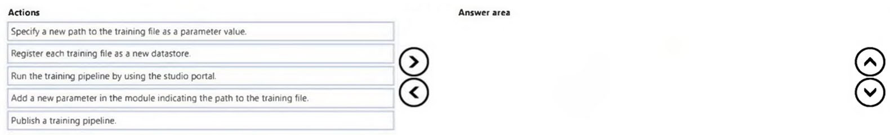
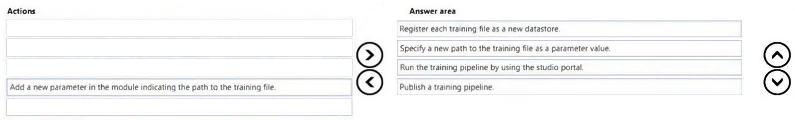

# Question 488

DRAG DROP -

You use a training pipeline in the Azure Machine Learning designer. You register a datastore named ds1. The datastore contains multiple training data files. You use the Import Data module with the configured datastore.

You need to retrain a model on a different set of data files.

Which four actions should you perform in sequence? To answer, move the appropriate actions from the list of actions to the answer area and arrange them in the correct order.

Select and Place:

  
Show Suggested Answer

 

  
Show Discussions

<blockquote>
<strong>Nami1986</strong> <code>(Sun 02 Oct 2022 02:27)</code> - <em>Upvotes: 18</em>

1. Specify a new path
2. Add a new parameter
3. Publish a training pipeline
4. Run the training pipeline
Ref: https://learn.microsoft.com/en-us/azure/machine-learning/how-to-retrain-designer
</blockquote>
<blockquote>
<strong>JTWang</strong> <code>(Tue 25 Oct 2022 08:49)</code> - <em>Upvotes: 2</em>

Agree your answer.
</blockquote>
<blockquote>
<strong>AzureJobsTillRetire</strong> <code>(Fri 10 Feb 2023 21:45)</code> - <em>Upvotes: 7</em>

Step1. Add a new parameter in the module indicating the path to the training file
We can make it on the Import Data module
Step2. Specify a new path to the training file as a parameter value 
Specify a new value for the parameter. This cannot be done before the parameter is created (Step1).
Specify which is the path to the new files needed to train the model again
Step3. publish the pipeline
Create an inference pipeline
Step3. run the pipeline in studio
This cannot be done before the pipeline is published (Step3).
Through the submit button.

https://learn.microsoft.com/en-us/azure/machine-learning/how-to-retrain-designer
</blockquote>

<blockquote>
<strong>AzureJobsTillRetire</strong> <code>(Sat 18 Feb 2023 20:45)</code> - <em>Upvotes: 2</em>

Sorry I was wrong. Mani1986 was right.
</blockquote>
<blockquote>
<strong>f2a9aa5</strong> <code>(Fri 28 Jun 2024 13:30)</code> - <em>Upvotes: 1</em>

You could even answer this question by just following articles &quot;a&quot; and &quot;the&quot;:

1. Specify &quot;a new path&quot; to the training file as a parameter value
2. Add a new parameter in the module indicating &quot;the path&quot; to the training file
3. Publish &quot;a&quot; training pipeline
4. Run &quot;the&quot; training pipeline

Can be used for most &quot;sequence&quot; type questions :) Or used as a verification technique.
</blockquote>

<blockquote>
<strong>3than</strong> <code>(Wed 22 Nov 2023 17:08)</code> - <em>Upvotes: 1</em>

Add new parameter, specify path, publish, run
</blockquote>
<blockquote>
<strong>Yuriy_Ch</strong> <code>(Wed 08 Mar 2023 12:35)</code> - <em>Upvotes: 3</em>

Exactly this question was on exam 07/March/2023
</blockquote>
<blockquote>
<strong>MattAnya</strong> <code>(Wed 04 Jan 2023 06:22)</code> - <em>Upvotes: 3</em>

was on exam 01/03/2023
</blockquote>
<blockquote>
<strong>bbigwolf</strong> <code>(Thu 01 Sep 2022 05:33)</code> - <em>Upvotes: 2</em>

1. Add a new parameter
2. publish the pipeline
3. Run the pipeline
4. Specify a new value for the parameter
</blockquote>
<blockquote>
<strong>giusecozza</strong> <code>(Thu 08 Sep 2022 09:37)</code> - <em>Upvotes: 1</em>

Maybe we should specify a new value for the parameter before running the pipeline, right? (as is 3 and 4 reversed)
</blockquote>
<blockquote>
<strong>giusecozza</strong> <code>(Thu 08 Sep 2022 12:14)</code> - <em>Upvotes: 10</em>

Sorry, I&#x27;ve read the question again carefully. Since the question is saying we need to manage the pipeline via ML studio, I made a quick check and  it seems that the correct order should be:
1. add a new parameter (we can make it on the Import Data module)
2. specify a new value for the parameter (specify which is the path to the new files needed to train the model again)
3. run the pipeline in studio (through the submit button)
4. publish the pipeline (create an inference pipeline)
</blockquote>

---

[<< Previous Question](question_487.md) | [Home](../index.md) | [Next Question >>](question_489.md)
