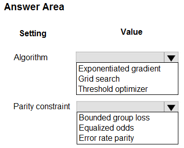
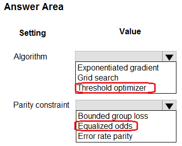

# Question 493

HOTSPOT

-

You have a binary classifier that predicts positive cases of diabetes within two separate age groups.

The classifier exhibits a high degree of disparity between the age groups.

You need to modify the output of the classifier to maximize its degree of fairness across the age groups and meet the following requirements:

• Eliminate the need to retrain the model on which the classifier is based.

• Minimize the disparity between true positive rates and false positive rates across age groups.

Which algorithm and parity constraint should you use? To answer, select the appropriate options in the answer area.

NOTE: Each correct selection is worth one point.

  
Show Suggested Answer

 

  
Show Discussions

<blockquote>
<strong>GHill1982</strong> <code>(Wed 17 Jul 2024 19:14)</code> - <em>Upvotes: 1</em>

Correct. To modify the output of the classifier to maximize its degree of fairness across the age groups, you should use a postprocessing algorithm and the equalized odds parity constraint.
</blockquote>
<blockquote>
<strong>damaldon</strong> <code>(Wed 10 Jan 2024 17:51)</code> - <em>Upvotes: 1</em>

Correct, Threshold Optimizer is for Post-processing. No re-train model needed.
https://learn.microsoft.com/en-us/azure/machine-learning/concept-fairness-ml?view=azureml-api-2
</blockquote>
<blockquote>
<strong>sap_dg</strong> <code>(Fri 29 Sep 2023 03:56)</code> - <em>Upvotes: 1</em>

Correct!
</blockquote>

---

[<< Previous Question](question_492.md) | [Home](/index.md) | [Next Question >>](question_494.md)
