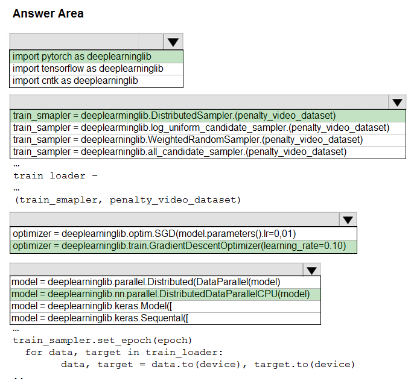

# Question 497

HOTSPOT -

You need to use the Python language to build a sampling strategy for the global penalty detection models.

How should you complete the code segment? To answer, select the appropriate options in the answer area.

NOTE: Each correct selection is worth one point.

Hot Area:

  
Show Suggested Answer

 

Box 1: import pytorch as deeplearninglib

Box 2: ..DistributedSampler(Sampler)..

DistributedSampler(Sampler):

Sampler that restricts data loading to a subset of the dataset.

It is especially useful in conjunction with class:`torch.nn.parallel.DistributedDataParallel`. In such case, each process can pass a DistributedSampler instance as a

DataLoader sampler, and load a subset of the original dataset that is exclusive to it.

Scenario: Sampling must guarantee mutual and collective exclusively between local and global segmentation models that share the same features.

Box 3: optimizer = deeplearninglib.train. GradientDescentOptimizer(learning_rate=0.10)

Incorrect Answers: ..SGD..

Scenario: All penalty detection models show inference phases using a Stochastic Gradient Descent (SGD) are running too slow.

Box 4: .. nn.parallel.DistributedDataParallel..

DistributedSampler(Sampler): The sampler that restricts data loading to a subset of the dataset.

It is especially useful in conjunction with :class:`torch.nn.parallel.DistributedDataParallel`.

Reference:

https://github.com/pytorch/pytorch/blob/master/torch/utils/data/distributed.py

  
Show Discussions

<blockquote>
<strong>prashantjoge</strong> <code>(Sat 28 May 2022 08:00)</code> - <em>Upvotes: 13</em>

TF supports static computational graph while pytorch supports  dynamic Computational Graph. So the answer to the first question  is pytorch since we are asked to use dynamic runtime graph computation
the 2nd and 4th option are as described in the given solution
The 3rd option is confusing, since SGD is offered by pytorch and gradient descent optimizer is offered by tensorflow. I will go with SGD, because it goes with the rest of the answers even though there is this &quot;All penalty detection models show inference phases using a Stochastic Gradient Descent (SGD) are running too slow&quot;
</blockquote>
<blockquote>
<strong>dzzz</strong> <code>(Tue 28 Dec 2021 13:05)</code> - <em>Upvotes: 7</em>

Box3: train.GradientDescentOptimizer belongs to TensorFlow, but the other boxes use Pytorch. 
https://www.tensorflow.org/api_docs/python/tf/compat/v1/train/GradientDescentOptimizer
</blockquote>
<blockquote>
<strong>phdykd</strong> <code>(Wed 31 Jul 2024 16:22)</code> - <em>Upvotes: 1</em>

-import pytorch as deeplearninglib
f-train sampler = deeplearninglib.WeightedRandomSampler.(penalty video dataset)
h-optimizer = deeplearninglib.optim. SGD(model. parameters).Ir=0,01)
k-model = deeplearninglib.nn.parallel. DistributedDataParallelCPU(model)
These options support the requirements of dynamic runtime graph computation, handling imbalance in the penalty detection classes, applying Stochastic Gradient Descent (SGD) optimizer, and employing parallel computations for the model respectively.
</blockquote>
<blockquote>
<strong>phdykd</strong> <code>(Sat 24 Feb 2024 22:52)</code> - <em>Upvotes: 1</em>

Box 1: A) import pytorch as deeplearninglib

Explanation: Since the feature mentioned, dynamic runtime graph computation, is a feature of PyTorch, we should import PyTorch in this case.

Box 2: C) train_sampler= deeplearninglib.WeightedRnadomSampler.(penalty_video_dataset)

Explanation: A sampling strategy is required for the global penalty detection models. The WeightedRandomSampler allows for weighted sampling, which may be useful for ensuring that rarer samples are not overlooked in the training process.

Box 3: A) optimizer= deeplearninglib.optim.SGD(model.parameters().lr=0.01)

Explanation: The SGD optimizer is mentioned specifically for the penalty detection models, and the learning rate is set to 0.01.

Box 4: A) model= deeplearninglib.parallel.DistributedDataParallel(model)

Explanation: The DistributedDataParallel module allows for parallel processing of a single model across multiple devices or nodes, which can significantly speed up the training process. This is useful for the global penalty detection models, which are mentioned to have slow inference times.
</blockquote>

<blockquote>
<strong>ning</strong> <code>(Sat 17 Jun 2023 11:52)</code> - <em>Upvotes: 1</em>

No clue, the only thing I know of is that 
DistributedSampler, Optim.SGD, and nn.Parallel ... are all pytouch packages or classes ...
</blockquote>
<blockquote>
<strong>frida321</strong> <code>(Tue 27 Sep 2022 13:43)</code> - <em>Upvotes: 5</em>

so hard to answer
</blockquote>
<blockquote>
<strong>ckkobe24</strong> <code>(Sat 24 Sep 2022 04:18)</code> - <em>Upvotes: 3</em>

its all messed up ......
</blockquote>
<blockquote>
<strong>YipingRuan</strong> <code>(Mon 25 Jul 2022 11:43)</code> - <em>Upvotes: 1</em>

Why Box 4 uses CPU?
</blockquote>
<blockquote>
<strong>andre999</strong> <code>(Tue 21 Jun 2022 06:02)</code> - <em>Upvotes: 1</em>

Box 2 is not correct either, it says &#x27;deeplearming&#x27; instead of &#x27;deeplearning&#x27;...
</blockquote>
<blockquote>
<strong>luca2712</strong> <code>(Sat 22 Jan 2022 13:34)</code> - <em>Upvotes: 3</em>

I think, box3: optimizer = deeplearninglib.optim.SGD(model.parameters().lr=0,01)

https://analyticsindiamag.com/how-ml-frameworks-like-tensorflow-and-pytorch-handle-gradient-descent/
</blockquote>

<blockquote>
<strong>wjrmffldrhrl</strong> <code>(Tue 08 Mar 2022 04:21)</code> - <em>Upvotes: 1</em>

In this case say &quot;All penalty detection models show inference phases using a Stochastic Gradient Descent (SGD) are running too slow.&quot;
</blockquote>
<blockquote>
<strong>lucho94</strong> <code>(Tue 04 Jan 2022 16:28)</code> - <em>Upvotes: 1</em>

Which is the correct one?
</blockquote>
<blockquote>
<strong>wahaha</strong> <code>(Mon 20 Dec 2021 09:03)</code> - <em>Upvotes: 1</em>

why pytorch not tensorflow? they both support Python
</blockquote>
<blockquote>
<strong>kurasaki</strong> <code>(Tue 28 Dec 2021 11:49)</code> - <em>Upvotes: 8</em>

we need to use dynamic runtime graph computation thus pytorch
</blockquote>
<blockquote>
<strong>sim39</strong> <code>(Wed 07 Sep 2022 10:16)</code> - <em>Upvotes: 3</em>

I might be wrong, but I think the &quot;to.device()&quot; code reveals that it must be PyTorch
</blockquote>

---

[<< Previous Question](question_496.md) | [Home](../index.md) | [Next Question >>](question_498.md)
