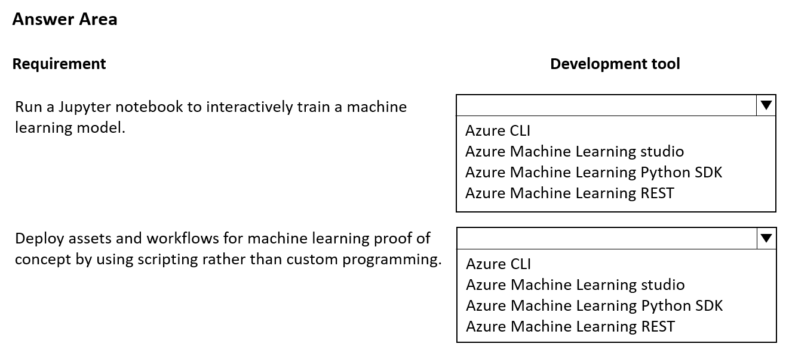
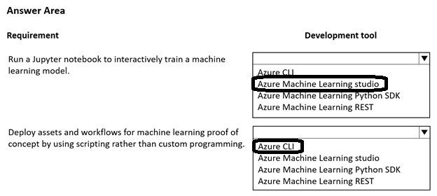

# Question 498

HOTSPOT

-

You plan to implement an Azure Machine Learning solution.

You have the following requirements:

• Run a Jupyter notebook to interactively train a machine learning model.

• Deploy assets and workflows for machine learning proof of concept by using scripting rather than custom programming.

You need to select a development technique for each requirement.

Which development technique should you use? To answer, select the appropriate options in the answer area.

NOTE: Each correct selection is worth one point.

  
Show Suggested Answer

 

  
Show Discussions

<blockquote>
<strong>A_PL300</strong> <code>(Mon 02 Oct 2023 21:12)</code> - <em>Upvotes: 5</em>

On September 4, 2023 exam.
</blockquote>
<blockquote>
<strong>jefimija</strong> <code>(Fri 25 Oct 2024 11:50)</code> - <em>Upvotes: 1</em>

I wonder if an actual question like this in the exam can have two correct answers?
</blockquote>
<blockquote>
<strong>sl_mslconsulting</strong> <code>(Tue 04 Jun 2024 23:22)</code> - <em>Upvotes: 1</em>

Train models using SDK:https://learn.microsoft.com/en-us/azure/machine-learning/how-to-train-model?view=azureml-api-2&amp;tabs=python

using studio: https://learn.microsoft.com/en-us/azure/machine-learning/how-to-train-with-ui?view=azureml-api-2

I will pick SDK for the first requirement as you need that to submit a job in a Notebook
</blockquote>

<blockquote>
<strong>ferren</strong> <code>(Tue 07 Nov 2023 23:11)</code> - <em>Upvotes: 1</em>

bard says the answeres are correct
</blockquote>
<blockquote>
<strong>sar77</strong> <code>(Tue 08 Jul 2025 04:44)</code> - <em>Upvotes: 1</em>

1. Run a Jupyter notebook to interactively train a machine learning model:
Use the Notebooks feature in Azure Machine Learning studio. This allows you to run Jupyter notebooks directly within your Azure ML workspace, providing an interactive environment for training and experimentation without additional setup.

2. Deploy assets and workflows for machine learning proof of concept by using scripting rather than custom programming:
Use the Azure CLI (Command-Line Interface). The Azure CLI enables you to deploy machine learning assets and workflows through scripts, which is ideal for proof of concept scenarios and does not require custom programming.
</blockquote>
<blockquote>
<strong>PI_Team</strong> <code>(Wed 13 Sep 2023 21:30)</code> - <em>Upvotes: 3</em>

For the requirement to run a Jupyter notebook to interactively train a machine learning model, you can use the Azure Machine Learning Python SDK. This SDK provides an interactive environment for training machine learning models and it integrates well with Jupyter notebooks.

For deploying assets and workflows for machine learning proof of concept by using scripting rather than custom programming, you can use the Azure CLI. It allows you to manage Azure resources, including Machine Learning assets, using scripts which is ideal for proof of concept deployments.
</blockquote>

<blockquote>
<strong>InversaRadice</strong> <code>(Sun 10 Dec 2023 19:32)</code> - <em>Upvotes: 2</em>

well question ask to interactively train so AML studio is correct
</blockquote>
<blockquote>
<strong>PI_Team</strong> <code>(Mon 11 Dec 2023 17:21)</code> - <em>Upvotes: 1</em>

the question specifically mentions using a Jupyter notebook, it does imply that you’ll be writing code. In this case, using the Azure Machine Learning Python SDK would be more appropriate.
</blockquote>
<blockquote>
<strong>deyoz</strong> <code>(Mon 26 Feb 2024 03:49)</code> - <em>Upvotes: 1</em>

we can also write code via notebook in azure ml studio. I believe both sdk and ml studio are correct options.
</blockquote>

---

[<< Previous Question](question_497.md) | [Home](/index.md) | [Next Question >>](question_499.md)
