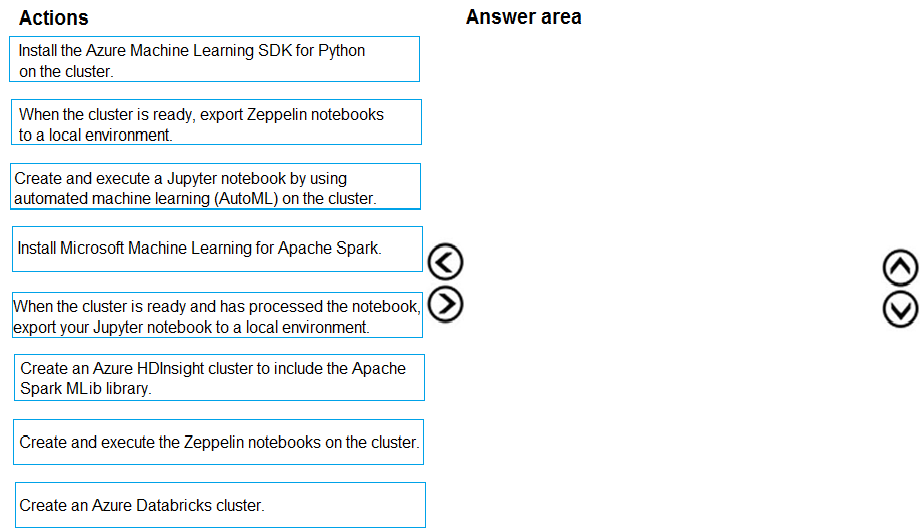
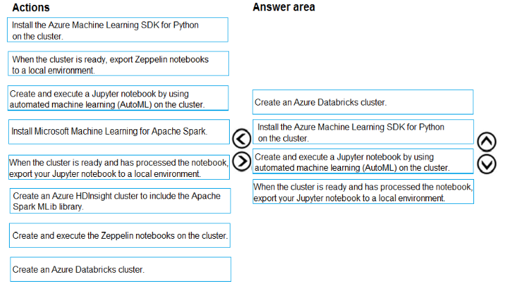

# Question 50

DRAG DROP -

You are building an intelligent solution using machine learning models.

The environment must support the following requirements:

✑ Data scientists must build notebooks in a cloud environment

✑ Data scientists must use automatic feature engineering and model building in machine learning pipelines.

✑ Notebooks must be deployed to retrain using Spark instances with dynamic worker allocation.

✑ Notebooks must be exportable to be version controlled locally.

You need to create the environment.

Which four actions should you perform in sequence? To answer, move the appropriate actions from the list of actions to the answer area and arrange them in the correct order.

Select and Place:

  
Show Suggested Answer

 

  
Show Discussions

<blockquote>
<strong>Dasist</strong> <code>(Mon 29 Mar 2021 21:39)</code> - <em>Upvotes: 50</em>

Should be: Create Azure Databricks cluster -&gt; Install Azure ML SDK for Python -&gt; Create and exec Jupyter notebook using AutoML -&gt; Export Jupyter to local env. That because you need auto feature engineering provided by autoML
</blockquote>
<blockquote>
<strong>spaceykacey</strong> <code>(Mon 25 Oct 2021 08:19)</code> - <em>Upvotes: 3</em>

incase anyone still has doubts about this, refer: https://docs.microsoft.com/en-us/azure/machine-learning/how-to-configure-databricks-automl-environment
</blockquote>
<blockquote>
<strong>prashantjoge</strong> <code>(Thu 20 May 2021 19:02)</code> - <em>Upvotes: 3</em>

dont see the option for install ML SDK for python for databricks
</blockquote>
<blockquote>
<strong>prashantjoge</strong> <code>(Thu 20 May 2021 19:53)</code> - <em>Upvotes: 3</em>

you can add ML lib using a script action when you create the HDinsight service. databricks-rg-azdatabrickspt-fkd2ogyzogbag
</blockquote>
<blockquote>
<strong>bruce</strong> <code>(Thu 08 Apr 2021 16:59)</code> - <em>Upvotes: 5</em>

Notebooks must be deployed to retrain using Spark instances with dynamic worker allocation- This condition won&#x27;t be satisfied with Jupyter
</blockquote>
<blockquote>
<strong>ajay_1233456</strong> <code>(Tue 23 Aug 2022 05:05)</code> - <em>Upvotes: 13</em>

1. Create Azure Databricks cluster
2. Install Azure ML SDK for Python
3. Create and exec Jupyter notebook using AutoML
4. Export Jupyter to local env
</blockquote>
<blockquote>
<strong>OdaNabunaga</strong> <code>(Thu 20 Jun 2024 16:54)</code> - <em>Upvotes: 3</em>

1.	Create an Azure Databricks cluster
2.	Install the Azure Machine Learning SDK for Python on the cluster
3.	Create and execute a Jupyter notebook by using automated machine learning (AutoML) on the cluster
4.	When the cluster is ready and has processed the notebook, export your Jupyter notebook to a local environment
</blockquote>
<blockquote>
<strong>larimalarima</strong> <code>(Mon 24 Jun 2024 14:41)</code> - <em>Upvotes: 2</em>

I think it&#x27;s most accurate
</blockquote>
<blockquote>
<strong>PI_Team</strong> <code>(Mon 10 Jul 2023 09:49)</code> - <em>Upvotes: 2</em>

Create an Azure Databricks cluster to provide a cloud environment for data scientists to build their notebooks.

Install the Azure ML SDK for Python on the cluster to enable data scientists to use automatic feature engineering and model building in machine learning pipelines.

Create and execute the Zeppelin notebooks on the cluster to build and train machine learning models using Spark instances with dynamic worker allocation.

When the cluster is ready, export Zeppelin notebooks to a local environment to enable version control of the notebooks locally.

SaM
</blockquote>

<blockquote>
<strong>phdykd</strong> <code>(Thu 02 Feb 2023 03:05)</code> - <em>Upvotes: 7</em>

Here is the most accurate sequence of actions for creating the desired environment:
Create an Azure Databricks cluster
Install Microsoft Machine Learning for Apache Spark on the cluster
Create and execute Jupyter notebooks using AutoML on the cluster
When the cluster is ready and has processed the notebook, export your Jupyter notebook to a local environment for version control.
This sequence of actions will allow you to take advantage of the Azure Databricks platform for cloud-based data processing, and the Microsoft Machine Learning for Apache Spark library for automating feature engineering and model building in your Jupyter notebooks. Additionally, exporting the notebooks to a local environment will allow you to version control them and collaborate with other team members.
</blockquote>
<blockquote>
<strong>shubhangi2612</strong> <code>(Thu 19 Jan 2023 15:02)</code> - <em>Upvotes: 3</em>

https://industry40.co.in/azure-hdinsight-and-azure-databricks/
</blockquote>
<blockquote>
<strong>ning</strong> <code>(Wed 11 May 2022 11:20)</code> - <em>Upvotes: 4</em>

Totally agree

1. Create Azure Databricks cluster
2. Install Azure ML SDK for Python
3. Create and exec Jupyter notebook using AutoML
4. Export Jupyter to local env
</blockquote>
<blockquote>
<strong>DingDongSingSong</strong> <code>(Wed 30 Mar 2022 19:32)</code> - <em>Upvotes: 3</em>

Reference this link: https://docs.microsoft.com/en-us/azure/machine-learning/concept-automated-ml

Answer is as per DASIST noted:

1. Create Azure Databricks cluster
2. Install Azure ML SDK for Python
3. Create and exec Jupyter notebook using AutoML
4. Export Jupyter to local env

Another link that supports this rationale is :https://industry40.co.in/azure-hdinsight-and-azure-databricks/. It clearly outlines why for Spark based environments, Databricks is a better option than HDInsight
</blockquote>

<blockquote>
<strong>ajayjha123</strong> <code>(Wed 08 Dec 2021 04:45)</code> - <em>Upvotes: 3</em>

Should be: Create Azure Databricks cluster -&gt; Install Azure ML SDK for Python -&gt; Create and exec Jupyter notebook using AutoML -&gt; Export Jupyter to local env. That because you need auto feature engineering provided by autoML
</blockquote>
<blockquote>
<strong>RyanTsai</strong> <code>(Wed 22 Sep 2021 00:27)</code> - <em>Upvotes: 4</em>

agree: Create Azure Databricks cluster -&gt;
Create and exec Jupyter notebook using AutoML -&gt;
Install Azure ML SDK for Python -&gt;
Export Jupyter to local env
</blockquote>
<blockquote>
<strong>dija123</strong> <code>(Wed 18 Aug 2021 12:52)</code> - <em>Upvotes: 3</em>

Create Azure Databricks cluster -&gt; 
Create and exec Jupyter notebook using AutoML -&gt;
Install Azure ML SDK for Python -&gt; 
 Export Jupyter to local env
</blockquote>
<blockquote>
<strong>Akki0120</strong> <code>(Sun 04 Jul 2021 16:06)</code> - <em>Upvotes: 3</em>

If anyone wants all questions ping me 9403778084
</blockquote>
<blockquote>
<strong>Lutendo</strong> <code>(Wed 01 Sep 2021 18:56)</code> - <em>Upvotes: 1</em>

Can you please share the email
</blockquote>
<blockquote>
<strong>tamoor</strong> <code>(Fri 19 Feb 2021 21:54)</code> - <em>Upvotes: 1</em>

you can use only azure hdinsights because of condition you can use only apache-spark
for data bricks, you must use Hadoop.
</blockquote>
<blockquote>
<strong>dzzz</strong> <code>(Sat 12 Dec 2020 21:59)</code> - <em>Upvotes: 3</em>

I believe Data Bricks is capable, but if you choose that as first step, there is no further actions can be chosen, which all around Zeppelin, but Data Bricks doesn&#x27;t support Zeppelin.
</blockquote>
<blockquote>
<strong>Srivathsan</strong> <code>(Sat 30 Jan 2021 02:23)</code> - <em>Upvotes: 1</em>

https://docs.microsoft.com/en-us/azure/databricks/dev-tools/databricks-connect#:~:text=Databricks%20Connect%20allows%20you%20to,applications%20to%20Azure%20Databricks%20clusters.

From the above link, it is seen that Databricks can support Zepplin.
</blockquote>

<blockquote>
<strong>prashantjoge</strong> <code>(Thu 20 May 2021 19:09)</code> - <em>Upvotes: 1</em>

data bricks is a an analytics platform. it does not support feature engineering
</blockquote>
<blockquote>
<strong>valkyrieShadow</strong> <code>(Fri 27 Nov 2020 19:43)</code> - <em>Upvotes: 3</em>

Azure data bricks meets all the requirements. HDInsight does not.
Example: automatic feature engineering is included with autoML. HDinsight does not include this feature.

HDinsight: https://docs.microsoft.com/en-us/azure/hdinsight/

Azure Databricks: https://docs.microsoft.com/en-us/azure/databricks/applications/machine-learning/automl-hyperparam-tuning/
</blockquote>

<blockquote>
<strong>HkIsCrazY</strong> <code>(Sat 06 Feb 2021 07:30)</code> - <em>Upvotes: 3</em>

No, HDinsight also provides all the autoML and auto feature engineering features

https://docs.microsoft.com/en-us/azure/hdinsight/spark/apache-spark-run-machine-learning-automl
</blockquote>

<blockquote>
<strong>prashantjoge</strong> <code>(Thu 20 May 2021 19:55)</code> - <em>Upvotes: 3</em>

the given answer is correct
</blockquote>
<blockquote>
<strong>Karen_12321</strong> <code>(Mon 26 Oct 2020 06:01)</code> - <em>Upvotes: 1</em>

Why not jupyter note book?
</blockquote>
<blockquote>
<strong>LakeSky</strong> <code>(Fri 09 Apr 2021 09:59)</code> - <em>Upvotes: 1</em>

Maybe because jupyter notebook don&#x27;t provide intepreter for Spark like Zeppelin?
https://medium.com/ankitakumar140494/a-comprehensive-comparison-between-jupyter-notebook-and-apache-zeppelin-911501981bfb
</blockquote>
<blockquote>
<strong>zehraoneexam</strong> <code>(Mon 14 Mar 2022 07:32)</code> - <em>Upvotes: 1</em>

No, it supports too.
</blockquote>
<blockquote>
<strong>sayak17</strong> <code>(Tue 15 Sep 2020 03:27)</code> - <em>Upvotes: 2</em>

first option can be Azure Databricks also right? It can also do all of the steps after that.
</blockquote>
<blockquote>
<strong>sayak17</strong> <code>(Tue 15 Sep 2020 03:41)</code> - <em>Upvotes: 1</em>

Why would both spark mllib and mmlspark be required? I feel first option will be databricks
</blockquote>

---

[<< Previous Question](question_49.md) | [Home](/index.md) | [Next Question >>](question_51.md)
