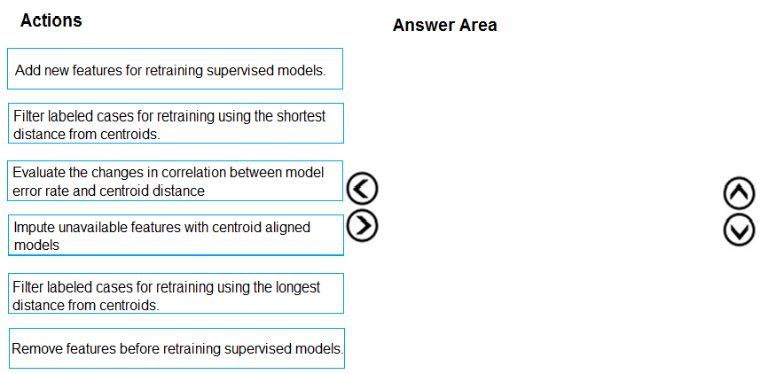
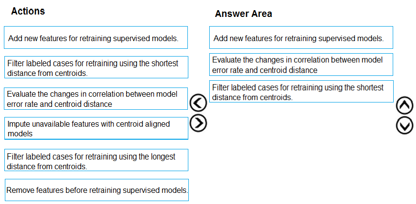

# Question 500

DRAG DROP -

You need to define an evaluation strategy for the crowd sentiment models.

Which three actions should you perform in sequence? To answer, move the appropriate actions from the list of actions to the answer area and arrange them in the correct order.

Select and Place:

  
Show Suggested Answer

 

Scenario:

Experiments for local crowd sentiment models must combine local penalty detection data.

Crowd sentiment models must identify known sounds such as cheers and known catch phrases. Individual crowd sentiment models will detect similar sounds.

Note: Evaluate the changed in correlation between model error rate and centroid distance

In machine learning, a nearest centroid classifier or nearest prototype classifier is a classification model that assigns to observations the label of the class of training samples whose mean (centroid) is closest to the observation.

Reference:

https://en.wikipedia.org/wiki/Nearest_centroid_classifier

https://docs.microsoft.com/en-us/azure/machine-learning/studio-module-reference/sweep-clustering

  
Show Discussions

<blockquote>
<strong>mrkalman</strong> <code>(Mon 08 Mar 2021 16:17)</code> - <em>Upvotes: 31</em>

does this question and answer make sense? i dont have any idea at all.  could any one kindly give explain
</blockquote>
<blockquote>
<strong>kalel249</strong> <code>(Wed 28 Apr 2021 15:05)</code> - <em>Upvotes: 15</em>

The best I could gather was that: they would like to do crowd segmentation which would help them target certain people for their ad campaigns, using clustering based on videos and audios of the people in the crowd. The question wants us to create an evaluation strategy for the models they created. In the problem description, they said they noticed 47 features were not performing rightly and they would engineer 10 independent features from them before retraining our model. This gives us the first answer &quot;Add new features for retraining...&quot;.
</blockquote>
<blockquote>
<strong>haby</strong> <code>(Thu 20 Jun 2024 17:30)</code> - <em>Upvotes: 1</em>

A - This will be the first one. I think this is part of Cluster-then-classification model. Based on my exp, I will use cluster result as a new feature for later classification model, that&#x27;s reason we say &quot;Add new features for retraining supervised models&quot;.
E makes sense to me as well, but have no idea for C
</blockquote>
<blockquote>
<strong>haby</strong> <code>(Thu 20 Jun 2024 17:36)</code> - <em>Upvotes: 1</em>

It looks like C is kind of Error check. For example, when using KMeans, we need to plot SSE vs. k to determine which k value is better. In this case, this is a classification, but doing similar things. It switches from SSE vs. K to &quot;Shortest Dis. from Centroid&quot; vs. &quot;Model Error Rate&quot;.
</blockquote>
<blockquote>
<strong>phdykd</strong> <code>(Fri 09 Feb 2024 18:56)</code> - <em>Upvotes: 1</em>

A,C,B could be
</blockquote>
<blockquote>
<strong>phdykd</strong> <code>(Wed 31 Jan 2024 18:10)</code> - <em>Upvotes: 1</em>

- Filter labeled cases for retraining using the shortest distance from centroids: Start by identifying the labeled cases that are closest to the centroids of their respective clusters. These would typically be the most representative samples of their classes and would form a solid base for initial model training.
C- Evaluate the changes in correlation between model error rate and centroid distance: After retraining the model with the selected cases, evaluate how the model&#x27;s error rate correlates with the distance of samples from the centroids. This will provide insights into how well the model is performing and whether samples farther from the centroids are more likely to be misclassified.
E- Filter labeled cases for retraining using the longest distance from centroids: Based on the evaluation in step 2, it may be observed that samples farther from the centroids are not being accurately classified. To improve the model&#x27;s performance on these cases, they should be included in the training set for retraining.
</blockquote>
<blockquote>
<strong>phdykd</strong> <code>(Fri 25 Aug 2023 06:18)</code> - <em>Upvotes: 3</em>

The three actions that should be performed in sequence to define an evaluation strategy for the crowd sentiment models are:

C) Evaluate the changes in correlation between model error rate and centroid distance: This step involves evaluating the correlation between the model&#x27;s error rate and the distance from the centroid. It helps in identifying if the model is overfitting or underfitting the data.

B) Filter labeled cases for retraining using the shortest distance from centroids: This step involves filtering the labeled cases for retraining based on the shortest distance from the centroids. This helps in selecting the cases that are closer to the centroids and are more representative of the cluster.

A) Add new features for retraining supervised models: This step involves adding new features for retraining supervised models. The new features can help improve the performance of the models and capture important information from the data.
Therefore, the correct order of actions is C, B, A.
</blockquote>

<blockquote>
<strong>snegnik</strong> <code>(Mon 04 Dec 2023 20:08)</code> - <em>Upvotes: 1</em>

ChatGPT3.5?
</blockquote>
<blockquote>
<strong>PremPatrick</strong> <code>(Wed 17 May 2023 07:33)</code> - <em>Upvotes: 6</em>

Did this appear in any of the previous exams?
</blockquote>
<blockquote>
<strong>michaelmorar</strong> <code>(Tue 22 Aug 2023 21:37)</code> - <em>Upvotes: 3</em>

Writing on Friday, will let you know.
</blockquote>
<blockquote>
<strong>snegnik</strong> <code>(Mon 04 Dec 2023 20:06)</code> - <em>Upvotes: 1</em>

What&#x27;s the news?
</blockquote>
<blockquote>
<strong>ning</strong> <code>(Sat 17 Dec 2022 12:21)</code> - <em>Upvotes: 2</em>

I cannot really follow this case study overall ...
After compare with all options, I think the answer is logically sound ...
No other comments ...
</blockquote>
<blockquote>
<strong>jed_elhak</strong> <code>(Sat 19 Mar 2022 02:13)</code> - <em>Upvotes: 2</em>

the question is complicated but i say that&#x27;s a comparisation between existing sound and new sound so the first thing 1) add new features , seconde 2)use correlation to now how much new and old feure are correlated 3)evaluate
</blockquote>
<blockquote>
<strong>jed_elhak</strong> <code>(Sat 19 Mar 2022 02:18)</code> - <em>Upvotes: 1</em>

sorry i mean  3)filter based on short distance
</blockquote>
<blockquote>
<strong>prashantjoge</strong> <code>(Sun 28 Nov 2021 17:45)</code> - <em>Upvotes: 6</em>

I couldn&#x27;t make head or tails of this question.  Clueless....
</blockquote>
<blockquote>
<strong>HoustonHo</strong> <code>(Tue 20 Apr 2021 06:33)</code> - <em>Upvotes: 4</em>

no idea about this.
</blockquote>

---

[<< Previous Question](question_499.md) | [Home](/index.md) | [Next Question >>](question_501.md)
