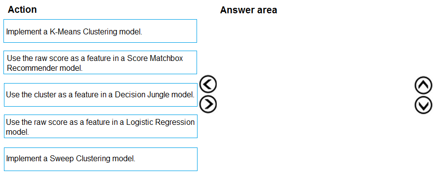
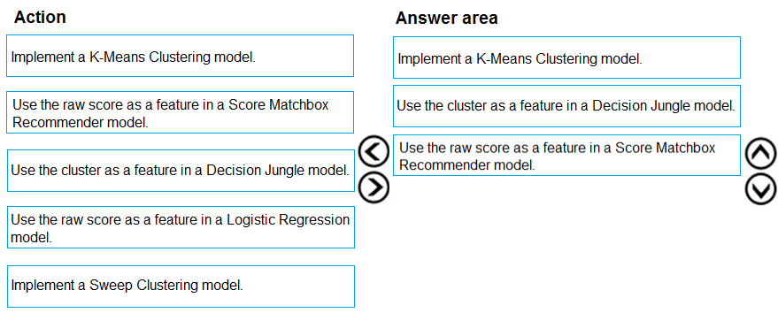

# Question 504

DRAG DROP -

You need to define a modeling strategy for ad response.

Which three actions should you perform in sequence? To answer, move the appropriate actions from the list of actions to the answer area and arrange them in the correct order.

Select and Place:

  
Show Suggested Answer

 

Step 1: Implement a K-Means Clustering model

Step 2: Use the cluster as a feature in a Decision jungle model.

Decision jungles are non-parametric models, which can represent non-linear decision boundaries.

Step 3: Use the raw score as a feature in a Score Matchbox Recommender model

The goal of creating a recommendation system is to recommend one or more &quot;items&quot; to &quot;users&quot; of the system. Examples of an item could be a movie, restaurant, book, or song. A user could be a person, group of persons, or other entity with item preferences.

Scenario:

Ad response rated declined.

Ad response models must be trained at the beginning of each event and applied during the sporting event.

Market segmentation models must optimize for similar ad response history.

Ad response models must support non-linear boundaries of features.

Reference:

https://docs.microsoft.com/en-us/azure/machine-learning/studio-module-reference/multiclass-decision-jungle https://docs.microsoft.com/en-us/azure/machine-learning/studio-module-reference/score-matchbox-recommender

  
Show Discussions

<blockquote>
<strong>phdykd</strong> <code>(Sun 25 Aug 2024 06:37)</code> - <em>Upvotes: 2</em>

The three actions to perform in sequence for defining a modeling strategy for ad response are as follows:

Implement a K-Means clustering model
Use the cluster as a feature in a decision jungle model
Use the raw score as a feature in a logistic regression model
Therefore, the correct order of actions is A, C, and D.
</blockquote>

<blockquote>
<strong>ning</strong> <code>(Sun 17 Dec 2023 13:03)</code> - <em>Upvotes: 1</em>

No idea, guess the answer is OK, thought process ...
K-means --&gt; we do not what will come, so clustering ...
Need a score as input for recommendation --&gt; Tree Forest Regression --&gt; Whatever score indicates what action we should take ????
</blockquote>
<blockquote>
<strong>ning</strong> <code>(Mon 18 Dec 2023 14:35)</code> - <em>Upvotes: 1</em>

On a second thought, it might not be the case, this is very confusing ...
Response rate is just response vs no response, no it is binary classification ...
Also, it mentioned the distribution of features for training and production data are different ...
So my bet is :
1. sweep clustering
2. Tree forest
3. Logistic regression
</blockquote>
<blockquote>
<strong>jackreacher</strong> <code>(Mon 23 May 2022 04:11)</code> - <em>Upvotes: 1</em>

Is there anybody who can explain this? Thanks
</blockquote>
<blockquote>
<strong>Indranee</strong> <code>(Wed 20 Jul 2022 08:57)</code> - <em>Upvotes: 26</em>

This question is challenging. The answer looks right.

1. The ad response model needs to support &#x27;non-linear decision boundaries&#x27;. This is supported by the decision jungle model. So now we have the decision jungle model as one of the three steps.
2. The decision jungle model uses K-means clusters as inputs, so K-Means comes before the decision jungle model. K-means clustering can be used to identify &#x27;market/customer segments&#x27;.
3. There remains a third step either before K-means or after decision jungle model. The ad response model needs to be &#x27;applied during the event&#x27;. It does seem that a recommender model is the more appropriate choice to apply onto the live dataset and serve recommendations during the event. And the recommender model would logically be at the last step.
4. So the overall flow seems to be identifying market/customer segments using KMeans -&gt; Non-linear decisions using Decision Jungle (frankly I still wonder how this model fits in the end-to-end flow) -&gt; serve recommendations using the recommender model.
</blockquote>

---

[<< Previous Question](question_503.md) | [Home](../index.md) | [Next Question >>](question_505.md)
