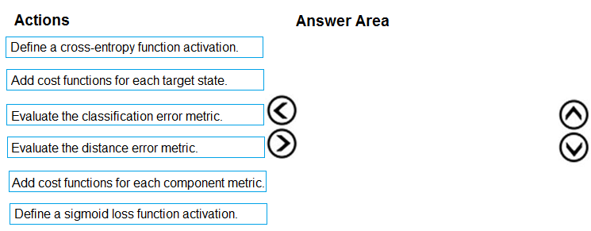
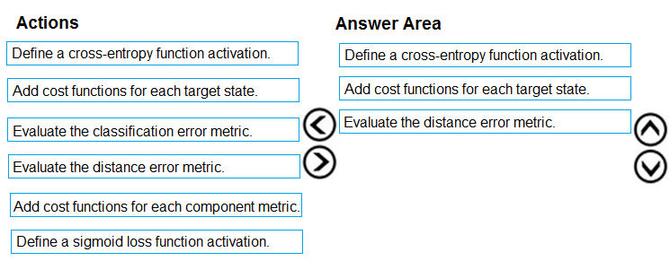

# Question 506

DRAG DROP -

You need to define an evaluation strategy for the crowd sentiment models.

Which three actions should you perform in sequence? To answer, move the appropriate actions from the list of actions to the answer area and arrange them in the correct order.

Select and Place:

  
Show Suggested Answer

 

Step 1: Define a cross-entropy function activation

When using a neural network to perform classification and prediction, it is usually better to use cross-entropy error than classification error, and somewhat better to use cross-entropy error than mean squared error to evaluate the quality of the neural network.

Step 2: Add cost functions for each target state.

Step 3: Evaluated the distance error metric.

Reference:

https://www.analyticsvidhya.com/blog/2018/04/fundamentals-deep-learning-regularization-techniques/

  
Show Discussions

<blockquote>
<strong>kurasaki</strong> <code>(Wed 29 Dec 2021 00:27)</code> - <em>Upvotes: 6</em>

Is there anyone could explain why we should use distance error metric not classification error metric (e.g. F-score, etc) as last step? Given this is classification not clustering problem
</blockquote>
<blockquote>
<strong>Indranee</strong> <code>(Thu 20 Jan 2022 10:02)</code> - <em>Upvotes: 1</em>

The technique we are using here is KMeans clustering to identify market segments/clusters. As we are not solving a supervised classification problem, the classification error metric is not applicable.
</blockquote>
<blockquote>
<strong>phdykd</strong> <code>(Wed 31 Jul 2024 18:21)</code> - <em>Upvotes: 3</em>

Therefore, the sequence might look like this:

a- Define a cross-entropy function activation: This function is more suitable for multi-class classification problems. It quantifies the difference between two probability distributions: the predictions made by the model and the actual distribution.
b- Add cost functions for each target state: By adding cost functions for each class, the model can optimize its predictions for each category.
c- Evaluate the classification error metric: After the model has been trained, evaluate its performance using a classification error metric. This metric will tell you how often the model&#x27;s predictions are incorrect.
So, the sequence would be A -&gt; B -&gt; C
</blockquote>

<blockquote>
<strong>phdykd</strong> <code>(Sun 25 Feb 2024 07:55)</code> - <em>Upvotes: 3</em>

C) Evaluate the classification error metric: This is the first step to evaluate the performance of a classification model, such as the crowd sentiment models. The classification error metric measures the proportion of misclassified samples in the dataset and provides a general idea of how well the model is performing.

B) Add cost functions for each target state: Cost functions are used to penalize the model for incorrect predictions and to optimize the model&#x27;s parameters during training. In the case of the crowd sentiment models, adding cost functions for each target state would enable the model to learn the differences between them and adjust its predictions accordingly.

F) Define a sigmoid loss function activation: The sigmoid loss function is a popular choice for binary classification problems such as sentiment analysis. It returns a value between 0 and 1, which can be interpreted as the probability of a sample belonging to a particular class. Defining this function as the activation function for the output layer of the model would help to improve its performance.
</blockquote>

<blockquote>
<strong>ning</strong> <code>(Sun 18 Jun 2023 13:24)</code> - <em>Upvotes: 1</em>

Sentiment analysis is a multi-class classification, so relevant answer for how to evaluate result is 1, 2, 3 that is 100% sure, what is the correct order??? I do not know ...
</blockquote>
<blockquote>
<strong>Gr4n4</strong> <code>(Tue 15 Nov 2022 19:52)</code> - <em>Upvotes: 1</em>

Cross entropy is a loss function not an activation function but also, in my opinion, defining a cost function for all target states is not correct (shouldn&#x27;t the cost function be one?); I think at most we can define a cost function for each component (clustering, classification) and evaluate distance metric and classification metric.
</blockquote>
<blockquote>
<strong>RyanTsai</strong> <code>(Mon 19 Sep 2022 13:21)</code> - <em>Upvotes: 4</em>

ans: 1,2,3
</blockquote>
<blockquote>
<strong>sp23</strong> <code>(Thu 06 Jan 2022 02:29)</code> - <em>Upvotes: 1</em>

sorry 3,2,4 boxes
</blockquote>
<blockquote>
<strong>sp23</strong> <code>(Thu 06 Jan 2022 02:28)</code> - <em>Upvotes: 2</em>

3,2,1 boxes
</blockquote>
<blockquote>
<strong>sp23</strong> <code>(Thu 06 Jan 2022 02:28)</code> - <em>Upvotes: 1</em>

should be 3rd option.
</blockquote>
<blockquote>
<strong>viplov</strong> <code>(Sat 28 Jan 2023 11:37)</code> - <em>Upvotes: 9</em>

chutiye kuch aata bhi hai tujhe...sirf confuse kar rha hai logo ko..haiiiinnnn
</blockquote>
<blockquote>
<strong>BTAB</strong> <code>(Mon 15 Jan 2024 14:16)</code> - <em>Upvotes: 6</em>

exactly what I was thinking
</blockquote>

---

[<< Previous Question](question_505.md) | [Home](/index.md) | [Next Question >>](question_507.md)
